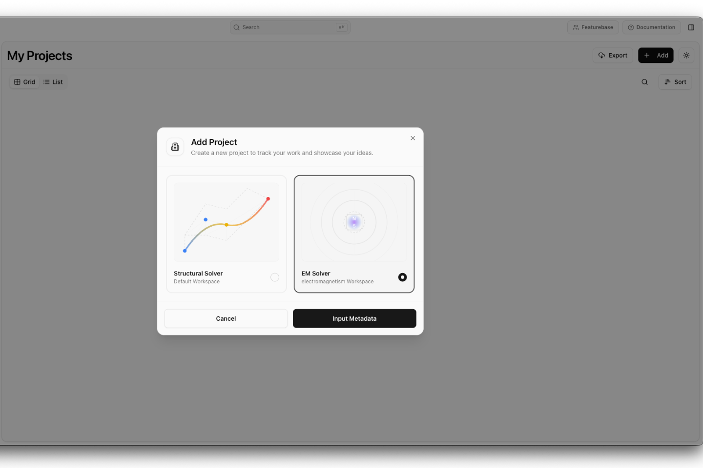
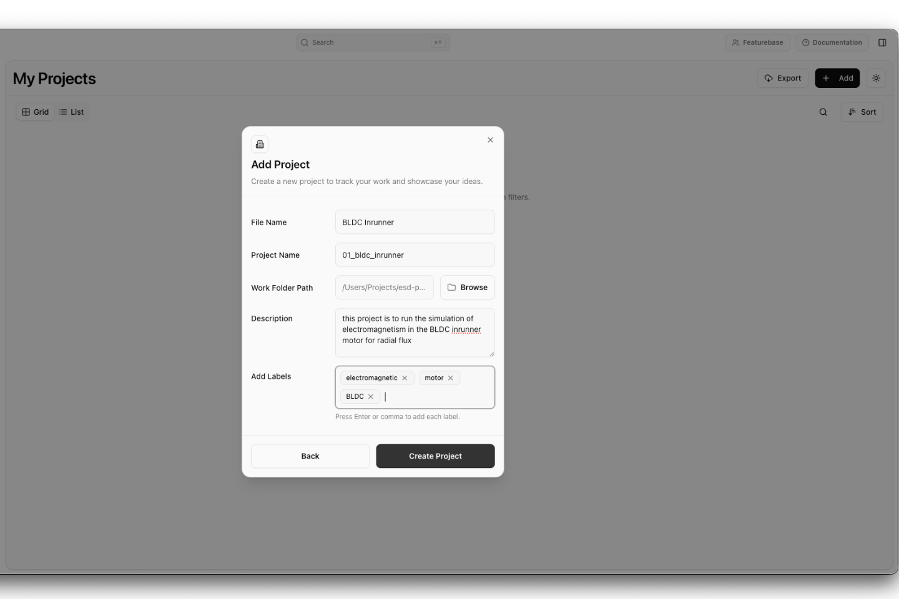
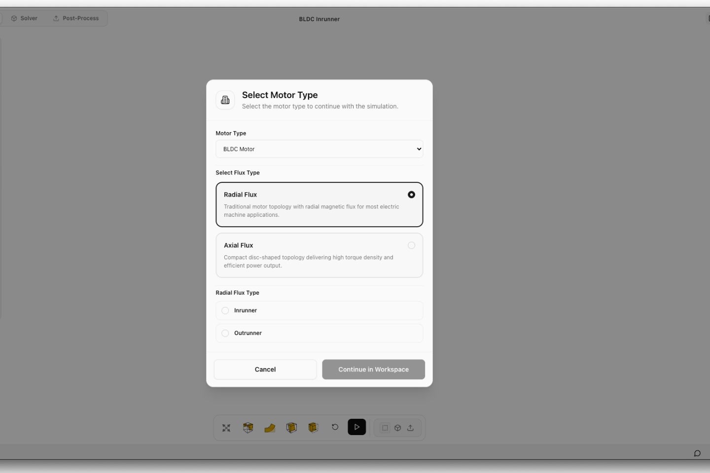

# Creating an Electromagnetic Solver Project

This section describes how to create a new **Electromagnetic (EM) Solver** project. During project creation, users select the EM workspace, enter the project details, and choose the motor topology before entering the simulation workspace.

# Select the EM Solver

Click **Add** on the Projects page.

In the **Add Project** dialog:

1. Select **EM Solver**.
2. Click **Input Metadata**.

---

# Enter Project Details

The **Project Details** dialog appears after selecting the EM Solver.

1. Enter the **File Name**.
2. Enter the **Project Name**.
3. Select the **Work Folder Path**.
4. Enter a **Description** (optional).
5. Add **Labels** (optional).
6. Click **Create Project**.

---

# Select the Motor Configuration

After creating the project, the **Select Motor Type** dialog is displayed.

1. Select the **Motor Type** (currently **BLDC Motor**).
2. Select the **Flux Type**:
	- **Radial Flux** – Conventional cylindrical motor topology.
	- **Axial Flux** – Disc-shaped motor topology.
3. If **Radial Flux** is selected, choose the motor subtype:
	- **Inrunner**
	- **Outrunner**
4. If **Axial Flux** is selected, choose the motor subtype:
	- **Single-Rotor Single-Stator** 
	- **Double-Rotor Single-Stator** 
	- **Double-Stator Single-Rotor**
 5. Click **Continue in Workspace**.

The software opens the **Pre-Process** workspace with the default geometry corresponding to the selected motor configuration.