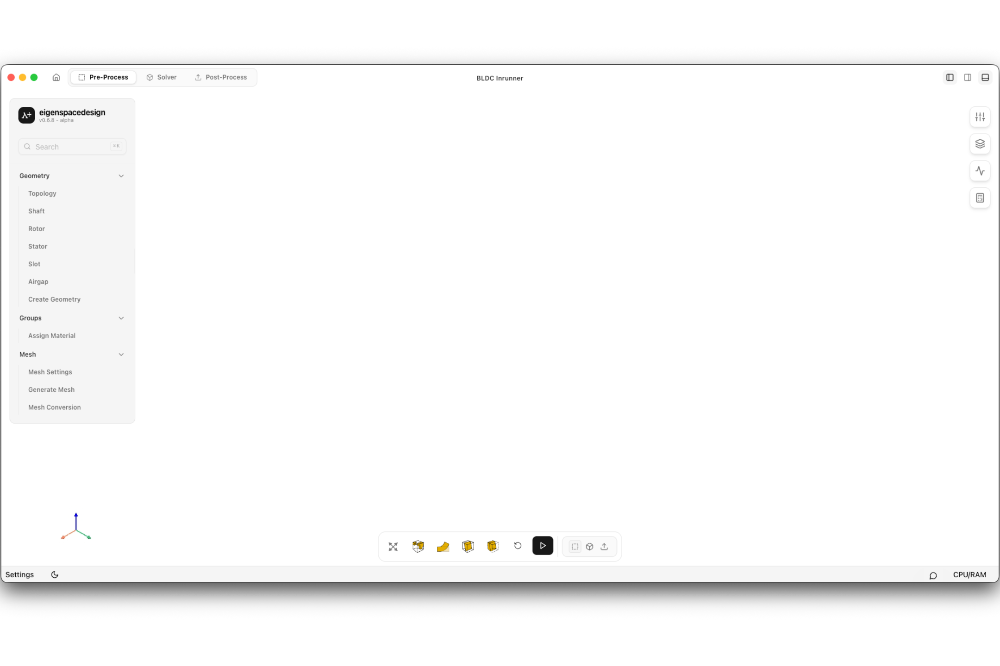

# Pre-Processing Interface Overview

The **Pre-Processing** workspace is used to define the motor geometry, assign material properties, generate the computational mesh, and prepare the model for electromagnetic analysis. All model preparation is completed in this workspace before moving to the solver.

The interface is divided into the following sections.

## 1. Navigation Bar

Located at the top of the window, the navigation bar provides access to the different stages of the simulation workflow.

- **Pre-Process** – Create and prepare the simulation model.
- **Solver** – Configure and run the electromagnetic analysis.
- **Post-Process** – Visualize and evaluate simulation results.

---

## 2. Geometry and Model Tree

The left sidebar contains the project tree used for model creation and setup.

It provides access to:

- Geometry definition (Topology, Shaft, Rotor, Stator, Stator Tooth, Airgap)
- Material assignment (Groups)
- Mesh configuration (Mesh Settings modal)

Each category can be expanded to configure the corresponding part of the simulation model.

---

## 3. Graphics Viewport

The center of the window is the **Graphics Viewport**, where the motor geometry, mesh, and model are displayed.

The viewport supports interactive operations such as:

- Pan
- Zoom
- Rotate

All geometry edits and visualization updates are displayed in this area.

---

## 4. View Controls

The toolbar at the bottom of the viewport provides controls for manipulating the model view.

Available functions include:

- Standard view orientations
- Isometric view
- View reset

These tools simplify inspection of the generated geometry.

---

## 5. Workspace Panel

The panel on the right displays information related to the current preprocessing task.

Depending on the selected operation, it displays information such as:

- Mesh generation status
- Number of elements
- Number of nodes
- Workspace-specific actions
- Navigation to the Solver workspace

The contents of this panel update automatically as preprocessing progresses.