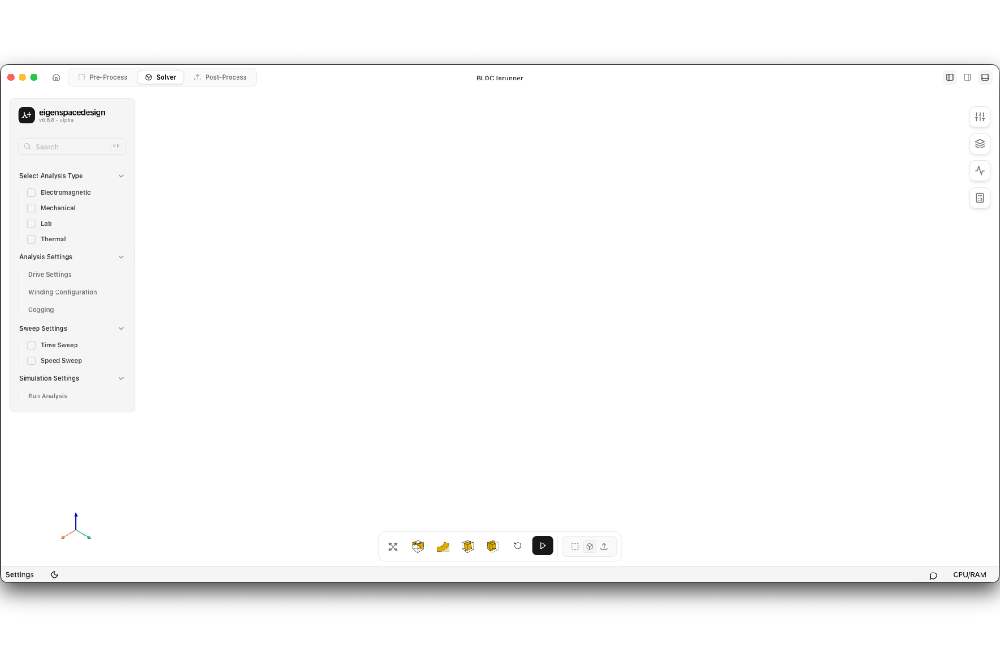

# Solver Interface Overview

The **Solver** workspace is used to configure the analysis, define excitation and simulation parameters, execute the electromagnetic solver, and monitor the progress of the simulation. Once the preprocessing stage is complete, all simulation setup and execution are performed in this workspace.

The interface is divided into the following sections.

---

## 1. Navigation Bar

Located at the top of the window, the navigation bar provides access to the different stages of the simulation workflow.

- **Pre-Process** – Return to geometry, material, and mesh preparation.
- **Solver** – Configure and execute the electromagnetic analysis.
- **Post-Process** – Visualize and evaluate simulation results after the analysis is complete.

---

## 2. Analysis Configuration Panel

The left sidebar contains all simulation setup options required before running the solver.

The available sections include:

- Analysis Type
- Drive Settings
- Winding Configuration
- Cogging Analysis
- Time Sweep
- Speed Sweep
- Run Analysis

Each section can be expanded to configure the corresponding simulation parameters.

---

## 3. Graphics Viewport

The center of the window displays the computational model used for the analysis.

The viewport allows users to:

- Inspect the generated mesh
- Rotate, pan, and zoom the model
- Verify the simulation setup before execution

---

## 4. Workspace Tools

The toolbar beside the graphics viewport provides quick access to workspace utilities such as visualization controls, workspace options, and model inspection tools.

---

## 5. Job Panel

The panel on the right displays the current simulation status.

During execution, it provides information such as:

- Solver status
- Progress
- Iteration count
- Convergence value
- Elapsed simulation time

The panel also provides controls to cancel the running analysis when required.