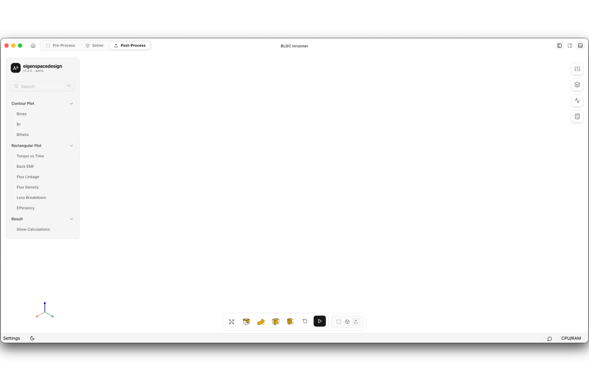

# Post-Processing Interface Overview

The **Post-Processing** workspace is used to visualize, analyze, and export simulation results after the electromagnetic analysis has been completed. It provides contour visualization, performance plots, and calculated quantities for evaluating motor performance.

The interface is divided into the following sections.

---

## 1. Navigation Bar

Located at the top of the window, the navigation bar provides access to the simulation workflow.

- **Pre-Process** – Return to geometry and mesh preparation.
- **Solver** – Modify analysis settings and rerun the simulation.
- **Post-Process** – Visualize and analyze simulation results.

---

## 2. Results Panel

The left sidebar provides access to all available simulation results.

The available categories include:

- **Contour Plot** – Visualize field quantities such as magnetic flux density and magnetic field components.
- **Rectangular Plot** – Display performance curves such as torque, back EMF, flux linkage, efficiency, and losses.
- **Result** – Access calculated numerical quantities and simulation summaries.

Selecting an item automatically updates the graphics viewport with the corresponding result.

---

## 3. Graphics Viewport

The center of the workspace displays the selected simulation result.

Depending on the selected output, the viewport can display:

- Field contours
- Mesh visualization
- Performance graphs
- Animation of transient results

Users can pan, zoom, and rotate the model to inspect the solution.

---

## 4. View Controls

The toolbar beside the graphics viewport provides tools for controlling the visualization.

These tools include:

- Display options
- Visualization settings
- Plot controls
- Result selection utilities

---

## 5. Plot and Visualization Window

Graphs and plots selected from the results panel are displayed in a separate floating window.

The plot window supports:

- Interactive visualization
- Exporting figures
- Closing or reopening individual plots

Multiple plots can be opened independently for comparison.

---

## 6. Color Legend

For contour results, a color legend is displayed beside the graphics viewport.

The legend indicates:

- Minimum and maximum values
- Color mapping of the selected field quantity
- Units of the displayed result

This enables quantitative interpretation of contour plots.

---

## 7. Workspace Status

The bottom status bar displays workspace information such as system status, CPU/RAM usage, and viewport controls during result visualization.