#  Cantilever Beam FEA in eigenspacedesign

## Description

This practice problem demonstrates the complete finite element workflow for a 3D cantilever beam. The beam is fixed at one end and loaded at the opposite free end. The objective is to show how to create the geometry, generate the mesh, import the model into ESD, apply material properties, assign boundary conditions and loads, run the solver, and visualize the results.

The workflow uses SALOME for CAD geometry and mesh generation, and ESD for solver setup, simulation execution, and post-processing.

| Complete pipeline | Part A | Part B | Part C |
| --- | --- | --- | --- |
| Workflow stage | SALOME CAD | SALOME Mesh | eigenspacedesign Solver |
| Main activity | Geometry creation | Mesh generation | Setup and run |

##  PART A — CAD Geometry in SALOME (Shaper Module)

### A.1 — Open Shaper Module

Open the **SALOME** application,From the **Module Selector** located in the SALOME toolbar or welcome screen, select **Shaper**. This will activate the CAD modeling workspace used for creating and editing geometric models. 

 
  ### A.2 — Define Parameters
*
  Open the **Parameters** panel and create the required named parameters that will control the beam geometry. Define each key dimension—such as length, width, height—as a separate parameter with an appropriate name and value. Using named parameters allows the beam dimensions to be modified easily at any stage without manually editing the geometry, enabling efficient design updates and parametric studies.
  
  | Parameter | Example Value | Description |
|-----------|---------------|----------------------|
| `L` | `3000 mm` | Beam length |
| `W` | `300 mm` | Beam width |
| `H` | `400 mm` | Beam height |

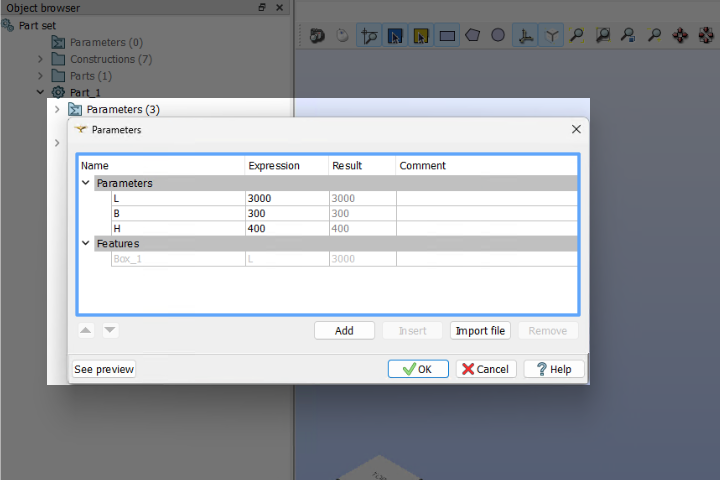

  
  ### A.3 — Create Sketch

. Click **Sketch** → select the reference plane (e.g., XY plane)
4. Draw the cross-section rectangle using the defined parameters (`W × H`)
5. Apply **constraints** (horizontal, vertical, fixed dimensions)
6. Click **Close Sketch**
7. Use **Extrude** → set extrusion length to parameter `L`
8. Confirm → a 3D solid cantilever beam is created

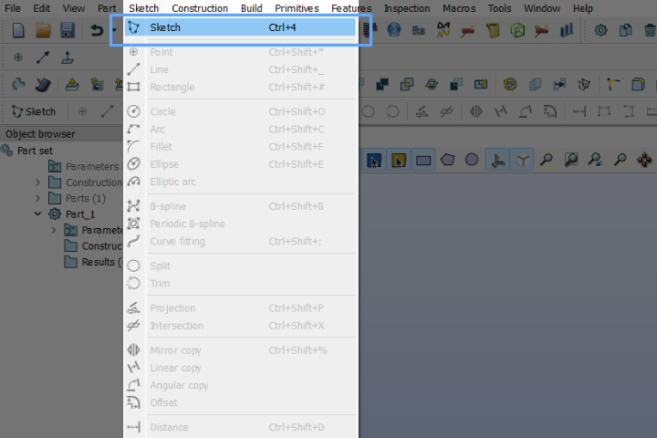

  ### **A.4 — Define Groups**

Navigate to the _Features_ panel and select the _Group_ tab. Create separate groups to organize the model entities based on their purpose, such as _Loads_, _Support Conditions_, and _Bodies_,

| Group Name     | Type  | Selection                        |
| -------------- | ----- | -------------------------------- |
| `domain`       | Solid | Entire beam body                 |
| `fixed_face`   | Face  | Fixed/clamped end face           |
| `loading_face` | Face  | Free end face (load application) |
**Steps:**

1. Go to **Groups** → **Create Group**
2. Select **type** (Solid / Face)
3. Pick geometry on screen
4. Name the group and click **Apply**
5. Repeat for all three groups
   
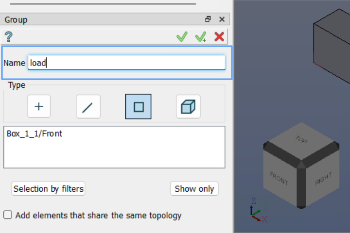

## PART B — Mesh Generation in SALOME (Mesh Module)

  ### B.1 — Switch to Mesh Module
1. After completing the geometry preparation, the next step is to generate a finite element mesh for the model.
2. In the **Module Selector** (usually located at the top of the SALOME interface), click on **Mesh** to switch from the Geometry module to the Mesh workbench.
3. In the **Object Browser** on the left side, locate the geometry (part or solid) that you want to mesh.
4. **Right-click** on the geometry and select **`Create Mesh`** from the context menu. This opens the **Mesh Creation** dialog.
   
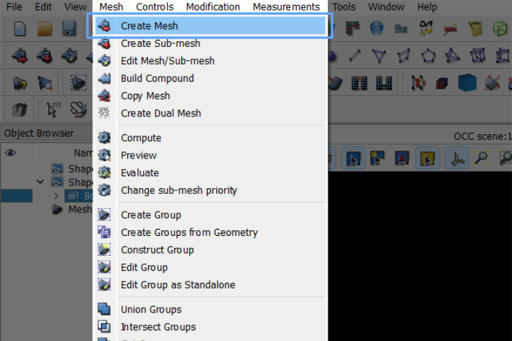

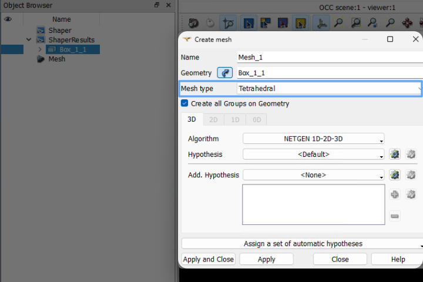
### B.2 — Mesh Settings

**Steps:**
1. In the **Create Mesh** dialog → select **3D** tab
2. Set **Algorithm** = `NETGEN 1D-2D-3D`
3. Click the gear icon to set **Hypothesis** (element size, fineness level)
4. Click **Apply and Close**
   
| Setting    | Value                       |
| ---------- | --------------------------- |
| Geometry   | Cantilever beam solid       |
| Mesh Type  | **3D**                      |
| Algorithm  | **NETGEN 1D-2D-3D**         |
| Hypothesis | NETGEN Simple 3D / Max Size |

### B.3 — Compute Mesh
1. Right-click the mesh in the object tree → **Compute**, then Wait for the mesh computation to complete
   
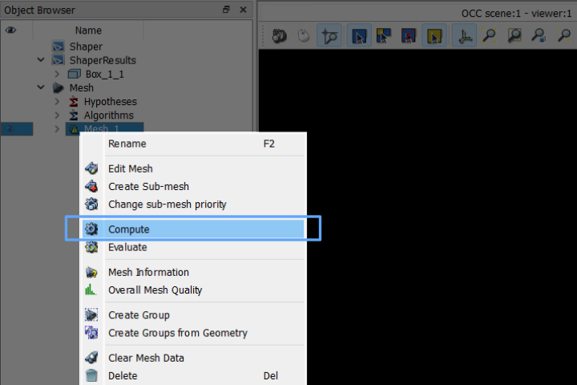

### B.4 — Export Mesh
1. Right-click the computed mesh → **Export** → choose format (e.g., **MED** or **UNV**), then Save the file (e.g., `cantilever_beam.med`)

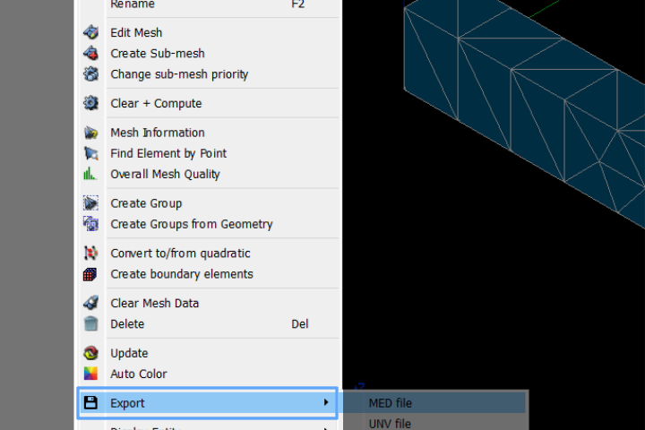
##  PART C — Solver Setup in eigenspace
### C.1 — Import Mesh

**Steps:**

1. In the left sidebar, expand **Mesh** section
2. Click **Import Mesh**
3. In the dialog → click **Choose file**
4. Navigate to and select your exported mesh file (`.med` )
5. Click **Save**
   
   
   
   
The mesh is now loaded. You can verify via **View Mesh Summary**.
### C.2 — Define Material
This bar is used to define different materials to various parts of the structure, allowing each component to have its own specific material properties for accurate analysis and simulation

**Steps:**

1. Expand **Materials** in the sidebar
2. Click **Define Material**
3. In the dialog, click **+** to add a new material
4. Enter material name: `steel`
5. Click **Save**

 *Additional properties (Young's modulus, Poisson's ratio) are set within the material editor.*
**Typical Steel Properties:**
| Property | Value |
|-------------------|---------------|
| Young's Modulus | `200 GPa` |
| Poisson's Ratio | `0.3` |
| Density | `7850 kg/m³` |
### C.3 — Assign Material
After defining the material properties, the next step is to assign the appropriate material to each part of the structure based on its design and functional requirements.

**Steps:**
1. Click **Assign Material** in the sidebar
2. A table shows all **Text IDs** (groups from SALOME):
| Text ID | Material to Assign |
|----------------|--------------------|
| `domain` | `steel` |
| `fixed_face` | `steel` |
| `loading_face` | `steel` |

3. For each row, select `steel` from the dropdown
4. Click **Save**

### C.4 — Define Boundary Condition

This toolbar is used to define and assign boundary conditions to different parts of the structure, ensuring that  constraints, and supports are accurately applied 

**Steps:**

1. Expand **Boundary Conditions** in the sidebar
2. Click **Define BC**
3. Click **+** to add a new BC
4. Name it: `Displacement Constraints`
5. Configure:
- **Type:** Displacement
- **U_x = 0, U_y = 0, U_z = 0** (fully fixed / clamped)
1. Click **Save**

### C.5 — Assign Boundary Condition

**Steps:**

1. Click **Assign BC** in the sidebar
2. The table shows all groups:
  
| Text ID        | Boundary Condition         |
| -------------- | -------------------------- |
| `domain`       | Unassigned                 |
| `fixed_face`   | `Displacement Constraints` |
| `loading_face` | Unassigned                 |

  
3. Assign **`Displacement Constraints`** to `fixed_face`
4. Leave `domain` and `loading_face` as **Unassigned**
5. Click **Save**

  *Only the clamped face gets the displacement constraint. The loading face remains free.*

### C.6 — Define Load
This bar is used to apply and define loads on various parts of the structure.
**Steps:**
1. Expand **Loads** in the sidebar
2. Click **Define Load**
3. Click **+** → name it: `Displacement Load`
4. Configure load parameters:
- **Type:** Displacement Load / Force
- Set magnitude and direction (e.g., `-Z` direction)
1. Click **Save**
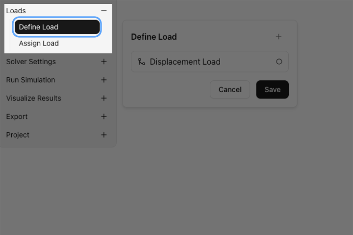

# C.7 — Assign Load
**Steps:**
1. Click **Assign Load** in the sidebar
2. The table shows:

| Text ID        | Load                |
| -------------- | ------------------- |
| `domain`       | Unassigned          |
| `fixed_face`   | Unassigned          |
| `loading_face` | `Displacement Load` |
3. Assign **`Displacement Load`** to `loading_face`
4. Click **Save**

 *The load is applied at the free end — correct cantilever beam setup.*

### C.8 — Solver Settings
#### C.8.1 — Select Physics

**Expand the _Solver Settings_ panel** in the left-hand navigation tree, then click **_Select Physics_** to open the physics configuration dialog and choose the appropriate analysis type (2D,3D)

**Steps:**
1. Expand **Solver Settings** → click **Select Physics**
2. Choose physics type:
- `3D Physics` — for full 3D solid elements
- `2D Physics` — for shell/plate elements (if applicable)
    Click **Save**
#### C.8.2 — Solver Parameters
1. Click **Solver Parameters**
2. Click **Save**

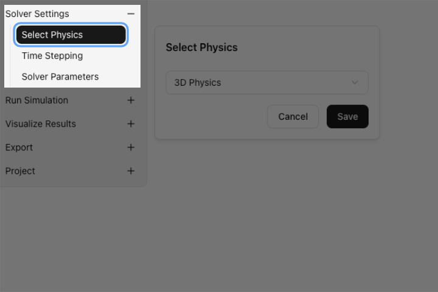

### C.9 — Run Simulation
1. Expand **Run Simulation** in the sidebar
2. Click **Start Simulation**
3. Monitor the solver log / progress
4. Wait for the simulation to complete ✅
   
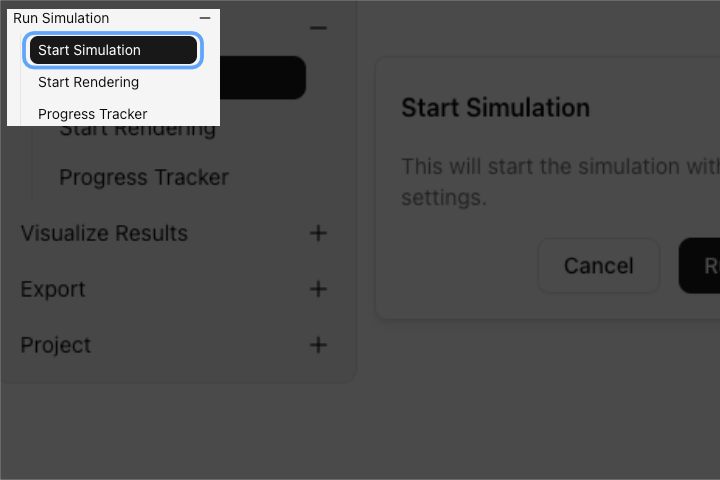

### C.10 — Visualize Results

1. Expand **Visualize Results** in the sidebar
2. Configure the visualization panel:
3. The contour plot renders on the mesh — inspect max/min values in the legend
      
| Setting          | Value                                  |
| ---------------- | -------------------------------------- |
| Representation   | `Surface with Edges`                   |
| Scalar Attribute | `Displacement` or `Stress_vonMises`    |
| Color Component  | `Z` (for Z-displacement) / `Magnitude` |
| Color Gradient   | `Custom` / `Rainbow`                   |
**Key Result Outputs:**

| Result             | Scalar Attribute  | Component   |
| ------------------ | ----------------- | ----------- |
| Z-Displacement     | `Displacement`    | `Z`         |
| Total Displacement | `Displacement`    | `Magnitude` |
| Von Mises Stress   | `Stress_vonMises` | `Magnitude` |

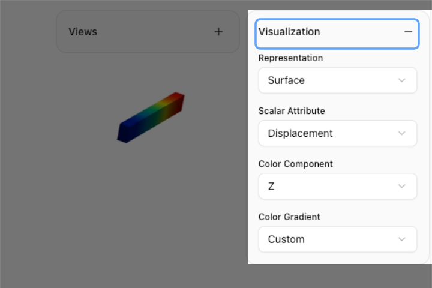

### C.11 — Export Results

1. Expand **Export** in the sidebar
2. Export results in desired format (CSV, VTK)