# Multi-Material Cantilever Beam FEA in eigenspacedesign
  
## Description

This practice problem demonstrates the complete finite element workflow for a multi-material 3D beam. The objective is to show how to create the geometry, generate the mesh, import the model into ESD, apply material properties, assign boundary conditions and loads, run the solver, and visualize the results.

The workflow uses SALOME for CAD geometry and mesh generation, and ESD for solver setup, simulation execution, and post-processing.

| Complete pipeline | Part A | Part B | Part C |
| --- | --- | --- | --- |
| Workflow stage | SALOME CAD | SALOME Mesh | eigenspacedesign Solver |
| Main activity | Geometry creation | Mesh generation | Setup and run |

## Model Overview
  
The cantilever beam is modelled as a two-segment, bimaterial solid:
  
| Segment        | Span         | Material         |
| -------------- | ------------ | ---------------- |
| Segment 1 (S1) | `0` to `L/2` | Structural Steel |
| Segment 2 (S2) | `L/2` to `L` | Aluminum Alloy   |
  
- The **fixed end** (clamped support) is at `x = 0` (steel segment face).
- The **free end** is at `x = L` (aluminum segment face), where a concentrated tip load or pressure load is applied.
- The two segments share a **conformal interface** at `x = L/2`; nodes at this plane are merged to enforce displacement continuity.
    
## PART A — CAD Geometry in SALOME (Shaper Module)
  
### A.1 — Open Shaper Module
  

Open the **SALOME** application. From the **Module Selector** in the SALOME toolbar or welcome screen, select **Shaper**. This activates the CAD modeling workspace for creating and editing geometric models.

  
> For a bimaterial cantilever beam, two distinct solid bodies are required:

> - **Steel body** — the first half of the beam (`0` to `L/2`)

> - **Aluminum body** — the second half of the beam (`L/2` to `L`)

> Both bodies must share a **coincident interface face** at `x = L/2`

  
   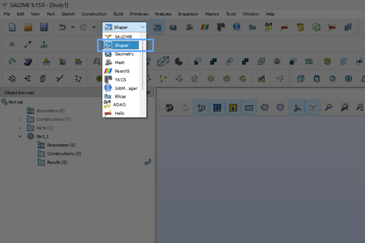
### A.2 — Define Parameters
  
Open the **Parameters** panel and create named parameters that control the beam geometry. Define each key dimension as a separate parameter to enable efficient parametric updates.
  
| Parameter | Example Value | Description                             |
| --------- | ------------- | --------------------------------------- |
| `L`       | `3000 mm`     | Total beam length                       |
| `W`       | `350 mm`      | Beam width (breadth)                    |
| `H`       | `400 mm`      | Beam height (depth)                     |
| `x_half`  | `1500 mm`     | Half-length = `L / 2` (interface plane) |
  
**Steps:**
  
1. Go to **Parameters** → **Define Parameter**
2. Enter `Name` and `Expression` for each parameter
3. Click **Apply** after each entry
4. Confirm all parameters appear in the model tree before proceeding

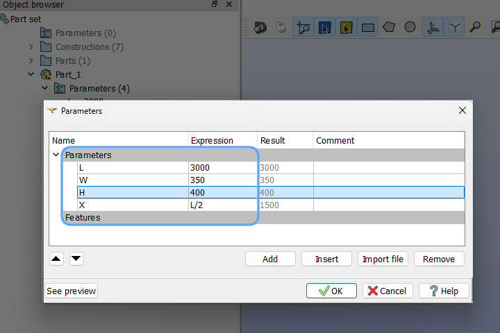
### A.3 — Create Steel Body (Segment 1: `0` to `L/2`)
  

1. Click **Sketch** → select the **YZ plane** as the reference plane (at `x = 0`)
2. Draw the beam cross-section rectangle of size `W × H`
3. Apply constraints:

- Horizontal dimension = `W`

- Vertical dimension = `H`

1. Click **Close Sketch**
2. Use **Extrude** → set extrusion direction along **+X axis** → length = `L_half`
3. Confirm → a 3D rectangular solid for the steel half is created
4. Rename the solid to `steel_body` in the object tree
   
### A.4 — Create Aluminum Body (Segment 2: `L/2` to `L`)
  

1. Click **Sketch** → select the **right face of `steel_body`** (the face at `x = L/2`) as the reference plane
  

> Selecting the interface face of `steel_body` ensures the aluminum sketch is coplanar with the steel face, guaranteeing a conformal interface.

  

2. Draw the **identical** cross-section rectangle `W × H` with the same origin constraints
3. Click **Close Sketch**
4. Use **Extrude** → direction along **+X axis** → length = `L_half`
5. Confirm → a 3D solid for the aluminum half is created
6. Rename the solid to `aluminum_body` in the object tree

  
 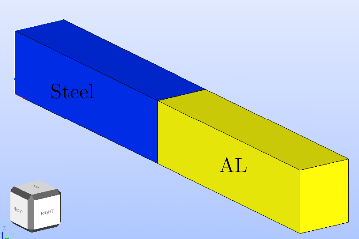

### A.5 — Define Groups
  
Navigate to the **Features** panel → **Group** tab. Create separate named groups for boundary condition assignment, load application, and material assignment.
  
| Group Name       | Entity Type | Selection                                            |
| ---------------- | ----------- | ---------------------------------------------------- |
| `steel_vol`      | Solid       | Steel body (`0` to `L/2`)                            |
| `alum_vol`       | Solid       | Aluminum body (`L/2` to `L`)                         |
| `fixed_face`     | Face        | Left end face of steel body at `x = 0` (clamped end) |
| `interface_face` | Face        | Shared face between steel and aluminum at `x = L/2`  |
| `free_face`      | Face        | Right end face of aluminum body at `x = L`           |
  

**Steps:**
  
1. Go to **Groups** → **Create Group**
2. Select **type** (Solid / Face / Edge)
3. Pick the required geometry on screen
4. Name the group and click **Apply**
5. Repeat for all groups listed above

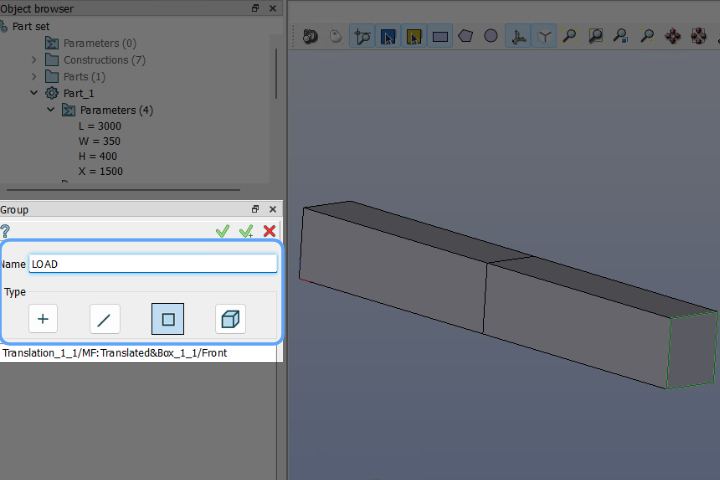
 
## PART B — Mesh Generation in SALOME (Mesh Module)
  
### B.1 — Switch to Mesh Module
  
1. After completing geometry preparation, switch to mesh generation.
2. In the **Module Selector**, click **Mesh** to switch from the Shaper/Geometry module.
3. In the **Object Browser**, locate the **compound geometry** containing both solids (`steel_body` + `aluminum_body`).
4. **Right-click** on the compound geometry → select **Create Mesh**. This opens the **Mesh Creation** dialog.
  

### B.2 — Mesh Settings
  
**Steps:**
  
1. In the **Create Mesh** dialog → select **3D** tab
2. Set **Algorithm** = `NETGEN 1D-2D-3D`
3. Click the gear icon → open **Hypothesis** settings
  
| Setting        | Value                                        |
| -------------- | -------------------------------------------- |
| Geometry       | Compound (steel body + aluminum body)        |
| Mesh Type      | **3D**                                       |
| Algorithm      | **NETGEN 1D-2D-3D**                          |
| Max Size       | `15 mm` (global maximum element size)        |
| Min Size       | `3 mm` (minimum element size near interface) |
| Fineness       | **Fine** or **Very Fine**                    |
| Growth Rate    | `0.3`                                        |
| Quad Dominated | Off (use tetrahedral elements)               |
  
1. Click **Apply and Close**
  
 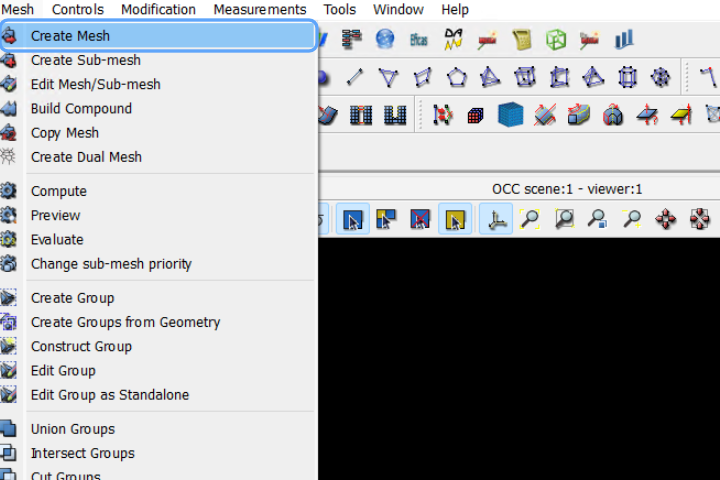
### B.4 — Compute Mesh
  
1. Right-click the mesh object in the object tree → **Compute**
2. Wait for the mesh computation to complete
  
  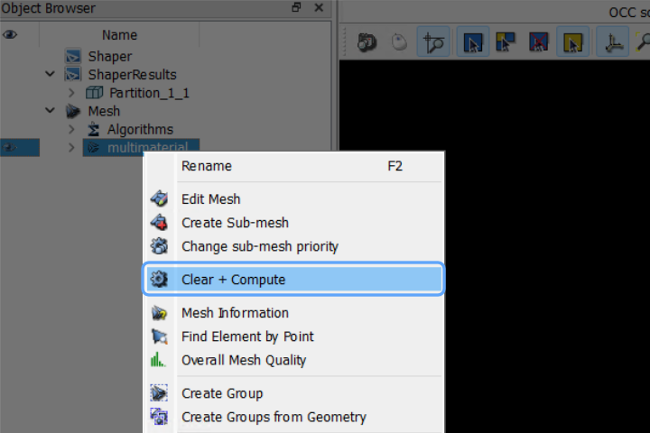
  
### B.5 — Export Mesh
 
1. Right-click the computed mesh → **Export** → choose **MED** format (`.med`)
2. Save the file: e.g., `cantilever_bimaterial.med`
  
## PART C — Solver Setup in eigenspace
  
### C.1 — Import Mesh
  
**Steps:**

  
1. In the left sidebar, expand the **Mesh** section
2. Click **Import Mesh**
3. In the dialog → click **Choose file**
4. Navigate to and select `cantilever_bimaterial.med`
5. Click **Save**
  
The mesh groups defined in SALOME will appear as **Text IDs** throughout the eigenspace setup panels.
  
  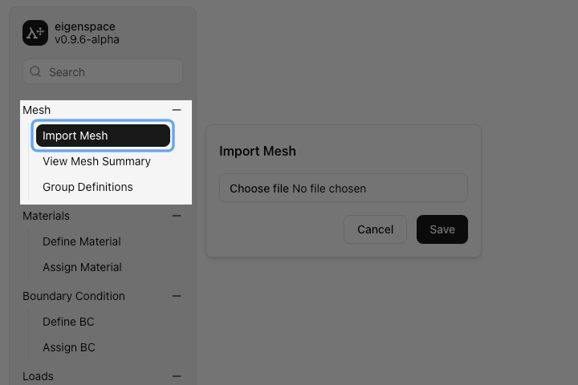
### C.2 — Define Materials
  
This section defines two distinct materials — **Structural Steel** and **Aluminum Alloy** — with their respective mechanical properties.
  
#### C.2.1 — Define Steel Material
  
1. Expand **Materials** in the sidebar → click **Define Material**
2. Click **+** to add a new material
3. Enter material name: `Structural_Steel`
4. Click **Save**
  
**Structural Steel Properties:**
  
| Property        | Value         |
| --------------- | ------------- |
| Young's Modulus | `200,000 MPa` |
| Poisson's Ratio | `0.30`        |
| Density         | `7850 kg/m³`  |
  
#### C.2.2 — Define Aluminum Material
  
1. Click **+** to add a second material
2. Enter material name: `Aluminum_Alloy`
3. Click **Save**

  
**Aluminum Alloy (6061-T6) Properties:**
  
| Property        | Value        |
| --------------- | ------------ |
| Young's Modulus | `69,000 MPa` |
| Poisson's Ratio | `0.33`       |
| Density         | `2700 kg/m³` |

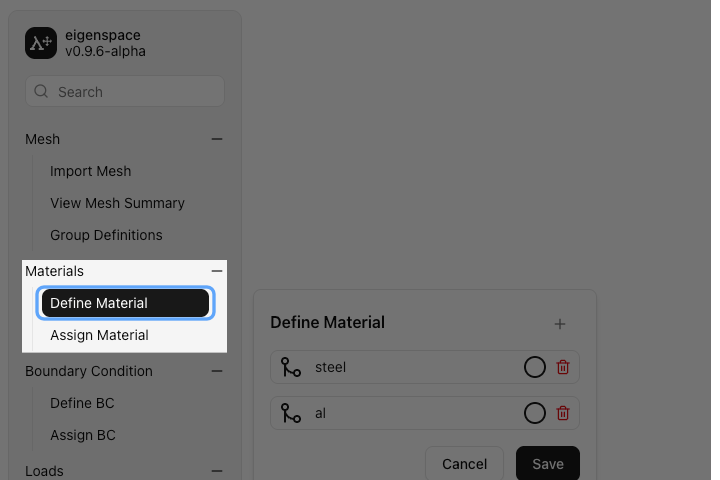
### C.3 — Assign Materials
  
After defining both materials, assign each to the appropriate mesh group (Text ID).
  
**Steps:**
  
1. Click **Assign Material** in the sidebar
2. The table shows all **Text IDs** (groups imported from the SALOME mesh):
  
| Text ID          | Material to Assign |
| ---------------- | ------------------ |
| `steel_vol`      | `Structural_Steel` |
| `alum_vol`       | `Aluminum_Alloy`   |
| `fixed_face`     | Unassigned         |
| `interface_face` | Unassigned         |
| `free_face`      | Unassigned         |
| `top_face`       | Unassigned         |
  
3. For each volume domain row, select the correct material from the dropdown
4. Click **Save**

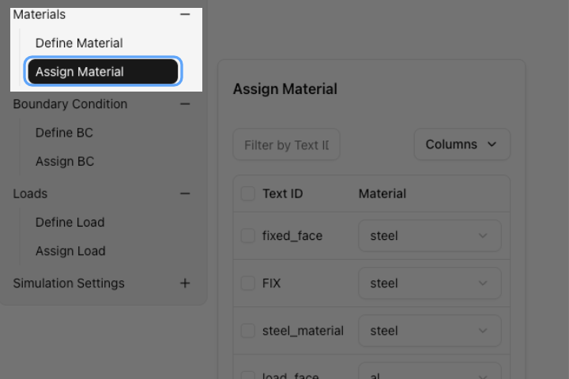
### C.4 — Define Boundary Conditions
  
This section applies support conditions for a **cantilever beam** (fully fixed at `x = 0`).
  
#### C.4.1 — Define Fixed Support
  
**Steps:**
  
1. Expand **Boundary Conditions** → click **Define BC**
2. Click **+** → name it: `Fixed_Support`
3. Configure:

- **Type:** Displacement

- **U_x = 0, U_y = 0, U_z = 0** (all translations constrained)

- **R_x = 0, R_y = 0, R_z = 0** (all rotations constrained — fully clamped)
1. Click **Save**

> For a **cantilever beam**, the fixed end at `x = 0` must suppress all six degrees of freedom. This simulates a rigid wall connection.
  
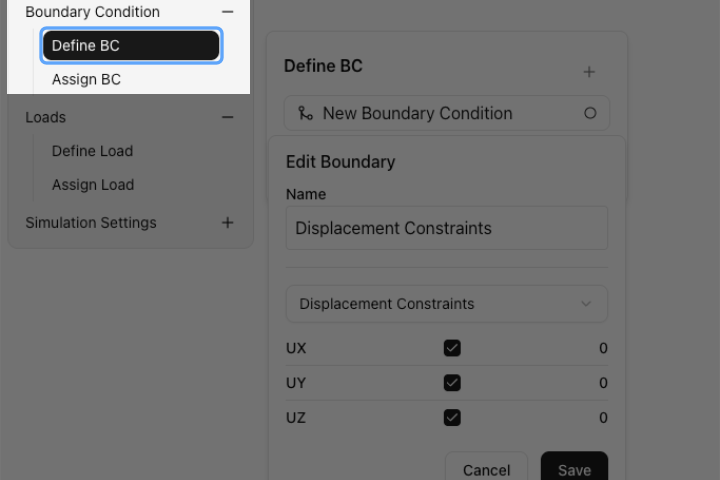
### C.5 — Assign Boundary Conditions

**Steps:**
 
1. Click **Assign BC** in the sidebar
2. The table shows all groups:
  
| Text ID          | Boundary Condition |
| ---------------- | ------------------ |
| `steel_vol`      | Unassigned         |
| `alum_vol`       | Unassigned         |
| `fixed_face`     | `Fixed_Support`    |
| `interface_face` | Unassigned         |
| `free_face`      | Unassigned         |
| `top_face`       | Unassigned         |
  
1. Assign **`Fixed_Support`** to `fixed_face`
2. Click **Save**

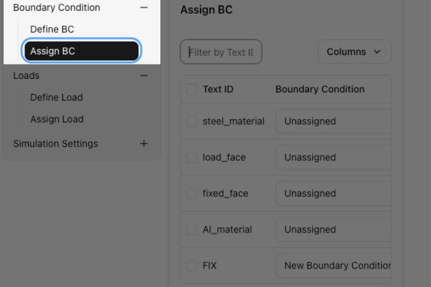
### C.6 — Define Load
  
The bimaterial cantilever beam is subjected to either a **tip load** at the free end 
  
#### C.6.1 —  point Load at Free End
  
**Steps:**

  

1. Expand **Loads** → click **Define Load**
2. Click **+** → name it: `p_load`
3. Configure load parameters:

- **Type:**  load
- **Magnitude:** `100 MPa`
- **Direction:** Normal to surface (–Y direction, downward, into the free face)
1. Click **Save**
  
  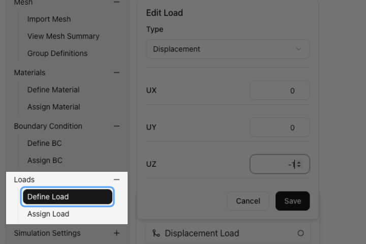
### C.7 — Assign Load
  
**Steps:**
  
1. Click **Assign Load** in the sidebar
2. The table shows:

  
| Text ID          | Load (Option A — Tip Load) | Load (Option B — UDL) |
| ---------------- | -------------------------- | --------------------- |
| `steel_vol`      | Unassigned                 | Unassigned            |
| `alum_vol`       | Unassigned                 | Unassigned            |
| `fixed_face`     | Unassigned                 | Unassigned            |
| `interface_face` | Unassigned                 | Unassigned            |
| `free_face`      | `point_load                | assigned              |
  
3. Assign the load to the appropriate group per chosen option
4. Click **Save**

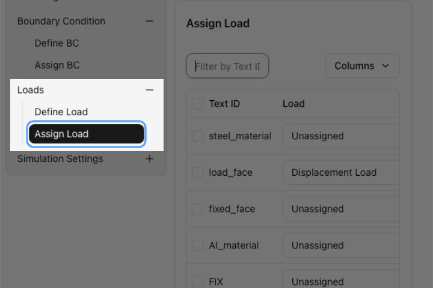
### C.8 — Solver Settings
  #### C.8.1 — Select Physics
  
1. Expand **Solver Settings** → click **Select Physics**
2. Choose physics type:

- `3D Physics` — for full 3D solid elements (used here for the bimaterial solid model)

- `2D Physics` — not applicable for this multi-material solid model

3. Click **Save**
  
  
### C.9 — Run Simulation
  
1. Expand **Run Simulation** in the sidebar

2. Click **Start Simulation**

3. Monitor the solver log / progress output panel

4. Wait for the simulation to complete ✅

  
> **Expected results for cantilever tip load:** Maximum displacement at free end (`x = L`), maximum von Mises stress near the fixed face (`x = 0`), and a visible stress discontinuity at the material interface (`x = L/2`) due to the difference in Young's modulus between steel and aluminum.

### C.10 — Visualize Results
  
1. Expand **Visualize Results** in the sidebar

2. Configure the visualization panel as follows:
 
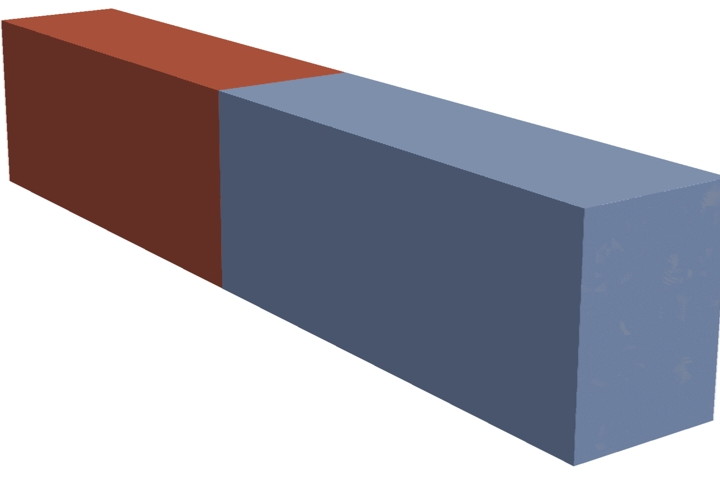  
#### Key Post-Processing Checks
 
| Check                           | Expected Observation                                                     |
| ------------------------------- | ------------------------------------------------------------------------ |
| Max displacement location       | At the free end of the aluminum segment (`x = L`)                        |
| Max von Mises stress location   | At the fixed face root in the steel segment (`x = 0`)                    |
| Stress at interface (`x = L/2`) | Discontinuity visible in stress field (ε continuous; σ jumps by E ratio) |
| Deformed shape                  | Smooth bending curve across both segments; no kink at interface          |

### C.11 — Export Results
  
1. Expand **Export** in the sidebar

2. Export results in the desired format:
  
| Format | Contents                                          | Use Case                    |
| ------ | ------------------------------------------------- | --------------------------- |
| `CSV`  | Nodal displacements, reaction forces              | Post-processing in Excel    |
| `VTK`  | Full field results (stress, strain, displacement) | ParaView visualization      |
| `MED`  | Results mapped back to mesh groups                | Further eigenspace analysis |