# Steel bracket FEA — step-by-step workflow using ESD

## Description

This practice problem demonstrates the complete finite element workflow for a 3D steel bracket. The bracket is fixed at the base and loaded through the vertical plate to evaluate deformation and stress concentration around the slot, bolt holes, and fillet regions.

The workflow uses **SALOME** for CAD geometry and mesh generation, and **ESD** for solver setup, simulation execution, result visualization, and result export.

| Complete pipeline | Part A | Part B | Part C |
| --- | --- | --- | --- |
| Workflow stage | SALOME CAD | SALOME Mesh | ESD Solver |
| Main activity | Geometry creation | Mesh generation | Setup and run |
 
  
## PART A — CAD Geometry in SALOME (Shaper Module)
  
### A.1 — Open Shaper Module
  
Open the **SALOME** application. From the **Module Selector** located in the SALOME toolbar or welcome screen, select **Shaper**. This activates the CAD modeling workspace used for creating and editing geometric models.
   
   
### A.2 — Define Parameters
  
Open the **Parameters** panel and create the required named parameters that control the bracket geometry. Define each key dimension as a separate parameter with an appropriate name and value. Using named parameters allows dimensions to be modified easily at any stage without manually editing the geometry, enabling efficient design updates and parametric studies.
  

| Parameter | Example Value | Description            |
| --------- | ------------- | ---------------------- |
| `BW`      | `150 mm`      | Bracket base width     |
| `BL`      | `150 mm`      | Bracket base length    |
| `VH`      | `180 mm`      | Vertical plate height  |
| `T`       | `15 mm`       | Plate thickness        |
| `SL`      | `60 mm`       | Slot length            |
| `SW`      | `15 mm`       | Slot width             |
| `HD`      | `18 mm`       | Bolt hole diameter     |
| `R`       | `20 mm`       | Top-edge fillet radius |

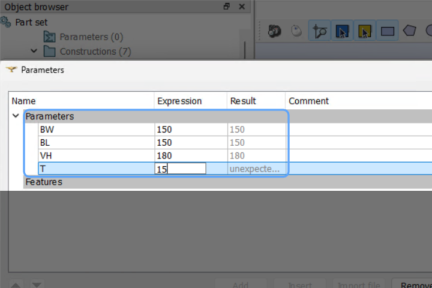

### A.3 — Create Sketch and Extrude
 
The bracket consists of three main geometric features: the **horizontal base plate**, the **vertical back plate**, and the **central gusset/rib** connecting them. A **slot** is cut through the vertical face, and **bolt holes** are drilled through both plates.
  
#### A.3.1 — Base Plate
  
1. Click **Sketch** → select the **XZ plane** as the reference plane
2. Draw the base rectangle using parameters `BL × BW`
3. Apply **constraints**: horizontal, vertical, fixed dimensions
4. Click **Close Sketch**
5. Use **Extrude** → set depth to `T` (plate thickness)
6. Confirm → the horizontal base plate solid is created
   
  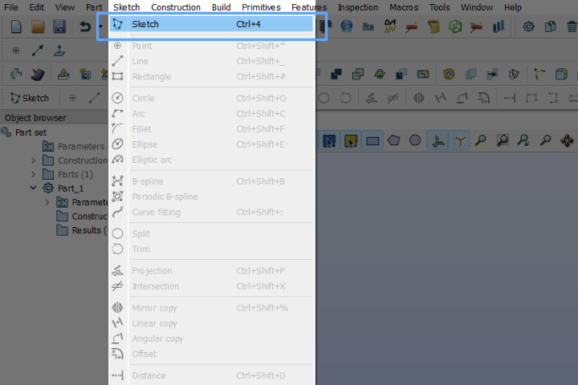
#### A.3.2 — Vertical Back Plate (Extrude)
  
1. Click **Sketch** → select the **YZ plane** (or the top face of the base plate)
2. Draw the vertical plate profile (`BW × VH`) with a rounded top arc (radius `R`)
3. Apply constraints and close the sketch
4. Use **Extrude** → depth = `T`
5. Confirm → the vertical plate solid is created
  
  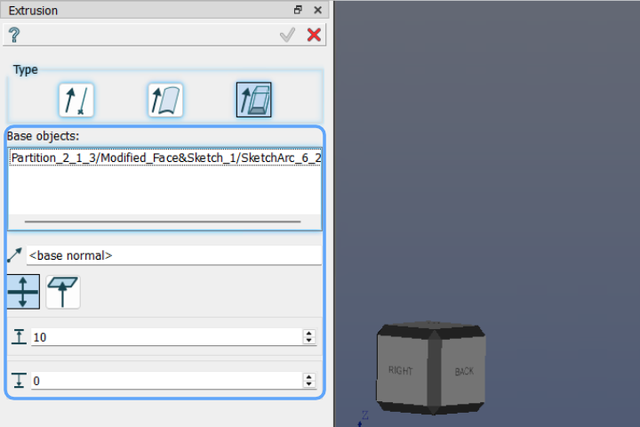
#### A.3.3 — Boolean Union
  
1. Select **Boolean → Fuse** from the Features panel
2. Select both the base plate and vertical plate bodies
3. Click **Apply** → a single unified bracket body is produced
  
  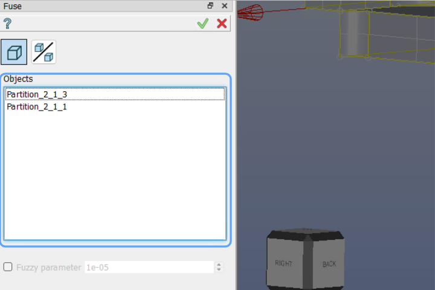
#### A.3.4 — Slot (Cut)
  
1. Click **Sketch** → select the **front face** of the vertical plate
2. Draw the slot rectangle at the center of the vertical face: width `SW`, height `SL`
3. Close sketch → use **Extrude / Cut** (Boolean Remove) with depth = `T` (through all)
4. Confirm → the central slot is cut through the vertical plate
   
  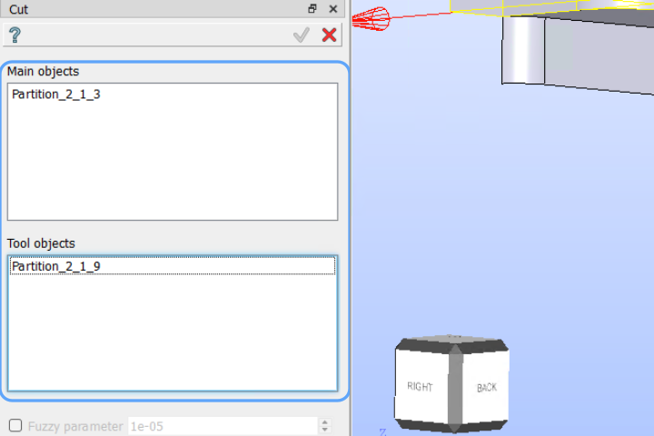
#### A.3.5 — Bolt Holes
  
1. Click **Sketch** → select the **top face** of the base plate
2. Draw four circles (diameter `HD`) at the bolt hole corner positions
3. Close sketch → **Extrude / Cut** through all
4. Repeat for the **vertical plate** face: draw four circles at corner bolt positions and cut through all
5. Confirm → all bolt holes are created on both plates
  
  
### A.4 — Define Groups
  
Navigate to the **Features** panel and select the **Group** tab. Create separate groups to organize model entities based on their purpose: loads, supports, and bodies.
  
  
| Group Name        | Type  | Selection                                          |
| ----------------- | ----- | -------------------------------------------------- |
| `domain`          | Solid | Entire bracket body                                |
| `fixed_face`      | Face  | Bottom face of base plate (bolted to ground)       |
| `loading_face`    | Face  | Top bolt-hole faces / vertical plate top edge      |
| `bolt_holes_base` | Face  | All four bolt hole cylindrical faces — base plate  |
| `bolt_holes_vert` | Face  | All four bolt hole cylindrical faces — vert. plate |
| `slot_face`       | Face  | Inner cylindrical/slot face on vertical plate      |
  
**Steps:**

  
1. Go to **Groups** → **Create Group**
2. Select **type** (Solid / Face)
3. Pick the geometry on screen
4. Name the group and click **Apply**
5. Repeat for all groups listed above
  
  
  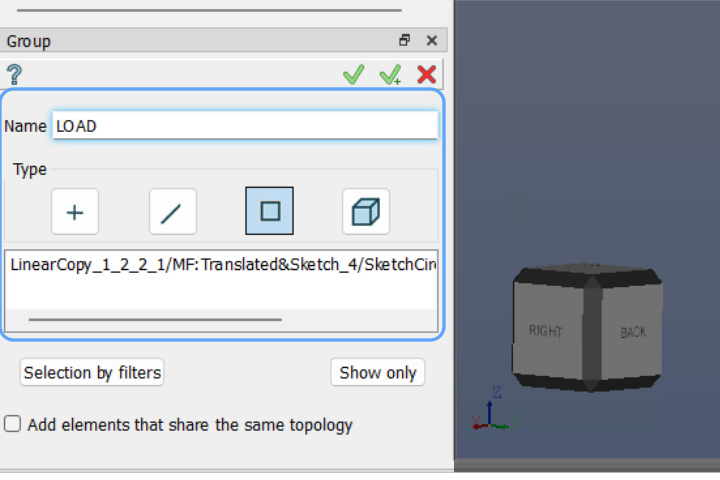
  
## PART B — Mesh Generation in SALOME (Mesh Module)
  
### B.1 — Switch to Mesh Module
  
1. After completing geometry preparation, switch to mesh generation.
2. In the **Module Selector** (top of SALOME interface), click **Mesh** to switch from the Shaper/Geometry module to the Mesh workbench.
3. In the **Object Browser** on the left, locate the bracket geometry (the fused solid with holes and slot).
4. **Right-click** on the geometry → select **`Create Mesh`** from the context menu. The **Mesh Creation** dialog opens.

### B.2 — Mesh Settings
  
The bracket contains stress-critical features (slot edges, fillet, bolt holes) that require local mesh refinement.
  
**Steps:**

  
1. In the **Create Mesh** dialog → select the **3D** tab
2. Set **Algorithm** = `NETGEN 1D-2D-3D`
3. Click the gear icon → set **Hypothesis** (global element size)
4. Click **Apply and Close**
  
| Setting         | Value                         |
| --------------- | ----------------------------- |
| Geometry        | Steel bracket solid (unified) |
| Mesh Type       | **3D**                        |
| Algorithm       | **NETGEN 1D-2D-3D**           |
| Hypothesis      | NETGEN Simple 3D / Max Size   |
| Global Max Size | `8 mm`                        |
| Min Size        | `2 mm`                        |
  
  
  

   
### B.3 — Compute Mesh
  
1. Right-click the mesh in the object tree → **Compute**
2. Wait for mesh computation to complete ✅
   
    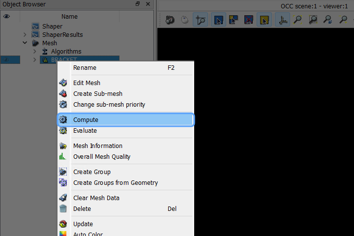
  
### B.4 — Export Mesh
  
1. Right-click the computed mesh → **Export** → choose **MED** format
2. Save the file as `steel_bracket.med`
  
  
  
## PART C — Solver Setup in eigenspace
  
### C.1 — Import Mesh
  
**Steps:**
  
1. In the left sidebar, expand the **Mesh** section
2. Click **Import Mesh**
3. In the dialog → click **Choose file**
4. Navigate to and select `steel_bracket.med`
5. Click **Save**

The mesh is now loaded. Verify via **View Mesh Summary** — confirm that all groups (`domain`, `fixed_face`, `loading_face`, `bolt_holes_base`, `bolt_holes_vert`, `slot_face`) are listed as Text IDs.

### C.2 — Define Material
  This step assigns material properties to the bracket. Steel is used throughout the entire body.
  
**Steps:**
  
1. Expand **Materials** in the sidebar
2. Click **Define Material**
3. In the dialog, click **+** to add a new material
4. Enter material name: `steel`
5. Click **Save**
  
*Additional properties (Young's modulus, Poisson's ratio, density) are set within the material editor.*
  
**Steel Material Properties:**
  
| Property          | Value           |
| ----------------- | --------------- |
| Young's Modulus   | `200 GPa`       |
| Poisson's Ratio   | `0.30`          |
| Density           | `7850 kg/m³`    |
| Yield Strength    | `250 MPa` (ref) |
   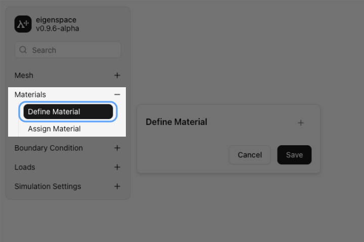
### C.3 — Assign Material
  
After defining material properties, assign the material to each group in the model.
  
**Steps:**
  
1. Click **Assign Material** in the sidebar
2. A table shows all **Text IDs** (groups from SALOME):
  
| Text ID           | Material to Assign |
| ----------------- | ------------------ |
| `domain`          | `steel`            |
| `fixed_face`      | `steel`            |
| `loading_face`    | `steel`            |
| `bolt_holes_base` | `steel`            |
| `bolt_holes_vert` | `steel`            |
| `slot_face`       | `steel`            |
  
3. For each row, select `steel` from the dropdown
4. Click **Save**
 
    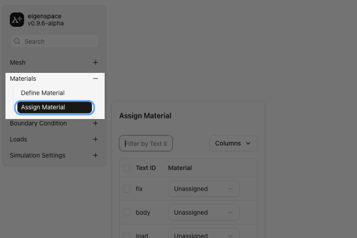### C.4 — Define Boundary Condition
  
The bracket base plate is assumed to be fully bolted to a rigid foundation. All six degrees of freedom on the bottom face are constrained.
  
**Steps:**
  
1. Expand **Boundary Conditions** in the sidebar
2. Click **Define BC**
3. Click **+** to add a new BC
4. Name it: `Fixed_Support`
5. Configure:

- **Type:** Displacement
- **U_x = 0, U_y = 0, U_z = 0** (fully fixed / clamped)

6. Click **Save**

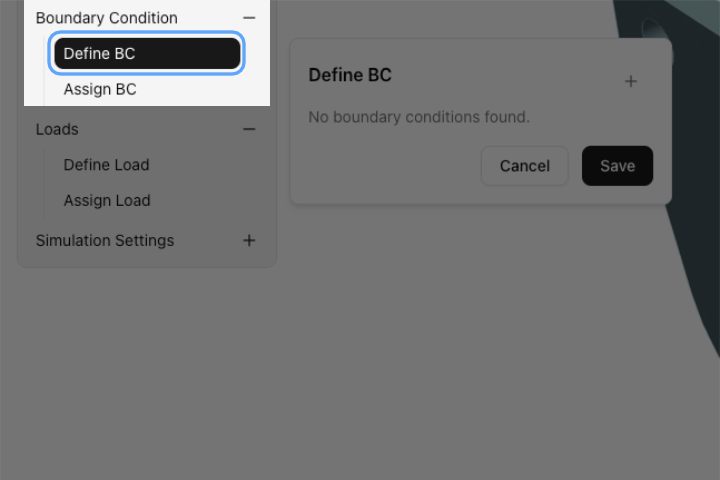
### C.5 — Assign Boundary Condition
  
**Steps:**
  
1. Click **Assign BC** in the sidebar
2. The table shows all groups:

  
| Text ID           | Boundary Condition |
| ----------------- | ------------------ |
| `domain`          | Unassigned         |
| `fixed_face`      | `Fixed_Support`    |
| `loading_face`    | Unassigned         |
| `bolt_holes_base` | Unassigned         |
| `bolt_holes_vert` | Unassigned         |
| `slot_face`       | Unassigned         |
 

3. Assign **`Fixed_Support`** to `fixed_face`
4. Leave all other groups as **Unassigned**
5. Click **Save**

  
*Only the bottom face of the base plate is constrained. The vertical plate remains free to deform under the applied load.*

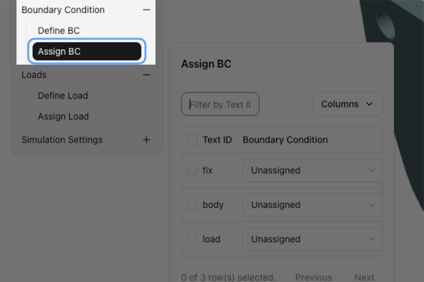

### C.6 — Define Load
 
The bracket is loaded through the bolt holes on the vertical plate (e.g., a bolt or pin transferring a shear/axial load from an attached component). A representative pressure or force load is applied to the `loading_face`.
  
**Steps:**
  
1. Expand **Loads** in the sidebar
2. Click **Define Load**
3. Click **+** → name it: `Bracket_Load`
4. Configure load parameters:
- **Type:** Force / Pressure
- **Direction:** `-Y` (downward, perpendicular to vertical plate)
- **Magnitude:** e.g., `10,000 N` total (or equivalent surface pressure)

5. Click **Save**

  **Load Definition Summary:**
  
| Parameter    | Value                              |
| ------------ | ---------------------------------- |
| Load Name    | `Bracket_Load`                     |
| Type         | Force (or Surface Pressure)        |
| Applied Face | `loading_face`                     |
| Direction    | `-Y` (gravity / service direction) |
| Magnitude    | `10,000 N`                         |

%201.png)
### C.7 — Assign Load
  
**Steps:**
  
1. Click **Assign Load** in the sidebar
2. The table shows:
  
| Text ID           | Load           |
| ----------------- | -------------- |
| `domain`          | Unassigned     |
| `fixed_face`      | Unassigned     |
| `loading_face`    | `Bracket_Load` |
| `bolt_holes_base` | Unassigned     |
| `bolt_holes_vert` | Unassigned     |
| `slot_face`       | Unassigned     |
  
1. Assign **`Bracket_Load`** to `loading_face`
2. Click **Save**
  
*The load is applied at the vertical plate loading face — correct bracket setup for a mounted component transferring load into the bracket.*
 
 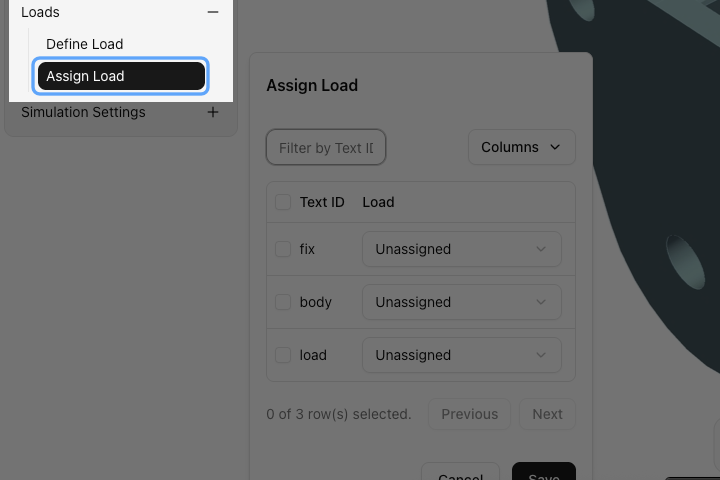
 
### C.8 — Solver Settings
  #### C.8.1 — Select Physics
  
Expand the **Solver Settings** panel in the left-hand navigation tree, then click **Select Physics** to open the physics configuration dialog.
  
**Steps:**
  1. Expand **Solver Settings** → click **Select Physics**
2. Choose physics type:
- `3D Physics` — for full 3D solid tetrahedral elements *(select this)*
- `2D Physics` — for shell/plate elements (not applicable here)

3. Click **Save**
  #### C.8.2 — Solver Parameters
  4. Click **Solver Parameters**
5. Confirm default linear elastic static analysis settings
6. Click **Save**

 
**Solver Parameters Summary:**
  
| Parameter         | Value                      |
| ----------------- | -------------------------- |
| Analysis Type     | Linear Static              |
| Physics Dimension | 3D                         |
       

  
### C.9 — Run Simulation
  
1. Expand **Run Simulation** in the sidebar
2. Click **Start Simulation**
3. Monitor the solver log / progress bar
4. Wait for the simulation to complete ✅

  
*Monitor convergence and check for any warnings regarding poor element quality or unconstrained degrees of freedom.*

   

  
### C.10 — Visualize Results
  
1. Expand **Visualize Results** in the sidebar
2. Configure the visualization panel as per the table below
3. The contour plot renders on the mesh — inspect max/min values in the legend
  
| Setting          | Value                               |
| ---------------- | ----------------------------------- |
| Representation   | `Surface with Edges`                |
| Scalar Attribute | `Displacement` or `Stress_vonMises` |
| Color Component  | `Magnitude`                         |
| Color Gradient   | `Rainbow` (Blue = low → Red = high) |
  
**Key Result Outputs:**
  
| Result             | Scalar Attribute  | Component   | Expected Location              |
| ------------------ | ----------------- | ----------- | ------------------------------ |
| Z-Displacement     | `Displacement`    | `Z`         | Top edge of vertical plate     |
| Total Displacement | `Displacement`    | `Magnitude` | Free top edge                  |
| Von Mises Stress   | `Stress_vonMises` | `Magnitude` | Slot edges / base-vert. fillet |
  
**Result Interpretation :
  
| Result Item          | Observed Value       | Location                              |
| -------------------- | -------------------- | ------------------------------------- |
| Max Von Mises Stress | ~ **170 MPa**        | Slot edge on vertical face (red zone) |
| Min Von Mises Stress | ~ **0 MPa**          | Base plate corners (blue zone)        |
| Critical Region      | Slot mid-section     | Stress concentration due to geometry  |
| Safety Factor (ref.) | ~ **1.47** (250/170) | Yield check for structural steel      |
  
> **Note:** The peak stress of ~170 MPa occurs at the slot edges on the vertical plate, which is the expected stress concentration zone. Ensure this remains below the material yield strength (250 MPa for mild steel) with an adequate safety factor.

  
### C.11 — Export Results
  

1. Expand **Export** in the sidebar
2. Export results in the desired format:
  
| Format | Use Case                                |
| ------ | --------------------------------------- |
| `CSV`  | Tabular node/element stress & disp data |
| `VTK`  | 3D post-processing in ParaView          |
| `MED`  | Re-import into SALOME for further use   |
  
## Summary
  
| Step | Module     | Action                         | Output                        |
| ---- | ---------- | ------------------------------ | ----------------------------- |
| A.1  | Shaper     | Open Shaper module             | CAD workspace active          |
| A.2  | Shaper     | Define parameters              | Parametric geometry control   |
| A.3  | Shaper     | Sketch, extrude, cut, fuse     | Unified bracket solid         |
| A.4  | Shaper     | Create groups                  | Named faces/solid for BCs     |
| B.1  | Mesh       | Switch to Mesh, Create Mesh    | Mesh dialog open              |
| B.2  | Mesh       | Set algorithm & hypothesis     | NETGEN 3D configured          |
| B.3  | Mesh       | Compute mesh                   | FE mesh generated             |
| B.4  | Mesh       | Export as `.med`               | `steel_bracket.med`           |
| C.1  | eigenspace | Import mesh                    | Mesh loaded                   |
| C.2  | eigenspace | Define material (steel)        | Material defined              |
| C.3  | eigenspace | Assign material to domain      | All groups assigned           |
| C.4  | eigenspace | Define BC (fixed base)         | `Fixed_Support` created       |
| C.5  | eigenspace | Assign BC to `fixed_face`      | Clamped base plate            |
| C.6  | eigenspace | Define load on vertical plate  | `Bracket_Load` created        |
| C.7  | eigenspace | Assign load to `loading_face`  | Load applied at vertical face |
| C.8  | eigenspace | Select 3D physics & parameters | Solver configured             |
| C.9  | eigenspace | Run simulation                 | Analysis complete ✅           |
| C.10 | eigenspace | Visualize Von Mises & disp.    | Contour plot rendered         |
| C.11 | eigenspace | Export CSV / VTK               | Results saved                 |