# Knuckle Joint FEA in eigenspacedesign
  
## Description

This practice problem demonstrates the complete finite element workflow for a knuckle joint. The bracket is fixed at the base and loaded through the vertical plate to evaluate deformation and stress concentration around the slot, bolt holes, and fillet regions.

The workflow uses **SALOME** for CAD geometry and mesh generation, and **ESD** for solver setup, simulation execution, result visualization, and result export.

| Complete pipeline | Part A | Part B | Part C |
| --- | --- | --- | --- |
| Workflow stage | SALOME CAD | SALOME Mesh | ESD Solver |
| Main activity | Geometry creation | Mesh generation | Setup and run |
 
  
  
## PART A — CAD Geometry in SALOME (Shaper Module)
  
### A.1 — Open Shaper Module
  
Open the **SALOME** application. From the **Module Selector** located in the SALOME toolbar or welcome screen, select **Shaper**. This activates the CAD modeling workspace for creating and editing geometric models.

  

> A knuckle joint consists of three primary solid bodies:

> - **Eye end (forked end / clevis)** — the fork-shaped rod end with two lugs

> - **Single eye (pin eye)** — the plain rod end that fits inside the fork

> - **Knuckle pin** — the cylindrical pin connecting both eyes through the lugs

  

  

  

### A.2 — Define Parameters
  
Open the **Parameters** panel and create named parameters that control the joint geometry. Define each dimension as a separate parameter to enable efficient parametric updates.

| Parameter  | Example Value | Description                               |
| ---------- | ------------- | ----------------------------------------- |
| `d`        | `30 mm`       | Diameter of the connecting rod            |
| `d_pin`    | `25 mm`       | Diameter of the knuckle pin               |
| `D_eye`    | `50 mm`       | Outer diameter of the eye end             |
| `t_eye`    | `30 mm`       | Thickness of single eye                   |
| `t_fork`   | `15 mm`       | Thickness of each fork lug                |
| `L_rod`    | `80 mm`       | Length of rod shank on each side          |
| `gap`      | `2 mm`        | Clearance gap between fork and single eye |
| `R_fillet` | `2.5 mm`      | Fillet radius at stress concentration     |

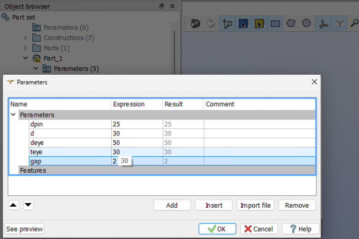

### A.3 — Create the Single Eye (Pin Eye Rod)
 
1. Click **Sketch** → select the **XY plane** as the reference plane

2. Draw the circular cross-section of the rod using diameter `d`

3. Apply a **fixed-point** constraint at the origin; apply **equal-radius** to the circle

4. Click **Close Sketch**

5. Use **Extrude** → set extrusion length to `L_rod`

6. Create a second sketch on the extruded face — draw an **annular ring** (outer diameter `D_eye`, inner diameter `d_pin + 1 mm` clearance)

7. Extrude the annulus by `t_eye` to form the eye lug

8. Use **Fillet** on the transitions between rod shank and eye lug with radius `R_fillet`

9. Rename the body to `single_eye` in the object tree
   
  
### A.4 — Create the Fork (Clevis / Eye End)
  
#### A.4.1 — Fork Shank
  
1. Click **Sketch** → select the **XY plane**

2. Draw a circle of diameter `d` centred at the origin (opposite side)

3. Click **Close Sketch**

4. **Extrude** by `L_rod` in the negative X direction

  
#### A.4.2 — Fork Lugs

  

1. Click **Sketch** → select the face at the end of the fork shank

2. Draw the fork cross-section: a rectangular profile of width `D_eye` and height `D_eye`, with the pin hole of diameter `d_pin + 1 mm` punched through each lug

3. Click **Close Sketch**

4. **Extrude** each lug plate by `t_fork`; repeat for the second lug, offset by `t_eye + 2 × gap`

5. Use **Boolean Fuse** to merge both lug extrusions with the shank body

6. Apply **Fillet** to lug-shank junctions with radius `R_fillet`

7. Rename the merged body to `fork_eye`
  
#### A.4.3 — Knuckle Pin
  
1. Click **Sketch** → select the **YZ plane**

2. Draw a circle of diameter `d_pin`

3. **Extrude** along X-axis by total pin length = `t_fork + t_eye + t_fork + 2 × gap + 4 mm` 

4. Rename to `knuckle_pin`

    
### A.5 — Define Groups
  
Navigate to the **Features** panel → **Group** tab. Create separate named groups for boundary condition assignment, load application, and material assignment.
  
| Group Name       | Entity Type | Selection                                          |
| ---------------- | ----------- | -------------------------------------------------- |
| `single_eye_vol` | Solid       | Single eye rod body                                |
| `fork_eye_vol`   | Solid       | Fork (clevis) rod body                             |
| `pin_vol`        | Solid       | Knuckle pin body                                   |
| `fixed_face`     | Face        | Rear annular face of the fork shank (fixed end)    |
| `load_face`      | Face        | Rear annular face of the single eye shank (loaded) |
| `pin_contact_A`  | Face        | Pin outer cylindrical surface (contact reference)  |
| `lug_hole_face`  | Face        | Inner bore surfaces of both fork lugs              |
| `eye_hole_face`  | Face        | Inner bore surface of the single eye               |
  
**Steps:**
  
1. Go to **Groups** → **Create Group**

2. Select **type** (Solid / Face / Edge)

3. Pick the required geometry on screen

4. Name the group and click **Apply**

5. Repeat for all groups listed above

  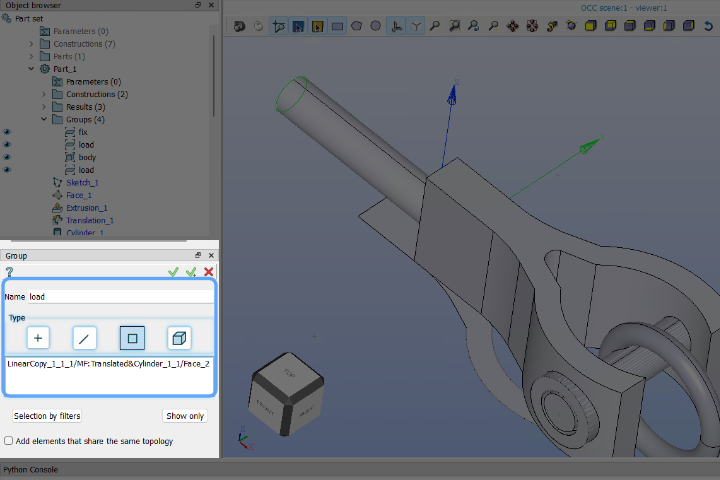
  
## PART B — Mesh Generation in SALOME (Mesh Module)
  
### B.1 — Switch to Mesh Module
  
1. After completing the geometry preparation, switch to mesh generation.

2. In the **Module Selector**, click **Mesh** to switch from the Shaper/Geometry module.

3. In the **Object Browser**, locate the compound geometry containing all three bodies (single eye + fork + pin).

4. **Right-click** on the geometry → select **Create Mesh**. This opens the **Mesh Creation** dialog.

### B.2 — Mesh Settings
  
**Steps:**
  

1. In the **Create Mesh** dialog → select **3D** tab

2. Set **Algorithm** = `NETGEN 1D-2D-3D`

3. Click the gear icon → open **Hypothesis** settings

| Setting     | Value                                     |
| ----------- | ----------------------------------------- |
| Geometry    | Compound (single eye + fork eye + pin)    |
| Mesh Type   | **3D**                                    |
| Algorithm   | **NETGEN 1D-2D-3D**                       |
| Max Size    | `5 mm` (global — rod shank regions)       |
| Min Size    | `1 mm` (local refinement — pin bore/hole) |
| Fineness    | **Fine** or **Very Fine**                 |
| Growth Rate | `0.3`                                     |
  
4. Click **Apply and Close**
  

  
### B.4 — Compute Mesh
 
1. Right-click the mesh object in the object tree → **Compute**

2. Wait for the mesh computation to complete
  
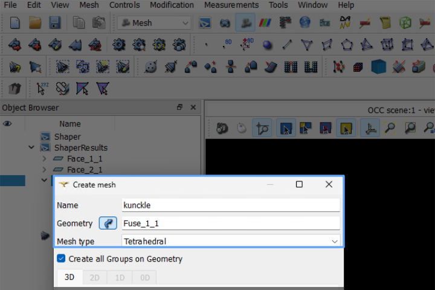

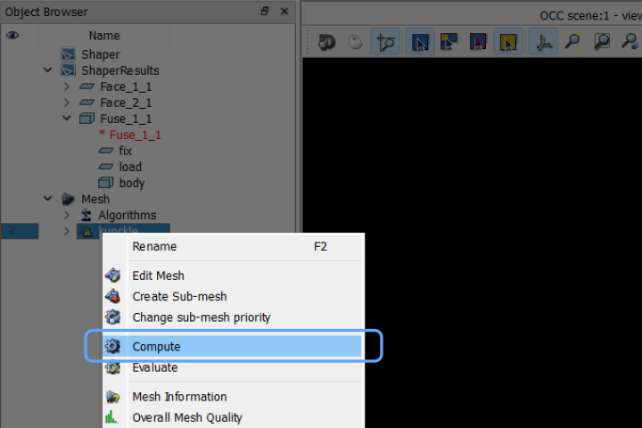
### B.5 — Export Mesh
  
1. Right-click the computed mesh → **Export** → choose **MED** format (`.med`)

2. Save the file: e.g., `knuckle_joint.med`
  
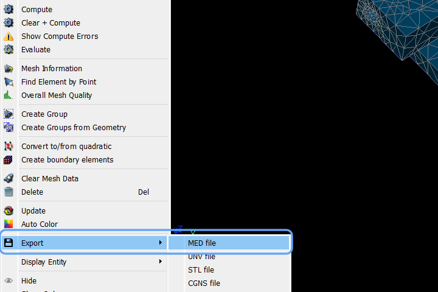

  
## PART C — Solver Setup in eigenspace
  
### C.1 — Import Mesh

  

**Steps:**

  

1. In the left sidebar, expand the **Mesh** section

2. Click **Import Mesh**

3. In the dialog → click **Choose file**

4. Navigate to and select `knuckle_joint.med`

5. Click **Save**

  

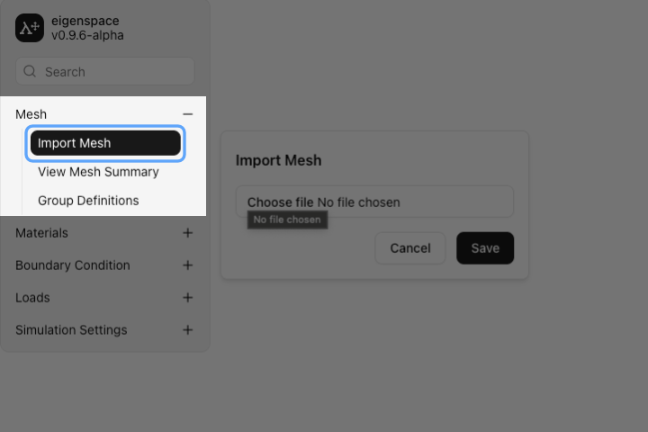

  

  

### C.2 — Define Materials

  

A **single structural steel** material is used for all three bodies (single eye, fork, and pin), which is representative of a standard knuckle joint manufactured from EN8 / C40 structural steel.

  

#### C.2.1 — Define Steel Material
  
1. Expand **Materials** in the sidebar → click **Define Material**

2. Click **+** to add a new material

3. Enter material name: `Structural_Steel`

4. Click **Save**
  
**Structural Steel  Properties:**
  
| Property        | Value         |
| --------------- | ------------- |
| Young's Modulus | `200,000 MPa` |
| Poisson's Ratio | `0.30`        |
| Density         | `7850 kg/m³`  |

  
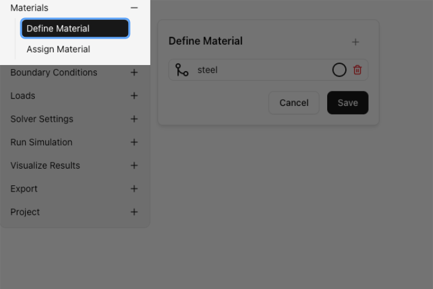

 
### C.3 — Assign Materials
  
After defining the material, assign it to all three mesh groups (Text IDs).
  
**Steps:**
 
1. Click **Assign Material** in the sidebar

2. The table shows all **Text IDs** (groups imported from SALOME mesh):
  
| Text ID          | Material to Assign |
| ---------------- | ------------------ |
| `single_eye_vol` | `Structural_Steel` |
| `fork_eye_vol`   | `Structural_Steel` |
| `pin_vol`        | `Structural_Steel` |

  3. For each solid domain row, select the correct material from the dropdown

4. Click **Save**

  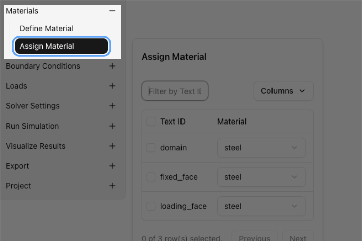

### C.4 — Define Boundary Conditions
  
This section applies support conditions for the knuckle joint. The fork end is fixed and a tensile axial load is applied to the single eye end.
  
#### C.4.1 — Define Fixed Support
  
**Steps:**
 1. Expand **Boundary Conditions** → click **Define BC**

2. Click **+** → name it: `Fixed_Support`

3. Configure:

- **Type:** Displacement

- **U_x = 0, U_y = 0, U_z = 0** (fully fixed — all translations constrained)

4. Click **Save**

  

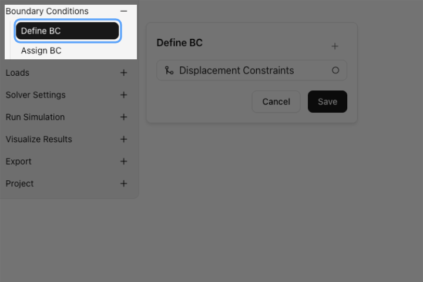

 
### C.5 — Assign Boundary Conditions
 
**Steps:**
 
1. Click **Assign BC** in the sidebar

2. The table shows all groups:
  
| Text ID          | Boundary Condition |
| ---------------- | ------------------ |
| `single_eye_vol` | Unassigned         |
| `fork_eye_vol`   | Unassigned         |
| `pin_vol`        | Unassigned         |
| `fixed_face`     | `Fixed_Support`    |
 
2. Assign **`Fixed_Support`** to `fixed_face`

3. Click **Save**

  

  
### C.6 — Define Load

  
The knuckle joint is subjected to an **axial tensile load** applied to the rear face of the single eye shank. This simulates the joint being pulled apart along its axis — the primary loading mode in service.
  
#### C.6.1 — Define Axial Tensile Load 
  
**Steps:**
 

1. Expand **Loads** → click **Define Load**

2. Click **+** → name it: `Tensile_Load`

3. Click **Save**
  
  

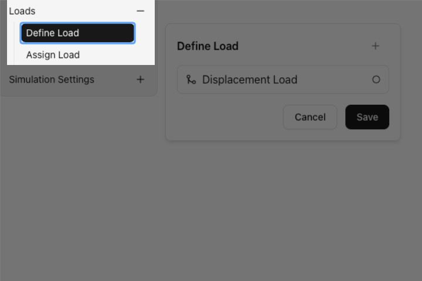

### C.7 — Assign Load
  
**Steps:**
  
1. Click **Assign Load** in the sidebar

2. The table shows:
 
| Text ID          | Load       |
| ---------------- | ---------- |
| `single_eye_vol` | Unassigned |
| `fork_eye_vol`   | Unassigned |
| `pin_vol`        | Unassigned |
| `fixed_face`     | Unassigned |
| `load_face` | `Tensile_Load` |
  
2. Assign **`Tensile_Load`** to `load_face`

3. Click **Save**

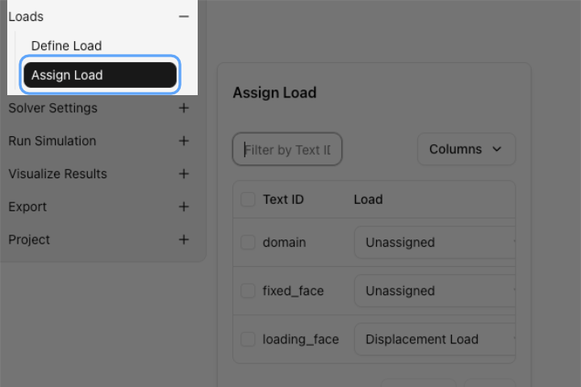

    
### C.8 — Solver Settings
  
#### C.8.1 — Select Physics
  
1. Expand **Solver Settings** → click **Select Physics**

2. Choose physics type:

- `3D Physics` — for full 3D solid elements (used here for the knuckle joint solid model)

- `2D Physics` — not applicable for this 3D solid model

3. Click **Save**
  
  
### C.9 — Run Simulation
  

1. Expand **Run Simulation** in the sidebar

2. Click **Start Simulation**

3. Monitor the solver log / progress output panel

4. Wait for the simulation to complete ✅

   

### C.10 — Visualize Results
  
1. Expand **Visualize Results** in the sidebar

2. Configure the visualization panel as follows:
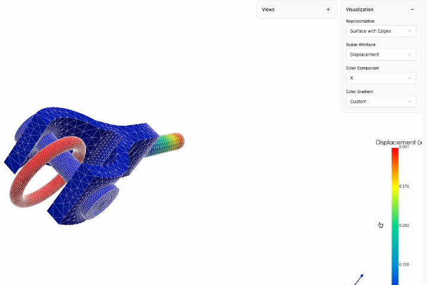

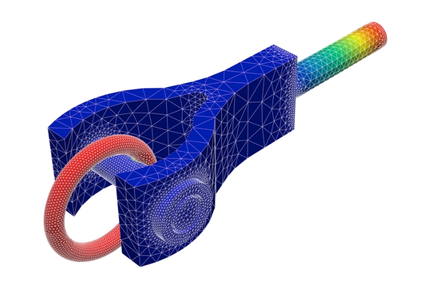
### C.11 — Export Results
  
1. Expand **Export** in the sidebar

2. Export results in the desired format:
  
| Format | Contents                                          | Use Case                 |
| ------ | ------------------------------------------------- | ------------------------ |
| `CSV`  | Nodal displacements, reaction forces              | Post-processing in Excel |
| `VTK`  | Full field results (stress, strain, displacement) | ParaView visualization   |
| `MED` | Results mapped back to mesh groups | Further eigenspace analysis |