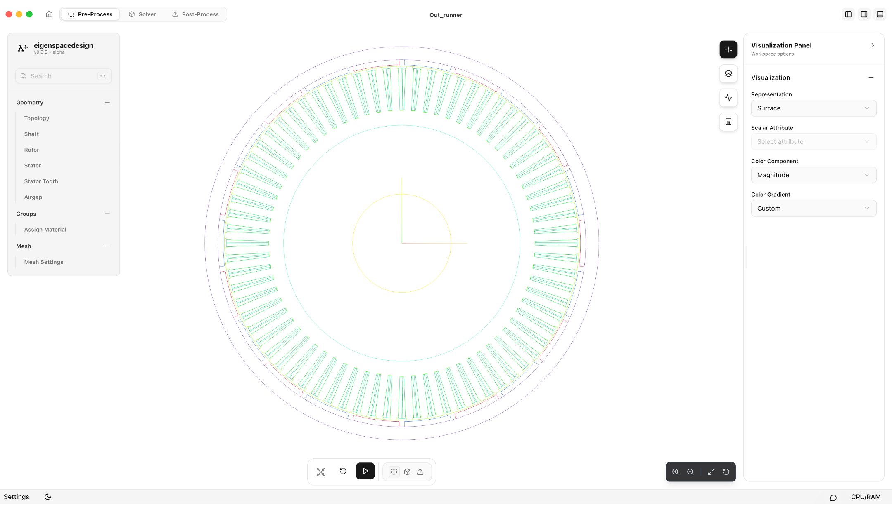
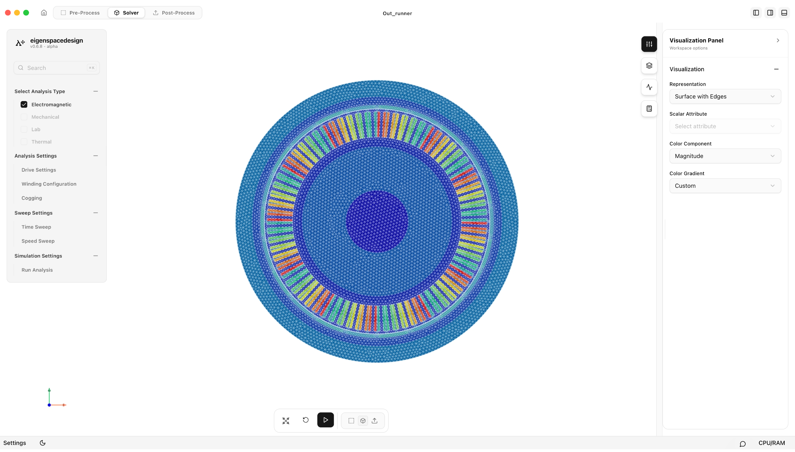
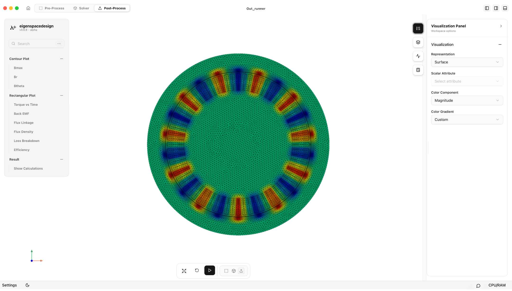
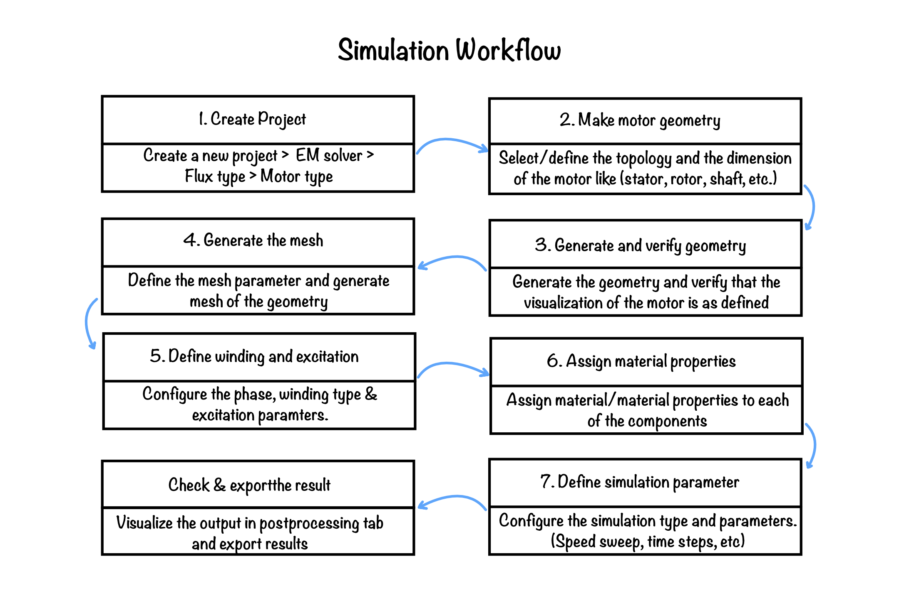

# Quick Start Guide – BLDC Motor Simulation

This guide describes the minimum steps required to perform a complete BLDC motor simulation using the default solver configuration. Taking reference from the inrunner and outrunner BLDC practice manuals, this concise guide walks through project creation, geometry verification, meshing, solver setup, simulation execution, and post-processing. All parameters are automatically populated with validated default values based on the benchmark model.

## Step 1 – Project Setup & Motor Configuration

1. Launch **eigenspacedesign** and click **Add** on the **My Projects** page.
2. In the workspace selection dialog, select **EM Solver** and click **Input Metadata**.
3. Enter project metadata (File Name, Project Name, Work Folder Path, Description) and click **Create Project**.
4. In the motor configuration workflow:
   - **Select Motor Type**: Select **BLDC (Brushless DC Motor)**.
   - **Select Flux Type**: Explicitly select **Radial Flux**.
   - **Select Motor Subtype**: Explicitly select **Outrunner**.
5. Click **Continue in Workspace** to open the Electromagnetic Workspace with the default outrunner BLDC model automatically generated.

## Step 2 – Configure & Verify Geometry

**Figure 1:** Pre-Process module workspace showing generated motor geometry.

Open the **Pre-Process** module and review the default geometry parameters:

| Section              | Default Value                                                                                                                |
| -------------------- | ---------------------------------------------------------------------------------------------------------------------------- |
| Number of Slots      | 72                                                                                                                           |
| Number of Phases     | 3                                                                                                                            |
| Number of Poles      | 22                                                                                                                           |
| Stack length         | 0.047                                                                                                                        |
| Shaft Radius         | 37.5 mm                                                                                                                      |
| Rotor Inner Radius   | Derived from shaft Radius                                                                                                    |
| Magnet Thickness     | 4.0 mm                                                                                                                       |
| Magnet Fill Factor   | 0.90                                                                                                                         |
| Rotor Yoke thickness | 10.0                                                                                                                         |
| Rotor Outer Radius   | Derived from shaft Radius and Rotor Yoke thickness                                                                           |
| Stator Inner Radius  | 90 mm                                                                                                                        |
| Stator Outer Radius  | 135 mm                                                                                                                       |
| Airgap Radius        | 1.0 mm                                                                                                                       |
| Slot Type            | Tapered Slot                                                                                                                 |
| Slot Dimensions      | Default template (No Change)                                                                                                 |
| Material Assignment  | Default template (No Change)  Steel  for Stator & Rotor, NdFe35 for Permanent Magnet, Copper for Windings, Iron for Shaft |

These default values are based on a 1500 W, 120 V, 1200 rpm outer-rotor BLDC motor benchmark.

After reviewing the parameters, click **Save** for each section.

## Step 3 – Generate the Mesh

**Figure 2:** Mesh settings modal dialog.

1. Open **Mesh Settings**.
2. Keep the default element size parameters:

| Parameter            | Default Value |
| -------------------- | ------------- |
| Min. size of Element | 0.5           |
| Max. size of Element | 1.0           |

3. Click **Generate Mesh** inside the modal dialog.
4. Once meshing finishes, verify that mesh generation was successful, review node/element counts, and check **Show Geometry Summary**.
5. Click **Go To Solver**.

## Step 4 – Review Solver Settings

**Figure 3:** Solver and analysis setup screen.

In the **Solver** workspace, verify that **Electromagnetic** is checked under **Select Analysis Type**, then review the analysis settings:

### Drive Settings

| Parameter       | Default Value |
| --------------- | ------------- |
| Current         | 10.8 A        |
| Frequency       | 310           |
| Speed           | 1200 rpm      |
| Excitation Type | Trapezoidal   |
| Phase           | 3             |

### Winding Configuration

| Parameter            | Default Value   |
| -------------------- | --------------- |
| Connection Type      | Star (Y)        |
| Winding Type         | Concentrated    |
| Coil Direction       | Alternate       |
| Turns per Phase      | 6               |
| Wires per Slot       | 1               |
| Resistance per Phase | 0.017 Ω         |
| Coil Area            | Auto Calculated |

### Cogging Analysis

| Parameter     | Default Value |
| ------------- | ------------- |
| Run Cogging   | Disabled      |
| Cogging Steps | -             |

### Time Sweep

| Parameter            | Default Value |
| -------------------- | ------------- |
| Number of Cycles     | 1             |
| Time Steps per cycle | 60            |

### Speed Sweep

To execute the simulation at a single operating speed of 1200 rpm, specify 1200 in all three Speed Sweep fields:

| Parameter | Default Value |
|-----------|---------------|
| Start Speed | 1200 rpm |
| End Speed | 1200 rpm |
| Speed Step | 1200 rpm |

> **Note:** Setting Start Speed, End Speed, and Speed Step all to 1200 rpm configures the solver to perform the simulation at only a single operating speed of 1200 rpm.

## Step 5 – Execute Simulation & Monitor Job Status

1. In the left navigation panel, select **Run Analysis** under **Simulation Settings**.
2. Review the simulation settings summary and click **Start Simulation**.
3. Monitor real-time progress in the **Job Status** panel on the right (tracking CPU Usage, Memory Usage, Iterations, and overall Progress).
4. Wait for **Job Status** to change from **Running** to **Completed**.

## Step 6 – View Results & Post-Processing

**Figure 4:** Post-Process module displaying contours, plots, and calculation summary.

After the analysis completes, open the **Post-Process** module.

The following results are available for visualization:

- Magnetic Flux Density (Bmax)
- Radial Flux Density (Br)
- Tangential Flux Density (Bθ)
- Torque vs Time
- Back EMF
- Flux Linkage
- Flux Density Distribution
- Loss Breakdown
- Efficiency
- Calculation Summary

Use the **Views** panel to adjust representation, field quantity, field component, and color gradients.

### Generate PDF Report

Click **Generate Report** in the **Post-Process** workspace to export a comprehensive PDF report summarizing the simulation model, geometry, materials, solver parameters, contour plots, graphs, and calculated performance metrics.

## Simulation Workflow

Using this default configuration, a complete outer-rotor BLDC motor simulation can be performed seamlessly. Advanced users may customize geometry, materials, winding configurations, or sweep settings as required for specific machine designs.