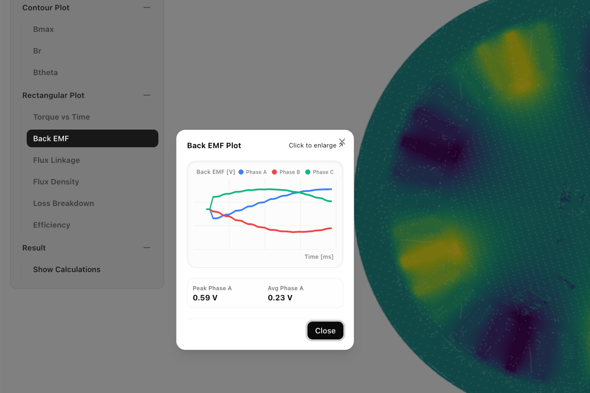
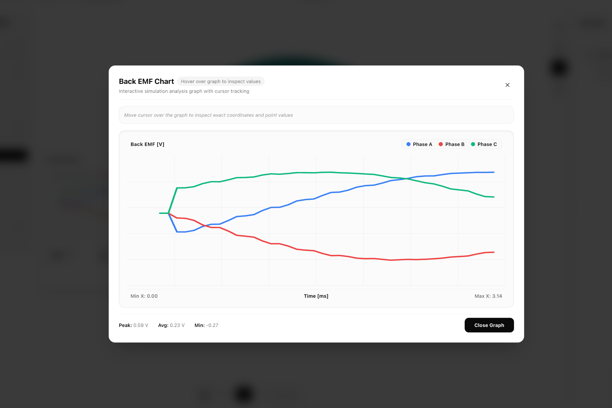
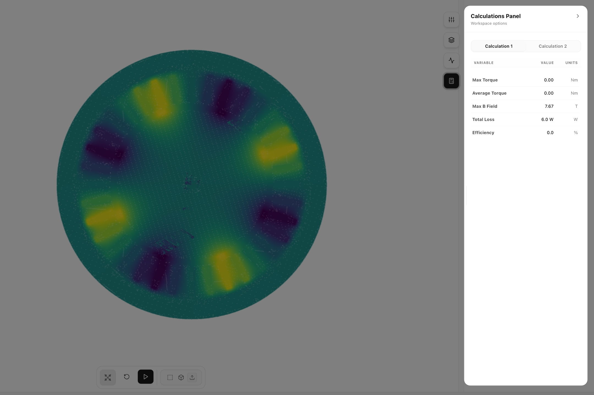

# Inrunner BLDC Motor Simulation — 4. Result & Post-Process

## Overview

After the simulation completes successfully, the final phase involves inspecting electromagnetic field contour plots, reviewing time-domain performance curves, checking numerical calculation summaries, and generating a formal PDF simulation report.

| Workflow Stage | Part 1           | Part 2                   | Part 3               | Stage G–H (Current)             |
| :------------- | :--------------- | :----------------------- | :------------------- | :------------------------------ |
| **Section**    | Creating Project | Preprocessing & Geometry | Solver & Excitations | **Post-Processing & Reporting** |

# STAGE G — Post-Processing and Result Visualization

Once the simulation has completed successfully, the post-processing workspace is used to inspect electromagnetic field distributions, plots, and calculated performance parameters.

## G.1 — Open the Post-Process Workspace

To access the simulation results:

1. Verify that the simulation status indicates **Completed**.
2. Click **Post-Process** in the top toolbar to open the result visualization workspace.
3. Verify that the result workspace opens with the left navigation panel, center viewport, and right calculations panel.

The workspace is divided into three main sections:

- The **left panel** contains contour plots, rectangular plots, and result options.
- The **center viewport** displays the selected field visualization.
- The **right panel** displays calculated performance values and result summaries.

## G.2 — Visualize Field Contour Plots

The **Contour Plot** section displays the spatial distribution of electromagnetic field quantities on the motor geometry.

1. Expand **Contour Plot** in the left navigation panel.
2. Select the desired field quantity.
3. View the selected contour displayed in the visualization window.

The following contour plots are available:

| Contour Plot | Description                                    |
| ------------ | ---------------------------------------------- |
| **Bmax**     | Maximum magnetic flux density.                 |
| **B**        | Radial component of the magnetic flux density. |
| **Az**       | Magnetic vector potential.                     |

## G.3 — View Performance Plots

The **Rectangular Plot** section provides graphical representations of key motor performance parameters over time or position.

1. Expand **Rectangular Plot** in the left navigation panel.
2. Select the desired plot. This will show a compact line plot of the selected quantity.

3. Click on the graph to view the selected graph displayed in the visualization window.

Available plots include:

| Plot | Description |
|------|-------------|
| **Torque vs Time** | Electromagnetic torque variation with time. |
| **Back EMF** | Induced phase back electromotive force. |
| **Flux Linkage** | Flux linkage variation of the stator windings. |
| **Flux Density** | Magnetic flux density distribution along the selected path. |
| **Loss Breakdown** | Distribution of electromagnetic losses. |
| **Efficiency** | Motor efficiency over the operating condition. |

## G.4 — Inspect Calculation Summary & Numerical Results

The **Result** section provides access to the calculated numerical performance parameters of the motor.

1. Expand **Result** in the left navigation panel.
2. Click **Show Calculations**.
3. Inspect the **Calculations** panel on the right side of the workspace.
4. Select the required calculation tab to view the corresponding numerical results.

# STAGE H — PDF Report Generation & Summary

After reviewing the simulation results, eigenspacedesign can generate a comprehensive PDF report that summarizes the complete motor model, simulation configuration, and analysis results.

## H.1 — Export Comprehensive PDF Report

To create the report:

1. Click **Generate Report** in the Post-Process workspace.
2. Select the destination folder.
3. Enter the report name if required.
4. Click **Generate PDF**.

The software automatically compiles the simulation data and exports a professionally formatted PDF document.

## H.2 — Overview of PDF Report Contents

The generated report includes all important information required to reproduce and review the simulation.

### Project Information

- Project name
- Simulation date and time
- Motor geometry
- Analysis type
- Software version

### Motor Topology

The report summarizes the overall motor configuration, including:

| Parameter | Description |
|-----------|-------------|
| Motor Type | Inrunner BLDC |
| Number of Slots | Total stator slots |
| Number of Poles | Total rotor poles |
| Number of Phases | Number of electrical phases |
| Stack Length | Axial stack length |

### Geometry Summary

The report documents the complete motor geometry used during the simulation, including parameters such as:

- Stator outer diameter
- Stator inner diameter
- Rotor inner and outer diameters
- Shaft diameter
- Airgap
- Magnet thickness
- Magnet fill factor
- Slot type
- Slot dimensions
- Tooth geometry
- Stack length

### Material Assignment

A summary table lists the material assigned to each motor component, including the stator, rotor, permanent magnets, windings, shaft, and air region.

### Simulation Setup & Excitations

The report records all analysis and excitation settings used during the simulation, including:

- Excitation type
- Phase current
- Current density
- Frequency
- Rotor speed
- Commutation offset
- Number of phases
- Time step
- Number of simulation cycles
- Speed sweep settings
- Cogging analysis settings (if enabled)

### Generated Geometry

The report includes an image of the generated motor geometry showing the configured rotor, stator, magnets, windings, shaft, and air region.

### Simulation Results

The report contains the principal plots generated during the simulation, including:

- Magnetic flux density contour
- Torque vs Time
- Back EMF
- Flux Linkage
- Flux Density
- Loss Breakdown
- Efficiency

### Performance Summary

The report concludes with a numerical summary of the calculated motor performance, including:

| Result | Description |
|--------|-------------|
| Average Torque | Electromagnetic output torque |
| Torque Ripple | Peak-to-peak torque variation |
| Peak Back EMF | Maximum induced voltage |
| Copper Loss | Stator winding loss |
| Core Loss | Electromagnetic core loss |
| Permanent Magnet Loss | Magnet eddy-current loss |
| Total Loss | Combined electromagnetic losses |
| Output Power | Mechanical output power |
| Efficiency | Overall motor efficiency |

The generated PDF serves as a complete record of the motor design, simulation setup, and calculated performance, making it suitable for documentation, design verification, reporting, and comparison of multiple simulation cases.

---

[← 3. Solver & Simulation Setup](03_solver_simulation_setup.md)
