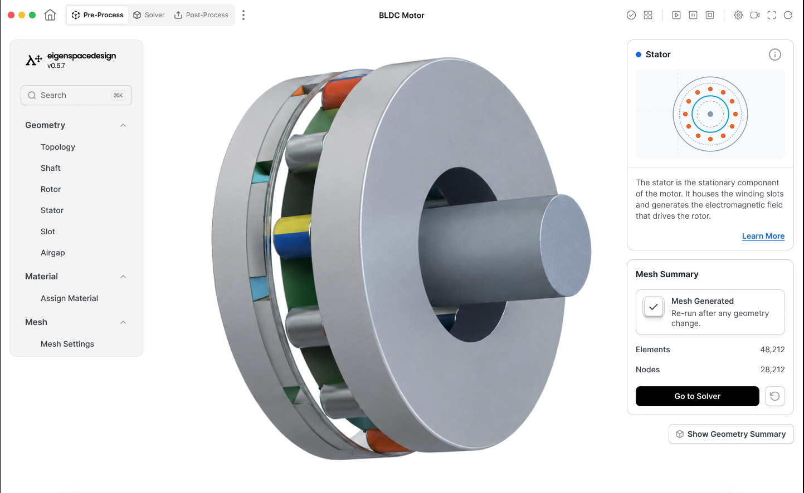
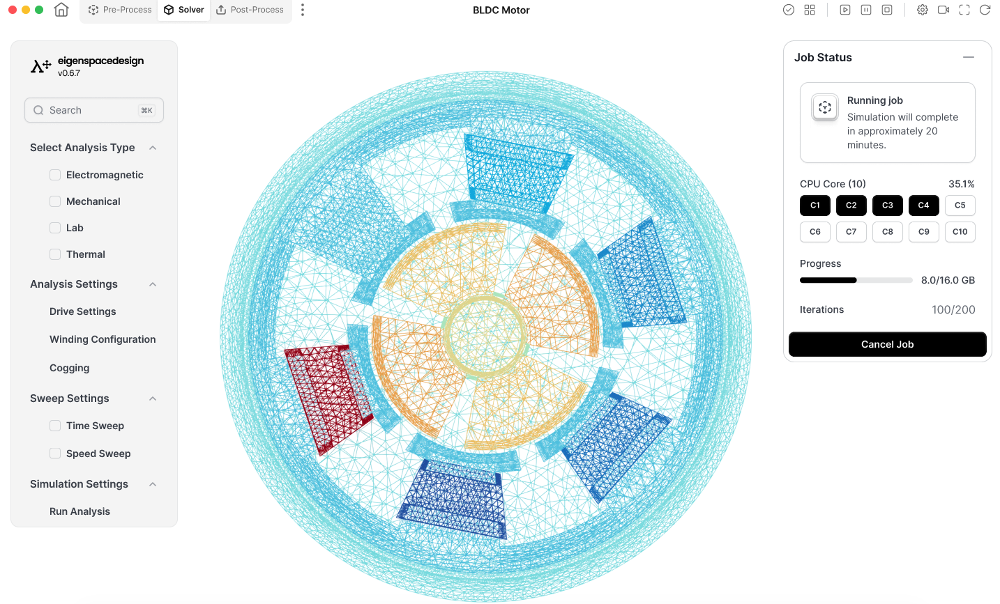
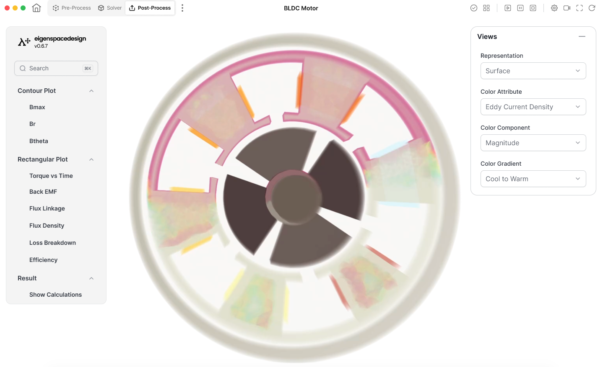

# Quick Start Guide – BLDC Motor Simulation

This guide describes the minimum steps required to perform a complete BLDC motor simulation using the default solver configuration. All parameters are automatically populated with validated default values. For a standard simulation, the user only needs to verify the inputs and proceed through the workflow.

## Step 1 – Configure the Geometry

**Figure 1:** This will be the first screen you will be greeted with when you open a new project. This is the Pre-Process module.

Open the **Pre-Process** module.

Review the following geometry parameters:

| Section | Default Value |
|----------|---------------|
| Number of Slots | 72 |
| Number of Phases | 3 |
| Number of Poles | 22 |
| Shaft Radius | 37.5 mm |
| Rotor Inner Radius | 37.5 mm |
| Rotor Outer Radius | 47.5 mm |
| Magnet Thickness | 4 mm |
| Magnet Fill Factor | 0.90 |
| Stator Inner Radius | 90 mm |
| Stator Outer Radius | 135 mm |
| Airgap Radius | 135.5 mm |
| Slot Type | Tapered Slot |
| Slot Dimensions | Default template |
| Material Assignment | Silicon Steel (Stator & Rotor), NdFe35 Magnet, Copper Windings, Air Region |

These default values are based on a 1500 W, 120 V, 3000 rpm outer-rotor BLDC motor benchmark. 

After reviewing the parameters, click **Save** for each section.

## Step 2 – Generate the Mesh

**Figure 2:** On clicking Mesh settings, check these options and click on **Generate Mesh**.

Open **Mesh Settings**.

Use the default mesh settings.

| Parameter                  | Default Value |
| -------------------------- | ------------- |
| Minimum Number of Elements | 30,000        |
| Maximum Number of Elements | 50,000        |

Click **Generate Mesh**.

Once meshing is complete:

- Verify that mesh generation was successful.
- Review the number of nodes and elements.
- Click **Show Geometry Summary** to verify the generated geometry.

Finally, click **Go To Solver**.

## Step 3 – Review Solver Settings


**Figure 3:** On the analysis screen, review solver settings once and then click on **Run Analysis**. 

Review the analysis settings before starting the simulation.

### Drive Settings

| Parameter       | Default Value |
| --------------- | ------------- |
| Current         | 10.9 A        |
| Frequency       | 550 Hz        |
| Speed           | 3000 rpm      |
| Excitation Type | Trapezoidal   |
| Phase           | 3             |

The current, speed and operating voltage correspond to the benchmark motor configuration. 

### Winding Configuration

| Parameter | Default Value |
|-----------|---------------|
| Connection Type | Star (Y) |
| Winding Type | Concentrated |
| Coil Direction | Alternate |
| Turns per Phase | 6 |
| Wires per Slot | 1 |
| Resistance per Phase | 0.017 Ω |
| Coil Area | Auto Calculated |

The resistance and conductors per slot are taken from the reference design. 

### Cogging Analysis

| Parameter | Default Value |
|-----------|---------------|
| Run Cogging | Enabled |
| Cogging Steps | 360 |

### Time Sweep

| Parameter | Default Value |
|-----------|---------------|
| Number of Cycles | 2 |
| Time Step | 0.1 ms |


### Speed Sweep

| Parameter | Default Value |
|-----------|---------------|
| Start Speed | 500 rpm |
| End Speed | 3000 rpm |
| Speed Step | 250 rpm |


After verifying all settings, click **Run Analysis**.

The solver automatically performs electromagnetic analysis and computes all supported machine characteristics.

## Step 4 – View Results

**Figure 4:** View the computed results on this screen. The contour section contains the contour plots, the rectangular section contains the graphical plots and the result section will show the tabular calculated data results.

After the analysis completes, open the **Post-Process** module.

The following results are available for visualization:

- Magnetic Flux Density (Bmax)
- Radial Flux Density (Br)
- Tangential Flux Density (Bθ)
- Torque vs Time
- Back EMF
- Flux Linkage
- Flux Density Distribution
- Loss Breakdown
- Efficiency
- Calculation Summary

Use the **Views** panel to change:

- Representation
- Field Quantity
- Field Component
- Colour Gradient

## Simulation Workflow

```text
Pre-Process
      │
      ▼
Verify Geometry
      │
      ▼
Generate Mesh
      │
      ▼
Show Geometry Summary
      │
      ▼
Go To Solver
      │
      ▼
Verify Solver Parameters
      │
      ▼
Run Analysis
      │
      ▼
Open Post-Process
      │
      ▼
Review Simulation Results
```

Using the default configuration, a complete BLDC motor simulation can be performed without modifying any input parameters. Advanced users may customize geometry, materials, excitation, winding configuration, mesh density, or analysis settings as required for specific machine designs.