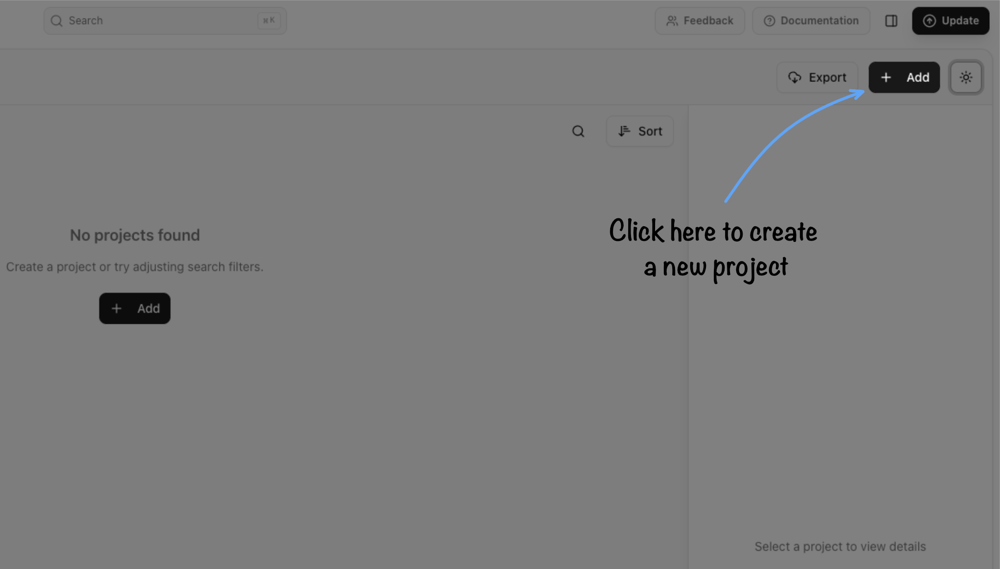
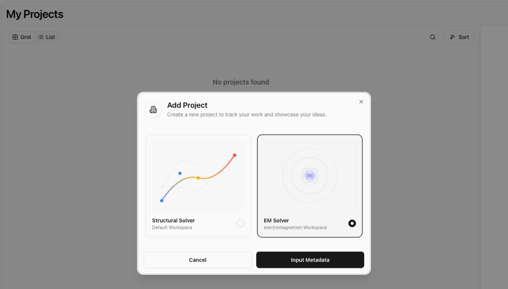

# Outrunner BLDC Motor Simulation — 1. Creating Project

## Description

This practice exercise demonstrates the complete workflow for performing an electromagnetic simulation of an outrunner Brushless DC (BLDC) motor using **eigenspacedesign**. 

In an outrunner BLDC motor topology, the permanent-magnet rotor surrounds the stator externally and rotates around the internal stator assembly. This configuration provides higher rotational torque, making it popular in direct-drive applications such as drones, electric bicycles, and robotics.

The tutorial is divided into 4 main stages:
1. **Creating Project** (Part A)
2. **Preprocessing & Creating Geometry** (Parts B, C, D)
3. **Solver & Simulation Setup** (Parts E, F)
4. **Result & Post-Process** (Parts G, H)

| Complete Workflow | Part A (Current) | Part B–D | Part E–F | Part G–H |
| :--- | :--- | :--- | :--- | :--- |
| **Workflow Stage** | **Project Creation** | Preprocessing & Geometry | Solver & Excitations | Post-Processing & Reporting |

# PART A — Creating an Electromagnetic Project

## A.1 — Open eigenspacedesign

Launch **eigenspacedesign**. After the application starts, the **My Projects** page is displayed. This page provides access to all previously created projects and allows users to create, organize, export, and open simulation projects.

To begin a new electromagnetic simulation:

1. Locate the project workspace header on the **My Projects** page.
2. Click the **Add** button located in the upper-right corner of the project page.

## A.2 — Select the Simulation Workspace

Clicking **Add** opens the **Add Project** dialog, where the simulation workspace must be selected before creating the project.

Two simulation workspaces are available.

| Workspace | Purpose |
| ---------- | ------- |
| **Structural Solver** | Used for static and dynamic structural finite element analysis. |
| **EM Solver** | Used for electromagnetic analysis of electrical machines such as BLDC motors. |

To select the simulation workspace:

1. Select **EM Solver** from the workspace options.
2. Click **Input Metadata** to proceed to project configuration.

> **Note:** The EM Solver workspace automatically generates the motor geometry and finite element mesh from the motor design parameters entered later in the workflow. No external CAD or mesh generation software is required.

## A.3 — Enter Project Information

After selecting the **EM Solver** workspace, the **Add Project** dialog is displayed. This dialog is used to define the project information and storage location.

Complete the project details as described below.

| Field | Description | Example |
| ------ | ----------- | ------- |
| **File Name** | Name of the project file. | `Outrunner_BLDC` |
| **Project Name** | Display name shown in the project list. | `Outrunner BLDC Motor Simulation` |
| **Work Folder Path** | Directory where the project files will be stored. | `D:\ESD\MotorProjects` |
| **Description** | Brief summary of the project objective. | `Electromagnetic simulation of an outrunner BLDC motor.` |
| **Labels** | Optional tags used to organize projects. | `Motor`, `BLDC`, `Outrunner`, `Electromagnetic` |

### Steps

1. Enter the **File Name**.
2. Enter the **Project Name**.
3. Click **Browse** and select the project directory.
4. Provide a brief project description.
5. Optionally add one or more labels.
6. Click **Create Project**.

> **Recommendation:** Store each motor simulation in its own dedicated project folder. This keeps generated geometry, meshes, simulation data, and exported results organized throughout the design process.

## A.4 — Select the Motor Configuration

After the project is created, the software guides you through a series of dialogs to configure the motor type before entering the simulation workspace.

### A.4.1 — Select Motor Type

To select the motor type:

1. In the **Select Motor Type** dialog, select **BLDC (Brushless DC Motor)** from the available motor types.
2. Click **Select Flux Type** to continue.

### A.4.2 — Select the Flux Type

The next dialog allows you to choose the magnetic flux topology of the motor.

To select the flux type:

1. In the **Select Flux Type** dialog, select **Radial Flux**.
2. Click **Next** to proceed to motor subtype selection.

### A.4.3 — Select the Radial Flux Motor Subtype

After selecting **Radial Flux**, additional motor topologies become available.

To select the radial flux motor subtype:

1. Select **Outrunner** from the available radial flux motor topologies.
2. Click **Continue in Workspace** to open the simulation environment.

### A.4.4 — Open the Electromagnetic Workspace

After the motor configuration is confirmed, eigenspacedesign automatically opens the **Electromagnetic Workspace**.

A default **Outrunner BLDC motor** model is generated automatically using the software's built-in geometry generator. The generated model includes the rotor, stator, permanent magnets, shaft, air region, and winding regions, providing a ready-to-configure starting point for the simulation.

Unlike structural simulations, no external CAD software or mesh generation tool is required. The geometry and finite element mesh are generated directly within eigenspacedesign based on the motor configuration selected in the previous steps.

---

**Next Step:** [2. Preprocessing & Creating Geometry →](02_preprocessing_creating_geometry.md)
