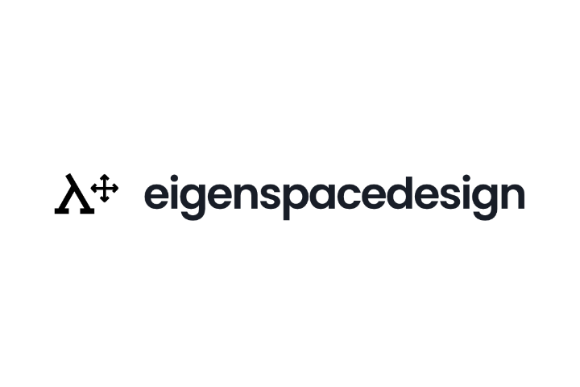

# Outrunner BLDC Motor Simulation in eigenspacedesign

## Description

This practice exercise demonstrates the complete workflow for performing an electromagnetic simulation of an outrunner Brushless DC (BLDC) motor using **eigenspacedesign**. 

The tutorial guides users through the complete process, beginning with project creation and workspace selection, followed by motor geometry generation, material assignment, winding and magnet configuration, automatic mesh generation, solver setup, simulation execution, result visualization, and export of simulation results.

| Complete Workflow | Part A | Part B | Part C | Part D | Part E | Part F | Part G |
| ----------------- | ------ | ------ | ------ | ------ | ------ | ------ | ------ |
| Workflow Stage | Project Creation | Geometry | Materials | Excitations | Mesh | Simulation | Results |

# PART A — Creating an Electromagnetic Project

## A.1 — Open eigenspacedesign

Launch **eigenspacedesign**. After the application starts, the **My Projects** page is displayed. This page provides access to all previously created projects and allows users to create, organize, export, and open simulation projects.

To begin a new electromagnetic simulation, click the **Add** button located in the upper-right corner of the project page.

## A.2 — Select the Simulation Workspace

Clicking **Add** opens the **Add Project** dialog, where the simulation workspace must be selected before creating the project.

Two simulation workspaces are available.

| Workspace | Purpose |
| ---------- | ------- |
| **Structural Solver** | Used for static and dynamic structural finite element analysis. |
| **EM Solver** | Used for electromagnetic analysis of electrical machines such as BLDC motors. |

For this tutorial, select **EM Solver**, then click **Input Metadata**.

 **Note:** The EM Solver workspace automatically generates the motor geometry and finite element mesh from the motor design parameters entered later in the workflow. No external CAD or mesh generation software is required.

## A.3 — Enter Project Information

After selecting the **EM Solver** workspace, the **Add Project** dialog is displayed. This dialog is used to define the project information and storage location.

Complete the project details as described below.

| Field | Description | Example |
| ------ | ----------- | ------- |
| **File Name** | Name of the project file. | `Outrunner_BLDC` |
| **Project Name** | Display name shown in the project list. | `Outrunner BLDC Motor Simulation` |
| **Work Folder Path** | Directory where the project files will be stored. | `D:\ESD\MotorProjects` |
| **Description** | Brief summary of the project objective. | `Electromagnetic simulation of an outrunner BLDC motor.` |
| **Labels** | Optional tags used to organize projects. | `Motor`, `BLDC`, `Electromagnetic` |

### Steps

1. Enter the **File Name**.
2. Enter the **Project Name**.
3. Click **Browse** and select the project directory.
4. Provide a brief project description.
5. Optionally add one or more labels.
6. Click **Create Project**.

 **Recommendation:** Store each motor simulation in its own dedicated project folder. This keeps generated geometry, meshes, simulation data, and exported results organized throughout the design process.

## A.4 — Select the Motor Configuration

After the project is created, the software guides you through a series of dialogs to configure the motor type before entering the simulation workspace.

### A.4.1 — Select Motor Type

In the **Select Motor Type** dialog, choose **BLDC (Brushless DC Motor)** from the available motor types. Once selected, click **Select Flux Type** to continue.

### A.4.2 — Select the Flux Type

The next dialog allows you to choose the magnetic flux topology of the motor.

Select **Radial Flux**, which is the conventional topology used in most BLDC motors, and click **Next**.

### A.4.3 — Select the Radial Flux Motor Subtype

After selecting **Radial Flux**, additional motor topologies become available.

For this practice tutorial, select **Outrunner** and click **Continue in Workspace**.

### A.4.4 — Open the Electromagnetic Workspace

After the motor configuration is confirmed, eigenspacedesign automatically opens the **Electromagnetic Workspace**.

A default **Outrunner BLDC motor** model is generated automatically using the software's built-in geometry generator. The generated model includes the rotor, stator, permanent magnets, shaft, air region, and winding regions, providing a ready-to-configure starting point for the simulation.

Unlike structural simulations, no external CAD software or mesh generation tool is required. The geometry and finite element mesh are generated directly within eigenspacedesign based on the motor configuration selected in the previous steps.

# PART B — Defining the Motor Geometry

After entering the electromagnetic workspace, the default outrunner BLDC motor geometry is displayed in the 3D viewport. The **Geometry** panel on the left side of the workspace is used to define all major dimensions of the motor. As parameters are updated, the software automatically regenerates the motor geometry and prepares it for mesh generation.

The geometry is defined by configuring the motor topology, shaft, rotor, stator slot, and airgap dimensions.

## B.1 — Define the Motor Topology

The **Topology** section defines the fundamental configuration of the motor. These parameters determine the number of poles, stator slots, winding phases, and stack length used to generate the motor geometry.

Click **Geometry → Topology** in the left navigation panel.

Enter the required values and click **Save**.

| Parameter | Description |
|-----------|-------------|
| Number of Slots | Total stator slots |
| Number of Phases | Number of electrical phases |
| Number of Poles | Total rotor poles |
| Stack Length | Axial length of the motor |

## B.2 — Define the Shaft

The shaft dimensions determine the central supporting shaft around which the rotor rotates.

Click **Geometry → Shaft**.

Enter the shaft radius and click **Save**.

| Parameter | Description |
|-----------|-------------|
| Shaft Radius | Radius of the motor shaft |

## B.3 — Define the Rotor

The **Rotor** section controls the dimensions of the rotor back iron and permanent magnets.

Click **Geometry → Rotor**.

Configure the rotor parameters and click **Save**.

| Parameter | Description |
|-----------|-------------|
| Magnet Thickness | Thickness of the permanent magnets |
| Rotor Inner Radius | Inner radius of the rotor |
| Rotor Outer Radius | Outer radius of the rotor |
| Magnet Fill Factor | Percentage of rotor surface occupied by magnets |

## B.4 — Define the Stator Slot Geometry

The stator slot dimensions determine the winding space and tooth geometry of the stator.

Click **Geometry → Slot**.

Select the required slot type and enter the slot dimensions.

| Parameter | Description |
|-----------|-------------|
| Slot Type | Stator slot profile |
| LS0–LS2 | Slot length parameters |
| CS0 | Slot opening parameter |
| WS0–WS2 | Slot width parameters |

After entering all values, click **Save**.

## B.5 — Define the Airgap

The airgap is the radial distance between the rotor and stator and has a significant influence on the electromagnetic performance of the motor.

Click **Geometry → Airgap**.

Enter the required airgap radius and click **Save**.

| Parameter | Description |
|-----------|-------------|
| Airgap Radius | Radial airgap between the rotor and stator |

## B.6 — Review the Generated Geometry

After all geometry parameters have been defined, eigenspacedesign automatically regenerates the complete outrunner BLDC motor model. The updated geometry is displayed in the 3D viewport, allowing the user to verify the overall motor dimensions before proceeding to material assignment and mesh generation.

At this stage, the model consists of the shaft, rotor, permanent magnets, stator, slots, and air region generated from the specified parameters.

# PART C — Assign Material Properties

After defining the motor geometry, the next step is to assign material properties to each component of the motor. Material properties determine how each region responds to the applied magnetic field and electrical excitation during the simulation.

Unlike structural analysis, the electromagnetic solver requires two primary material properties for each component:

- **Relative Magnetic Permeability ($\mu_r$)** — Defines the magnetic behavior of the material relative to free space.
- **Electrical Conductivity ($\sigma$)** — Defines the ability of the material to conduct electric current.

To assign materials, expand **Material** in the left navigation panel and select **Assign Material**.

## C.1 — Material Properties

The following materials are used for the default outrunner BLDC motor model.

| Material | Relative Magnetic Permeability ($\mu_r$) | Electrical Conductivity ($\sigma$) |
|-----------|------------------------------------------:|-----------------------------------:|
| Electrical Steel | 4000 | $2.0 \times 10^6$ S/m |
| NdFeB Permanent Magnet | 1.05 | $6.25 \times 10^5$ S/m |
| Copper | 1.0 | $5.8 \times 10^7$ S/m |
| Air | 1.0 | 0 S/m |
| Structural Steel (Shaft) | 1000 | $6.99 \times 10^6$ S/m |

## C.2 — Assign Materials

Assign the appropriate material to each motor component using the material selection table.

| Motor Component | Material |
|-----------------|----------|
| Stator Core | Electrical Steel |
| Rotor Core | Electrical Steel |
| Permanent Magnets | NdFeB Permanent Magnet |
| Windings | Copper |
| Shaft | Structural Steel |
| Air Region | Air |

After selecting the material for each component, click **Save** to apply the assignments.

# PART E — Mesh Generation

After the motor geometry and material properties have been defined, the next step is to generate the finite element mesh. eigenspacedesign automatically creates the mesh directly from the motor geometry, eliminating the need for external meshing software.

To generate the mesh, expand the **Mesh** section in the left navigation panel and select **Mesh Settings**.

## E.1 — Configure Mesh Settings

The **Generate Mesh** dialog allows you to specify the target mesh density by defining the minimum and maximum number of finite elements to be generated.

Enter the desired mesh limits and click **Generate Mesh**.

| Parameter | Description |
|-----------|-------------|
| Minimum Number of Elements | Lower limit for the generated finite element mesh. |
| Maximum Number of Elements | Upper limit for the generated finite element mesh. |

## E.2 — Generate the Mesh

Click **Generate Mesh** to begin mesh generation. The software automatically discretizes the motor geometry into finite elements suitable for electromagnetic analysis.

Depending on the complexity of the motor geometry and the selected mesh density, mesh generation may take a few moments.

No additional user interaction is required during this process.

## E.3 — Review the Mesh Summary

After the mesh has been successfully generated, the **Mesh Summary** panel on the right side of the workspace is updated automatically.

The panel indicates that mesh generation has completed successfully and displays basic mesh statistics, including the total number of elements and nodes.

| Information | Description |
|------------|-------------|
| Mesh Status | Indicates whether the mesh has been generated successfully. |
| Elements | Total number of finite elements in the mesh. |
| Nodes | Total number of mesh nodes. |

The **Go to Solver** button becomes available once the mesh has been generated, allowing the user to proceed to the solver configuration stage.

## E.4 — Regenerate the Mesh

If any geometry parameter is modified after the mesh has been generated, the existing mesh becomes outdated.

Regenerate the mesh by returning to **Mesh Settings**, updating the mesh parameters if necessary, and clicking **Generate Mesh** again. The **Mesh Summary** panel is automatically refreshed to reflect the updated mesh information.

# PART F — Solver Configuration and Analysis Setup

Once the mesh has been generated successfully, click **Go to Solver** in the **Mesh Summary** panel. The workspace switches from the **Pre-Process** stage to the **Solver** stage, where the analysis type and simulation parameters are configured.

## F.1 — Open the Solver Workspace

The **Solver** workspace contains all settings required to configure and execute the electromagnetic simulation. The left navigation panel provides options for selecting the analysis type, defining analysis settings, configuring parameter sweeps, and running the simulation.

### F.2 — Select Analysis Type

To configure the solver for an electromagnetic simulation:

1. Click **Solver** in the top toolbar to switch from the **Pre-Process** workspace.
2. In the left navigation panel, expand **Select Analysis Type**.
3. Select the **Electromagnetic** checkbox.
4. Leave the **Mechanical**, **Thermal**, and **Lab** options unselected for this tutorial.
5. Verify that the **Electromagnetic** analysis type is enabled before proceeding to the analysis settings.

## F.3 — Configure Drive Settings

The **Drive Settings** section defines the electrical operating conditions of the motor during the simulation.

1. Expand **Analysis Settings** in the left navigation panel.
2. Click **Drive Settings**.
3. Enter the operating **Current**.
4. Enter the operating **Frequency**.
5. Enter the motor **Speed**.
6. Select the **Excitation Type** from the dropdown menu.
7. Specify the number of **Phases** (typically `3` for a three-phase BLDC motor).
8. Click **Save**.

## F.4 — Configure Winding Configuration

The **Winding Configuration** section is used to define the winding arrangement for the stator slots.

1. Expand **Analysis Settings**.
2. Click **Winding Configuration**.
3. Select the desired winding configuration.
4. Assign the winding sequence for each stator slot as required.
5. Verify that all phase assignments are correct.
6. Click **Save**.

## F.5 — Configure Cogging Analysis

Cogging analysis evaluates the cogging torque produced by the interaction between the rotor magnets and stator teeth.

1. Expand **Analysis Settings**.
2. Click **Cogging**.
3. Enable **Run Cogging** if cogging torque analysis is required.
4. Enter the number of **Cogging Steps**.
5. Click **Save**.

## F.6 — Configure Time Sweep Settings

The **Time Sweep** settings define the transient simulation duration and time resolution used during the electromagnetic analysis.

1. Expand **Sweep Settings** in the left navigation panel.
2. Click **Time Sweep**.
3. Enter the **Number of Cycles**.
4. Enter the **Time Step**.
5. Click **Save**.

## F.7 — Configure Speed Sweep Settings

The **Speed Sweep** settings define the operating speed range over which the motor performance will be evaluated.

1. Expand **Sweep Settings**.
2. Click **Speed Sweep**.
3. Enter the **Start Speed**.
4. Enter the **End Speed**.
5. Enter the **Speed Step**.
6. Click **Save**.

## F.8 — Run the Analysis

After configuring all analysis and sweep settings, the simulation is ready to execute.

1. Expand **Simulation Settings** in the left navigation panel.
2. Click **Run Analysis**.
3. Review the simulation settings.
4. Click **Start Simulation** to begin the analysis.

The electromagnetic solver initializes the model, applies the defined operating conditions, and begins solving the finite element problem.

## F.9 — Monitor Simulation Progress

Once the simulation starts, the **Job Status** panel on the right side of the workspace automatically displays the current progress of the analysis.

The panel provides real-time information about the simulation, including processor utilization, memory usage, iteration progress, and overall completion status. The running simulation can be cancelled at any time using the **Cancel Job** button.

The **Job Status** panel displays the following information:

| Item | Description |
|------|-------------|
| Job Status | Current simulation state (Running, Completed, Failed). |
| CPU Usage | Active processor cores used during the simulation. |
| Progress | Overall simulation progress. |
| Memory Usage | Current memory consumption. |
| Iterations | Completed and total solver iterations. |

# PART F — Post-Processing and Result Visualization

After the simulation has completed successfully, click the **Post-Process** tab in the top toolbar to open the result visualization workspace.

The **Post-Process** workspace provides tools for visualizing electromagnetic field distributions, plotting simulation results, and reviewing calculated performance parameters.

## F.1 — Open the Post-Process Workspace

To access the simulation results:

1. Wait until the simulation status changes to **Completed**.
2. Click **Post-Process** in the top toolbar.
3. The result visualization workspace opens automatically.

The workspace is divided into three main sections:

- The **left panel** contains contour plots, rectangular plots, and result options.
- The **center viewport** displays the selected field visualization.
- The **right panel** displays calculated performance values and result summaries.

## F.2 — Visualize Contour Plots

The **Contour Plot** section displays the spatial distribution of electromagnetic field quantities on the motor geometry.

1. Expand **Contour Plot** in the left navigation panel.
2. Select the desired field quantity.
3. The selected contour is displayed in the visualization window.

The following contour plots are available.

| Contour Plot | Description |
|--------------|-------------|
| **Bmax** | Maximum magnetic flux density. |
| **Br** | Radial component of the magnetic flux density. |
| **Btheta** | Tangential component of the magnetic flux density. |

## F.3 — View Rectangular Plots

The **Rectangular Plot** section provides graphical representations of key motor performance parameters.

1. Expand **Rectangular Plot**.
2. Select the desired plot.
3. The selected graph is displayed in the visualization window.

Available plots include:

| Plot | Description |
|------|-------------|
| **Torque vs Time** | Electromagnetic torque variation with time. |
| **Back EMF** | Induced phase back electromotive force. |
| **Flux Linkage** | Flux linkage variation of the stator windings. |
| **Flux Density** | Magnetic flux density distribution along the selected path. |
| **Loss Breakdown** | Distribution of electromagnetic losses. |
| **Efficiency** | Motor efficiency over the operating condition. |

## F.4 — View Calculation Results/ Summary

The **Result** section provides access to the calculated performance parameters of the motor.

1. Expand **Result** in the left navigation panel.
2. Click **Show Calculations**.
3. The **Calculations** panel opens on the right side of the workspace.
4. Select the required calculation tab to view the corresponding results.

The calculations panel displays the numerical values computed during the simulation, such as torque, torque ripple, and other motor performance metrics.

