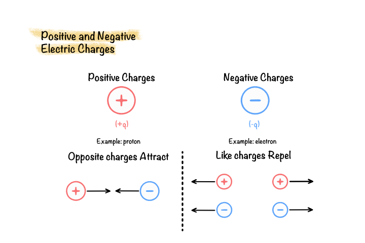
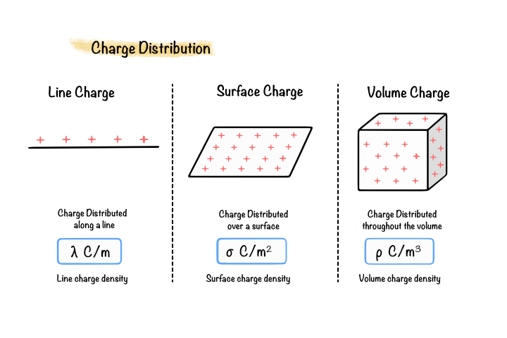
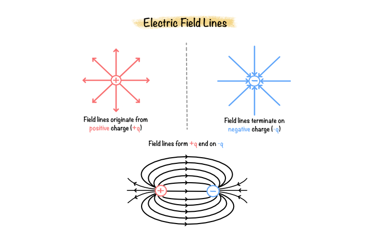
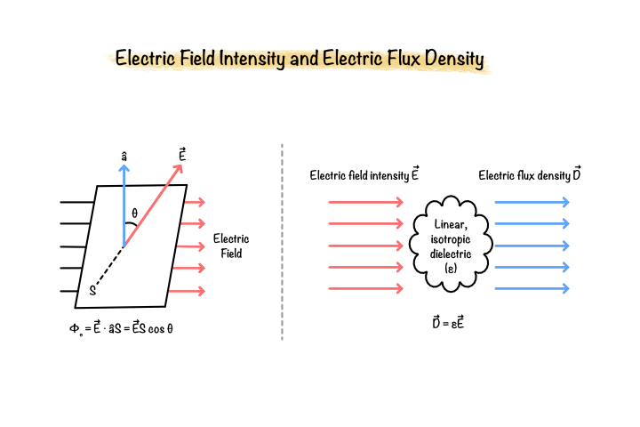

# Fundamentals to Electrostatics

Electrostatics is the branch of classical electromagnetics that studies electric charges at rest and the electric fields they produce. It establishes the fundamental principles governing electric interactions and provides the basis for Maxwell's equations and electromagnetic field theory.

Although the numerical simulation of permanent magnet electric machines primarily involves magnetic fields, many of the mathematical concepts used throughout electromagnetic finite element analysis originate from electrostatics. Understanding these concepts provides the foundation required for the chapters that follow.

## What is electrostatics?

Electrostatics describes the interaction between stationary electric charges and the electric fields they generate. These interactions are governed by Coulomb's Law and are characterised by quantities such as electric field intensity, electric potential, electric flux, and charge density.

Electrostatic theory provides one of the fundamental building blocks of classical electromagnetics and forms the basis for many of the governing equations used in finite element analysis.

## Why is electrostatics important?

Electrostatic theory introduces many of the mathematical relationships that later appear in Maxwell's equations. The concepts of potential fields, field intensity, conservation laws, and governing partial differential equations are all first developed within electrostatics.

Although permanent magnet machine simulations are predominantly magnetostatic, electrostatic formulations establish the theoretical framework upon which electromagnetic field analysis is built.

## Applications in electromagnetic engineering

Electrostatic analysis is widely used in engineering applications involving electric field prediction and insulation design. 

The mathematical formulations developed in electrostatics are also directly applicable to electromagnetic finite element methods used in electric machine simulation.

## ## Fundamental Electrostatic Quantities

Electrostatic analysis is based on a set of fundamental physical quantities that describe the behaviour of electric charges and the electric fields they generate. These quantities are closely related through Coulomb's Law, Gauss's Law, and the governing electrostatic equations that form the basis of classical electromagnetics.

### Electric Charge

Electric charge is the fundamental property of matter responsible for electric interactions. Charges exist in two forms, positive and negative, and are measured in coulombs (C).

The SI unit of charge is

$$
[Q] = \text{C}
$$

Charge is conserved and cannot be created or destroyed.

 **Figure 2.1:** Positive and negative electric charges.

### Charge Density

Charge may be distributed over a line, surface, or volume. The distribution is described by the corresponding charge density.

Linear charge density

$$
\lambda=\frac{dQ}{dl}
$$

Surface charge density

$$
\sigma=\frac{dQ}{dA}
$$

Volume charge density

$$
\rho=\frac{dQ}{dV}
$$

where

- $\lambda$ is the linear charge density (C/m)
- $\sigma$ is the surface charge density (C/m²)
- $\rho$ is the volume charge density (C/m³)

 
 **Figure 2.2:** Line, surface, and volume charge distributions.

### Electric Field Intensity

An electric field describes the force experienced by a unit positive test charge placed within the field.

It is defined as

$$
\mathbf{E}
=
\frac{\mathbf{F}}{q}
$$

where

- $\mathbf{E}$ is the electric field intensity (V/m or N/C)
- $\mathbf{F}$ is the electric force (N)
- $q$ is the test charge (C)

For a point charge,

$$
\mathbf{E}
=
\frac{1}{4\pi\varepsilon}
\frac{Q}{r^2}
\hat{r}
$$

**Figure 2.3:** Electric field surrounding a positive point charge.

### Electric Potential

Electric potential represents the work required to move a unit positive charge from infinity to a specified point.

$$
V
=
\frac{W}{Q}
$$

where

- $V$ is the electric potential (V)
- $W$ is the work done (J)

The electric field is related to the potential by

$$
\mathbf{E}
=
-\nabla V
$$

### Electric Flux

Electric flux measures the amount of electric field passing through a surface.

For a uniform electric field,

$$
\Phi_E
=
\mathbf{E}\cdot\mathbf{A}
=
EA\cos\theta
$$

where

- $\Phi_E$ is the electric flux (N·m²/C)
- $\mathbf{A}$ is the area vector

Electric flux is maximum when the electric field is perpendicular to the surface.

**Figure 2.4:** Electric field intensity and electric flux density.

### Electric Flux Density

Electric flux density relates the electric field to the permittivity of the medium.

$$
\mathbf{D}
=
\varepsilon\mathbf{E}
$$

where

- $\mathbf{D}$ is the electric flux density (C/m²)
- $\varepsilon$ is the permittivity (F/m)

Electric flux density is particularly useful when analysing dielectric materials and Gauss's Law.
