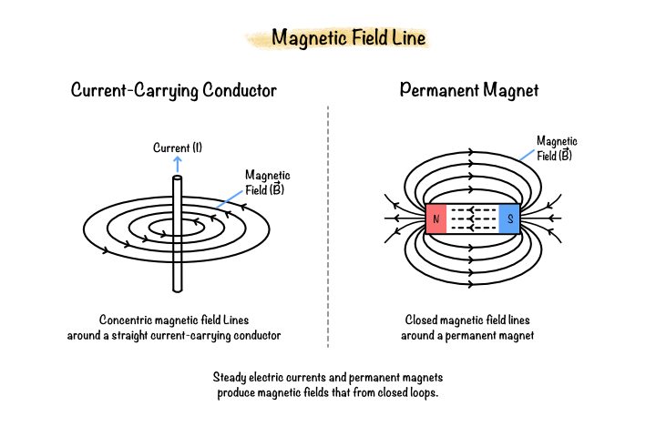
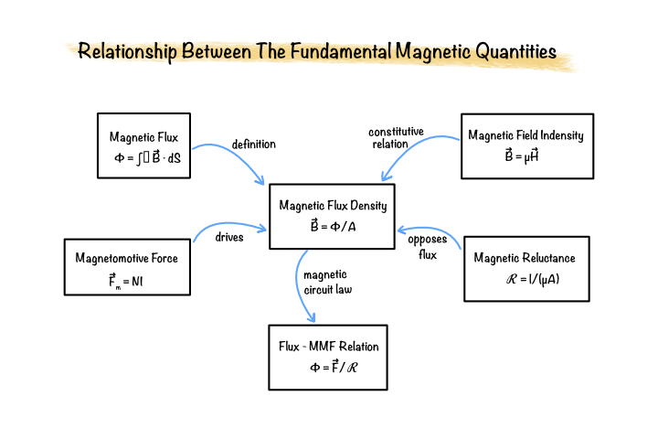

# Fundamentals to Magnetostatics

Magnetostatics is the branch of electromagnetics that studies magnetic fields produced by steady currents and permanent magnets. Unlike electrostatics, where electric charges remain stationary, magnetostatics considers magnetic fields that do not vary with time. These fields are fundamental to the operation of electric machines, transformers, actuators, and many electromagnetic devices.

For permanent magnet brushless DC (BLDC) machines, magnetostatic theory provides the foundation for predicting magnetic flux distribution, magnetic forces, and electromagnetic torque. The governing principles introduced in this chapter are later combined with Maxwell's equations and formulated using the magnetic vector potential for finite element analysis.

## What is magnetostatics?

Magnetostatics describes magnetic fields that remain constant with time. Such fields are generated by steady electric currents flowing through conductors or by permanently magnetized materials.

Unlike electrostatic fields, magnetic field lines always form closed loops and do not originate or terminate at isolated magnetic charges. This behaviour is one of the fundamental characteristics of magnetic fields.

**Figure 3.1:** Magnetic field lines generated by a current-carrying conductor and a permanent magnet.

## Why is magnetostatics important?

Most electromagnetic simulations of electric machines are based on magnetostatic or quasi-static assumptions. Under these conditions, displacement currents are negligible and the magnetic field varies slowly enough that static field equations accurately describe the electromagnetic behaviour.

Magnetostatics provides the theoretical basis for:

- Magnetic circuit analysis
- Permanent magnet modelling
- Current-generated magnetic fields
- Magnetic flux distribution
- Electromagnetic force calculation
- Torque production in electrical machines

These principles form the foundation of the finite element formulation presented in later chapters.

## Applications in electromagnetic engineering

Magnetostatic analysis is widely used throughout electrical engineering for predicting magnetic field behaviour in devices containing magnetic materials and current-carrying conductors.

Typical applications include:

- Permanent magnet motors
- Induction machines
- Synchronous machines
- Transformers
- Electromagnetic actuators
- Solenoids
- Magnetic bearings
- Sensors

Within this project, magnetostatic analysis is used to determine the magnetic field distribution throughout the BLDC motor and to evaluate electromagnetic performance quantities such as torque, flux linkage, and back electromotive force (EMF).

## Fundamental magnetic quantities

Magnetostatic analysis is based on several physical quantities that describe magnetic field behaviour.

### Magnetic Flux

Magnetic flux represents the total magnetic field passing through a surface.

$$
\Phi=\int_S \mathbf{B}\cdot d\mathbf{S}
$$

where

- $\Phi$ is the magnetic flux (Wb)
- $\mathbf{B}$ is the magnetic flux density
- $d\mathbf{S}$ is the differential surface element

### Magnetic Flux Density

Magnetic flux density describes the strength of the magnetic field passing through a unit area.

$$
\mathbf{B}
=
\frac{\Phi}{A}
$$

Its SI unit is the tesla (T).

Flux density is one of the primary quantities computed during finite element analysis.

### Magnetic Field Intensity

Magnetic field intensity represents the magnetizing force responsible for producing magnetic flux.

The relationship between magnetic field intensity and magnetic flux density is

$$
\mathbf{B}
=
\mu\mathbf{H}
$$

where

- $\mathbf{H}$ is the magnetic field intensity (A/m)
- $\mu$ is the magnetic permeability of the material

### Magnetomotive Force

Magnetomotive force (MMF) represents the magnetic potential that drives magnetic flux through a magnetic circuit.

$$
\mathcal{F}
=
NI
$$

where

- $N$ is the number of turns
- $I$ is the current

The SI unit of magnetomotive force is ampere-turns (At).

### Magnetic Reluctance

Reluctance describes the opposition offered by a magnetic path to magnetic flux.

$$
\mathcal{R}
=
\frac{l}{\mu A}
$$

where

- $l$ is the magnetic path length
- $A$ is the cross-sectional area
- $\mu$ is the permeability

Reluctance is analogous to electrical resistance in electric circuits.

The quantities introduced above are closely related through Ampère's Law, the Biot–Savart Law, constitutive relations, and magnetic circuit theory. Together they describe how magnetic fields are generated, distributed, and controlled within electromagnetic devices.

**Figure 3.2:** Relationship between the fundamental magnetic quantities.

## Relationship to subsequent chapters

This chapter establishes the physical concepts required to understand magnetic field generation and magnetic materials. The following chapter extends these ideas by introducing Maxwell's equations, which unify electrostatic and magnetostatic theory into a complete description of electromagnetic fields.

The magnetic quantities introduced here also form the basis of the magnetic vector potential formulation and finite element equations used throughout this project.

## Summary

Magnetostatics describes the behaviour of steady magnetic fields generated by electric currents and permanent magnets. The concepts of magnetic flux, magnetic flux density, magnetic field intensity, magnetomotive force, and reluctance provide the foundation for analysing magnetic circuits and electrical machines.

These principles are fundamental to permanent magnet BLDC machine analysis and are used extensively in the finite element formulations presented in later chapters.