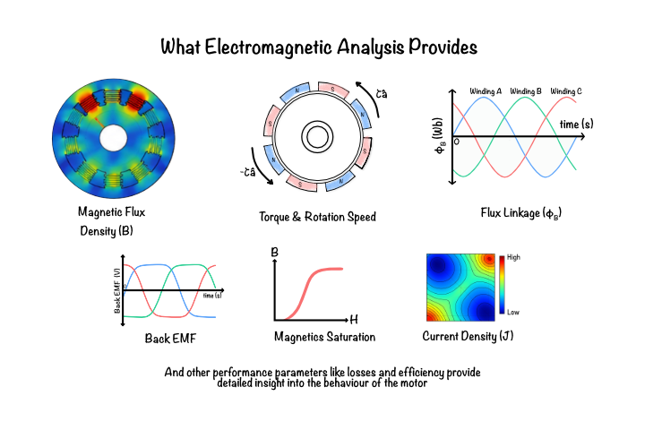

# Why motors need electromagnetic analysis?

Electric motors convert electrical energy into mechanical motion through the interaction of electric currents and magnetic fields. Although the operating principle is conceptually simple, the electromagnetic behaviour within a motor is highly complex due to nonlinear materials, intricate geometries, and the coupling of electrical and mechanical phenomena.

Electromagnetic analysis provides engineers with the ability to understand, predict, and optimise motor performance before a physical prototype is manufactured. It has therefore become an essential component of modern electric machine design and development.

The electromagnetic quantities predicted during simulation are described in [Electromagnetic analysis of a BLDC Motor](09_em_analysis_of_bldc_motor.md).
## Why is electromagnetic analysis important for electric motors?

The performance of an electric motor is governed almost entirely by the distribution of magnetic and electric fields within the machine. These fields determine how effectively electrical energy is converted into mechanical torque and influence nearly every performance characteristic of the motor.

Accurate electromagnetic analysis enables engineers to evaluate machine behaviour under different operating conditions without relying solely on experimental testing. This reduces development time, lowers manufacturing costs, and allows multiple design iterations to be evaluated rapidly.

As electric machines become increasingly compact and efficient, conventional analytical methods are no longer sufficient to capture the complex interactions between materials, windings, permanent magnets, and rotor motion. Numerical electromagnetic analysis provides the accuracy required for modern machine design.

## What motor characteristics can electromagnetic analysis predict?

Electromagnetic analysis provides detailed insight into the internal behaviour of a motor by computing the distribution of electric and magnetic fields throughout the machine.

From these field solutions, engineers can predict important performance quantities including magnetic flux density, magnetic field intensity, current density, flux linkage, induced back electromotive force (Back EMF), electromagnetic torque, cogging torque, and torque ripple.

It also enables the estimation of copper losses, core losses, magnetic saturation, leakage flux, efficiency, and other parameters that directly influence the overall performance and reliability of the motor.

**Figure 1:** Overview of electromagnetic analysis  
## Why are analytical calculations alone not sufficient?

Analytical equations are extremely useful during the preliminary stages of motor design because they provide quick estimates of machine dimensions and operating characteristics. However, these equations generally assume simplified geometries, uniform magnetic fields, and linear material behaviour.

Real electric motors contain complex slot geometries, distributed windings, air gaps, permanent magnets, and magnetic materials whose permeability changes with flux density. These nonlinear effects cannot be accurately represented using closed-form analytical solutions.

Consequently, numerical methods are required to model the actual electromagnetic behaviour of practical electrical machines with a high degree of accuracy.
## Why is finite element analysis used for motor simulation?

The Finite Element Method (FEM) is the most widely used numerical technique for solving electromagnetic field problems in electric machines. Instead of solving the governing equations over the entire motor at once, FEM divides the geometry into thousands of small elements where the electromagnetic fields are approximated locally.

This approach allows highly complex geometries, nonlinear magnetic materials, multiple material regions, permanent magnets, and intricate winding configurations to be represented accurately within a single computational model.

The mathematical formulation of the finite element solver is presented in [Finite Element Solver](10_fem_solver.md).
## How does electromagnetic analysis improve motor design?

Electromagnetic analysis allows engineers to evaluate the effect of design changes long before manufacturing begins. Parameters such as slot geometry, air-gap length, winding arrangement, magnet dimensions, and material selection can be modified and analysed rapidly to determine their influence on machine performance.

This iterative design process enables optimisation of torque production, efficiency, power density, thermal behaviour, and overall machine reliability while reducing the number of costly physical prototypes required during development.

The ability to identify issues such as excessive magnetic saturation, high torque ripple, leakage flux, and increased losses early in the design cycle significantly shortens product development time.

The influence of geometry on motor performance is discussed in [Geometry of the stator](05_stator_parameters.md), [Geometry of the rotor](06_rotor_params.md), and [Geometry of the shaft](07_shaft_params.md).
## How is electromagnetic analysis applied in this software?

This project focuses on the electromagnetic simulation of permanent magnet brushless DC (BLDC) machines using the Finite Element Method. The objective is to accurately model the magnetic field distribution within the motor and compute important performance quantities under different operating conditions.

The simulation framework developed throughout this manual predicts magnetic flux density, flux linkage, back EMF, electromagnetic torque, cogging torque, magnetic forces, and machine losses using Maxwell's equations and finite element formulations.

The theoretical concepts introduced in the following chapters provide the mathematical foundation required to develop this simulation methodology.

## Summary

Electromagnetic analysis is an indispensable tool for the design and optimisation of modern electric machines. By accurately solving the governing electromagnetic equations, engineers can predict motor performance, identify design limitations, and optimise machine characteristics before physical prototypes are manufactured.

The need for accurate electromagnetic analysis naturally leads to the mathematical framework presented in the following chapters, beginning with the fundamental principles of electromagnetics and the governing Maxwell's equations.