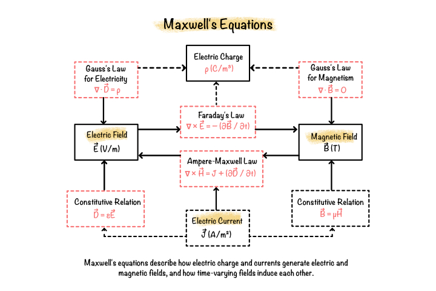

# Maxwell's Equations and Electromagnetic Field Theory

Maxwell's equations form the foundation of classical electromagnetics by unifying the principles of electrostatics and magnetostatics into a single mathematical framework. They describe how electric charges, electric currents, and time-varying electromagnetic fields interact within different materials and provide the governing equations for nearly all electromagnetic engineering problems.

Modern electromagnetic simulation, including finite element analysis of electric machines, is fundamentally based on Maxwell's equations. Every governing equation, constitutive relation, boundary condition, and numerical formulation presented in the following chapters originates from these four equations.

## What are Maxwell's equations?

Maxwell's equations are four coupled partial differential equations that completely describe the behaviour of electric and magnetic fields.

They establish the relationships between:

- Electric charge
- Electric current
- Electric field
- Magnetic field
- Time-varying electromagnetic fields

Together they describe the generation, propagation, and interaction of electromagnetic energy.

**Figure 4.1:** Relationship between electric fields, magnetic fields, currents, and charges described by Maxwell's equations.

## Why are Maxwell's equations important?

Every electromagnetic device, from electric motors and generators to transformers, antennas, and sensors, operates according to Maxwell's equations.

For permanent magnet BLDC machines, these equations describe:

- Magnetic field generation by current-carrying windings.
- Magnetic fields produced by permanent magnets.
- Electromagnetic induction.
- Flux linkage.
- Back electromotive force (Back EMF).
- Electromagnetic force and torque production.

Although the governing equations are often simplified under magnetostatic assumptions, the complete formulation always originates from Maxwell's equations.

## Applications in electromagnetic engineering

Maxwell's equations are applied throughout electrical and electronic engineering, including:

- Electric machines
- Transformers
- Power systems
- Wireless communication
- Microwave engineering
- Electromagnetic compatibility
- High-voltage engineering
- Medical imaging
- Particle accelerators

Within this project, Maxwell's equations are simplified into the magnetic vector potential formulation used by the finite element solver.

## Fundamental equations

The complete electromagnetic field is governed by four equations.

### Gauss's Law for Electricity

Relates electric fields to electric charge.

$$
\nabla\cdot\mathbf{D}=\rho
$$

### Gauss's Law for Magnetism

States that isolated magnetic monopoles do not exist.

$$
\nabla\cdot\mathbf{B}=0
$$

### Faraday's Law

Describes electromagnetic induction produced by changing magnetic fields.

$$
\nabla\times\mathbf{E}
=
-\frac{\partial\mathbf{B}}{\partial t}
$$

### Ampère-Maxwell Law

Relates magnetic fields to electric currents and changing electric fields.

$$
\nabla\times\mathbf{H}
=
\mathbf{J}
+
\frac{\partial\mathbf{D}}{\partial t}
$$

## Constitutive relations

To solve Maxwell's equations, the electromagnetic fields must be related to the material properties.

The constitutive relations are

$$
\mathbf{B}=\mu\mathbf{H}
$$

$$
\mathbf{D}=\varepsilon\mathbf{E}
$$

$$
\mathbf{J}=\sigma\mathbf{E}
$$

These equations define the behaviour of magnetic, dielectric, and conducting materials.

## Relationship to finite element analysis

The finite element method does not directly solve the complete set of Maxwell's equations in their original form.

Instead, appropriate assumptions are introduced depending on the physical problem.

For permanent magnet BLDC machine analysis:

- Electromagnetic fields are assumed to vary slowly.
- Displacement current is neglected.
- The governing equations are expressed using the magnetic vector potential.

These simplifications produce equations that are computationally efficient while maintaining high accuracy.

## Relationship to subsequent chapters

The next chapter introduces the magnetic vector potential formulation, which transforms Maxwell's equations into the governing equation solved by the finite element method.

This formulation forms the mathematical core of the electromagnetic solver implemented in this project.

## Summary

Maxwell's equations provide the complete mathematical description of electromagnetic fields and their interaction with electric charges, currents, and materials.

Every numerical formulation presented throughout this manual is ultimately derived from these four equations, making them the theoretical foundation of electromagnetic finite element analysis.