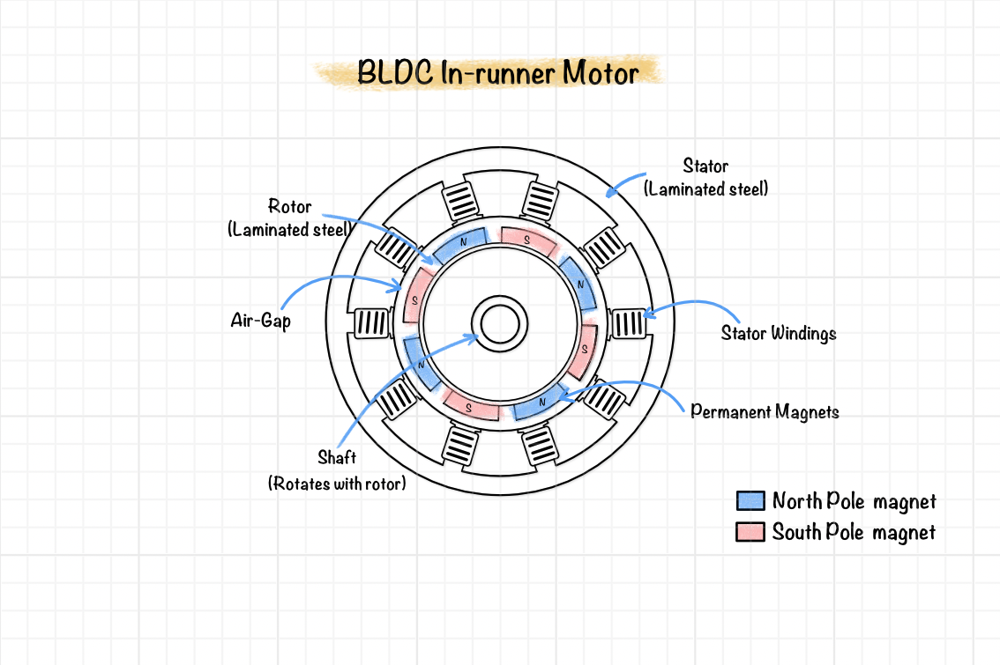
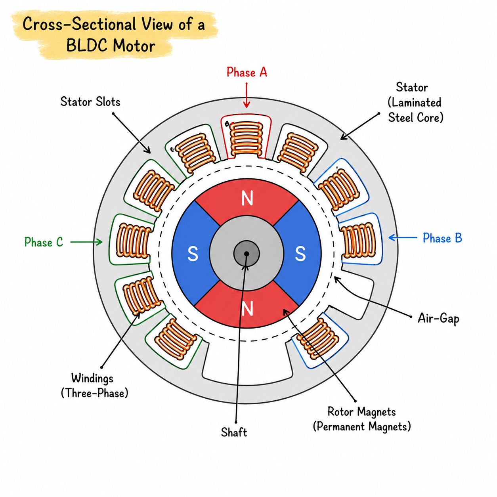

# Permanent Magnet BLDC Machine Theory

Permanent magnet brushless DC (BLDC) machines are synchronous electric machines in which permanent magnets mounted on the rotor provide the excitation magnetic field, while electronically commutated stator windings generate the rotating magnetic field required for torque production. Their high efficiency, compact size, and excellent power density make them one of the most widely used machine types in electric vehicles, robotics, aerospace, industrial automation, and consumer electronics.

Unlike conventional brushed DC motors, BLDC machines eliminate mechanical commutation through electronic switching, resulting in improved reliability, reduced maintenance, and higher operating efficiency.

## What is a permanent magnet BLDC machine?

A BLDC machine converts electrical energy into mechanical energy through the interaction between the magnetic field produced by stator windings and the magnetic field generated by permanent magnets mounted on the rotor.

The machine consists of two primary components:

- Stator carrying n-phase windings.
- Rotor containing permanent magnets.

Electronic commutation ensures that the stator magnetic field continuously pulls the rotor, producing continuous rotation. 

**Figure 1:** Construction of a permanent magnet BLDC machine showing stator, rotor, air-gap, and permanent magnets.

## Why are BLDC machines important?

Permanent magnet BLDC machines offer several advantages over conventional electrical machines.

These include:

- High efficiency.
- High torque density.
- Excellent power density.
- High dynamic response.
- Low maintenance requirements.
- Wide operating speed range.
- Compact construction.

These characteristics have made BLDC machines one of the preferred choices for modern high-performance electromechanical systems.

## What are the different types of BLDC machines?

Permanent magnet BLDC machines can be classified according to the direction of the magnetic flux between the stator and rotor. The two principal configurations are radial flux machines and axial flux machines.

The machine types supported by this software are introduced below.
### Radial Flux BLDC Machines

In radial flux machines, the magnetic flux travels radially across the air gap between the rotor and stator. This is the most common BLDC motor configuration and is widely used in industrial drives, electric vehicles, robotics, pumps, fans, and household appliances.

The stator and rotor are arranged concentrically, producing a cylindrical magnetic circuit that is well suited for finite element analysis.

Radial flux BLDC machines can be broadly classified into two configurations.

#### Inrunner BLDC Motors

In an inrunner motor, the rotor is located inside the stator, and the permanent magnets rotate within the stationary stator windings.

Characteristics of inrunner motors include:

- Compact rotor construction.
- High rotational speed capability.
- Lower rotor inertia.
- Good dynamic response.
- Commonly used in industrial drives and high-speed applications.

The stator and rotor parameterisation presented throughout this manual primarily follows the inrunner machine configuration. The geometric parameters are described in [Geometry of the Stator](05_stator_parameters.md) and [Geometry of the rotor](06_rotor_params.md).
#### Outrunner BLDC Motors

In an outrunner motor, the rotor surrounds the stator and rotates externally while the stator remains fixed at the centre.

Compared with inrunner machines, outrunner motors generally provide:

- Larger effective air-gap radius.
- Higher torque at lower speeds.
- Greater rotor inertia.
- Improved torque density for direct-drive applications.

Outrunner machines are commonly used in drones, electric bicycles, and low-speed high-torque applications. Their electromagnetic analysis follows the same finite element formulation presented in [Finite Element Solver](10_fem_solver.md), although the machine geometry differs from the inrunner configuration.

### Axial Flux BLDC Machines

In axial flux machines, the magnetic flux travels parallel to the shaft axis rather than radially. The stator and rotor are arranged as opposing discs, producing a compact axial magnetic circuit.

Because of their short magnetic path and large effective radius, axial flux machines can achieve very high torque density and excellent power-to-weight ratio.

Axial flux BLDC machines are commonly classified according to the number of stators and rotors.

#### Single-Sided Axial Flux Machines

A single-sided axial flux machine consists of one stator facing one rotor.

This configuration provides:

- Simple construction.
- Reduced manufacturing complexity.
- Compact design.
- Suitable performance for medium-power applications.

#### Double-Sided Axial Flux Machines

A double-sided axial flux machine typically consists of either:

- Two stators surrounding one rotor, or
- Two rotors surrounding one stator.

This arrangement increases magnetic loading and improves torque production while reducing axial magnetic forces through better magnetic symmetry.

Double-sided axial flux machines are widely used in applications requiring very high torque density, including electric vehicles and aerospace systems.

## Machine topology

The electromagnetic characteristics of a BLDC machine are largely determined by its machine topology. The topology defines the fundamental arrangement of the stator windings and rotor magnetic poles, influencing torque production, back electromotive force (Back EMF), efficiency, and operating speed.

Within the software, the machine topology is specified using three primary parameters:

- Number of phases
- Number of poles
- Number of slots

These parameters establish the basic electromagnetic configuration from which the machine geometry and winding arrangement are generated.

### Number of Phases

A phase represents an independent electrical winding circuit supplied by a separate alternating current. Multiple phases are used to produce a rotating magnetic field capable of generating continuous electromagnetic torque.

Although electrical machines may employ different phase numbers, three-phase BLDC machines are the most widely used because they provide smooth torque production, balanced power transfer, and high efficiency.

Increasing the number of phases may improve fault tolerance and reduce torque ripple in specialised applications, although it also increases winding complexity and inverter requirements.

The winding arrangement associated with the selected number of phases is discussed in [Geometry of the Stator](05_stator_parameters.md).

### Number of Poles

A magnetic pole is a region of concentrated magnetic flux produced by the permanent magnets mounted on the rotor. The poles are arranged with alternating north (N) and south (S) polarities around the rotor circumference.

The number of poles determines the electrical frequency of the machine and strongly influences its torque-speed characteristics.

In general:

- Higher pole counts increase torque density.
- Lower pole counts permit higher operating speeds.
- Poles always occur in north-south pairs, resulting in an even total number of poles.

The permanent magnet arrangement associated with the selected pole count is described in [Geometry of the rotor](06_rotor_params.md).

### Number of Slots

A slot is a recessed opening formed within the stator core that accommodates the machine windings. The number of slots determines the winding layout, slot pitch, magnetic loading, and several important performance characteristics including cogging torque and torque ripple.

The detailed geometric parameterisation of stator slots is presented in [Geometry of the Stator](05_stator_parameters.md).
## What is the typical machine construction of a BLDC motor?

The electromagnetic performance of a BLDC machine depends primarily on its mechanical construction and magnetic circuit.

**Figure 2:** Cross-sectional view showing stator slots, windings, rotor magnets, and air-gap.

The principal components include:

### Stator

The stator consists of laminated electrical steel containing slots that house the three-phase windings.

Its primary functions are:

- Supporting the windings.
- Providing a low-reluctance magnetic path.
- Producing the rotating magnetic field.

The detailed parameterisation of each machine component is provided in [Geometry of the Stator](05_stator_parameters.md).
### Rotor

The rotor carries permanent magnets arranged according to the desired pole configuration.

The rotor rotates under the electromagnetic torque generated by the interaction between the stator and rotor magnetic fields.

The detailed parameterisation of each machine component is provided in [Geometry of the rotor](06_rotor_params.md).
### Permanent Magnets

Permanent magnets provide the excitation field without requiring external electrical power.

Common magnet materials include:

- NdFeB
- SmCo
- Ferrite

Their magnetic properties strongly influence torque production and machine efficiency.

Permanent magnet material properties are discussed in [Material definition](08_material_definition.md).
### Air Gap

The air gap separates the stator and rotor.

Although physically small, it has a significant influence on:

- Magnetic reluctance
- Flux density
- Torque production
- Cogging torque

Proper air-gap design is essential for achieving high machine performance.

### Windings

Three-phase concentrated or distributed windings are placed within the stator slots.

When supplied with balanced currents, these windings generate a rotating magnetic field that interacts with the rotor magnets.

### Shaft

The shaft provides the mechanical support for the rotor assembly and transmits the developed electromagnetic torque to the external load. It also maintains the alignment of the rotating components and supports the rotor through the bearing system.

In the electromagnetic model, the shaft is represented by its shaft radius, which defines the inner boundary of the rotor geometry. Although the shaft has little influence on the magnetic field when constructed from non-magnetic materials, its dimensions directly affect the rotor geometry and overall mechanical design.

## What is the operating principle of BLDC motors?

The operating principles of typical BLDC motor is as follows:

- Current flowing through the stator windings produces a magnetic field.

- The permanent magnets establish a second magnetic field on the rotor.

- The interaction between these fields produces electromagnetic forces which generate torque.

- As the rotor rotates, electronic commutation continuously changes the stator current, maintaining torque production over an entire electrical revolution.

## Electromagnetic quantities

The principal quantities analysed during BLDC simulation include:

- Magnetic flux density
- Air-gap flux density
- Magnetic vector potential
- Flux linkage
- Back electromotive force (Back EMF)
- Electromagnetic torque
- Cogging torque
- Torque ripple

These quantities are computed directly from the finite element solution.

These quantities are computed during simulation as described in [ Electromagnetic analysis of a BLDC Motor](09_em_analysis_of_bldc_motor.md).

The machine geometry introduced in this chapter forms the basis for [Geometry of the stator](05_stator_parameters.md), [Geometry of the rotor](06_rotor_params.md), [Geometry of the shaft](07_shaft_params.md), and the finite element model developed in [Finite Element Solver](10_fem_solver.md).

## Summary

Permanent magnet BLDC machines produce torque through the interaction of magnetic fields generated by stator currents and rotor permanent magnets. Their construction, excitation method, and magnetic circuit determine the electromagnetic performance predicted by finite element analysis.

This physical understanding forms the basis for the numerical formulations presented in the remainder of this manual.