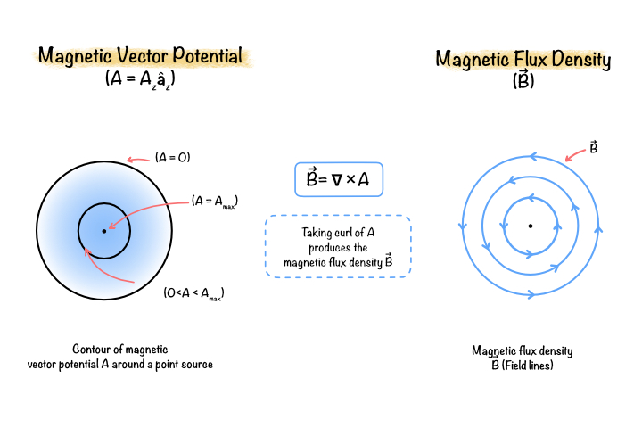

# Magnetic Vector Potential Formulation

The magnetic vector potential formulation is one of the most widely used approaches for solving magnetostatic and low-frequency electromagnetic problems using the finite element method. Rather than solving directly for the magnetic flux density or magnetic field intensity, the formulation introduces an auxiliary variable known as the magnetic vector potential, from which all magnetic field quantities can be derived.

This approach satisfies Maxwell's equations naturally, simplifies the governing equations, and is particularly well suited for analysing permanent magnet electric machines.

## What is the magnetic vector potential?

The magnetic vector potential is a vector field whose curl produces the magnetic flux density.

It is defined as

$$
\mathbf{B}
=
\nabla\times\mathbf{A}
$$

where

- $\mathbf{A}$ is the magnetic vector potential (Wb/m)
- $\mathbf{B}$ is the magnetic flux density (T)

This definition automatically satisfies Gauss's Law for Magnetism,

$$
\nabla\cdot\mathbf{B}=0
$$

ensuring that magnetic flux remains continuous throughout the computational domain.

**Figure 5.1:** Relationship between the magnetic vector potential and magnetic flux density.

## Why is the magnetic vector potential used?

Directly solving Maxwell's equations in terms of magnetic flux density is difficult because the field must always satisfy the divergence-free condition.

Using the magnetic vector potential offers several advantages:

- Automatically satisfies Gauss's Law for Magnetism.
- Produces a single governing equation.
- Easily incorporates permanent magnets and current sources.
- Simplifies finite element discretisation.
- Improves numerical stability.

These advantages make it the preferred formulation for most electromagnetic finite element software.

## Two-dimensional formulation

For two-dimensional machine cross-sections, only the axial component of the magnetic vector potential is required.

$$
\mathbf{A}
=
A_z\hat{z}
$$

The magnetic flux density is obtained from

$$
B_x
=
\frac{\partial A_z}{\partial y}
$$

$$
B_y
=
-
\frac{\partial A_z}{\partial x}
$$

Thus, the complete magnetic field can be recovered from a single scalar unknown.

## Governing equation

Starting from Maxwell's equations and applying the magnetostatic assumptions leads to

$$
\nabla\times
\left(
\frac{1}{\mu}
\nabla\times\mathbf{A}
\right)
=
\mathbf{J}
+
\nabla\times\mathbf{M}
$$

where

- $\mu$ is the magnetic permeability.
- $\mathbf{J}$ is the current density.
- $\mathbf{M}$ is the permanent magnet magnetization.

For two-dimensional analysis, this equation reduces to a scalar partial differential equation in terms of $A_z$.

## Permanent magnet formulation

Permanent magnets are represented through their magnetization vector.

Instead of modelling equivalent current loops explicitly, the magnetization is incorporated directly into the governing equation.

This approach accurately predicts the magnetic field produced by the permanent magnets while simplifying the numerical implementation.

## Current source formulation

Current-carrying conductors are represented using the current density

$$
\mathbf{J}
=
\frac{NI}{A}
$$

where

- $N$ is the number of turns.
- $I$ is the current.
- $A$ is the conductor cross-sectional area.

This current density acts as the excitation source within the finite element formulation.

## Weak formulation

The governing equation is converted into its weak form by multiplying it by a test function and integrating over the computational domain.

This process:

- Reduces continuity requirements.
- Naturally incorporates Neumann boundary conditions.
- Produces the finite element matrix equations.

The weak formulation forms the mathematical basis for finite element discretisation and matrix assembly.

## Relationship to finite element analysis

After obtaining the weak formulation:

- The computational domain is discretised into finite elements.
- Shape functions approximate the magnetic vector potential.
- Local element matrices are assembled into the global system.
- The resulting sparse linear system is solved numerically.

The computed magnetic vector potential is then used to evaluate magnetic flux density, forces, torque, and other derived quantities.

## Summary

The magnetic vector potential formulation transforms Maxwell's equations into a numerically efficient form suitable for finite element analysis. By solving for the magnetic vector potential instead of the magnetic field directly, the formulation naturally satisfies magnetic flux conservation while providing a robust framework for modelling current sources, permanent magnets, and complex magnetic materials.

This formulation serves as the theoretical foundation for the finite element implementation described in the following chapters.