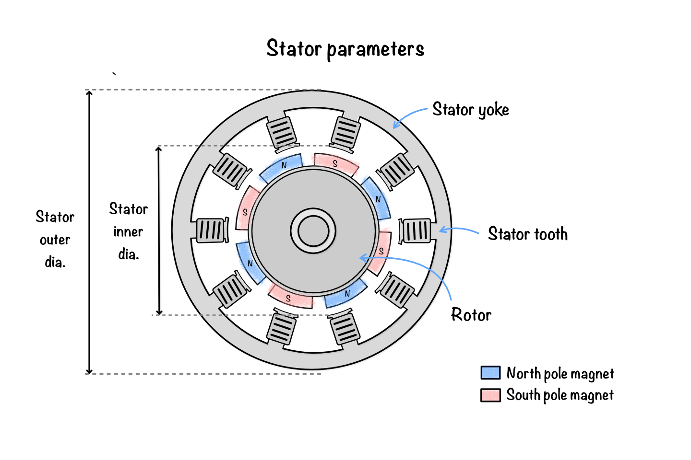
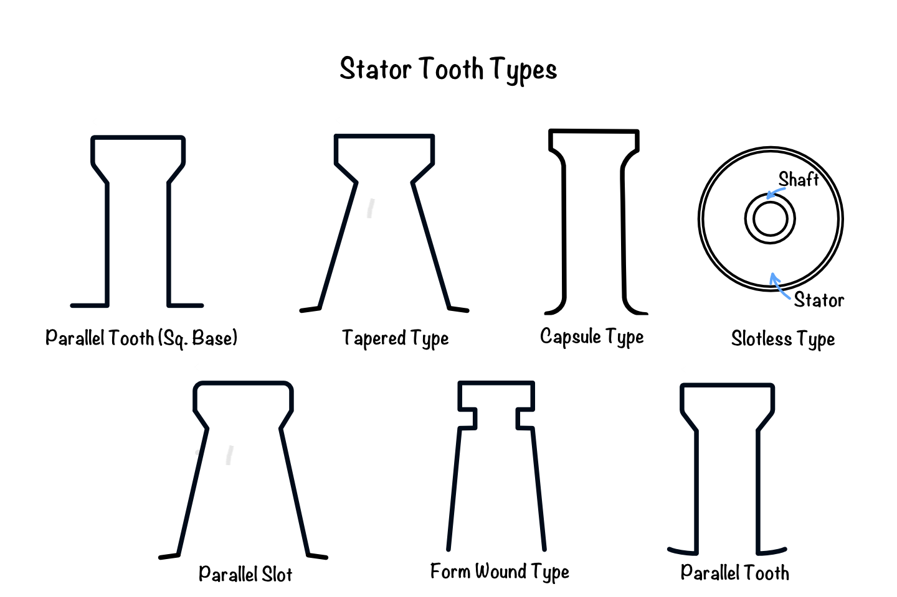
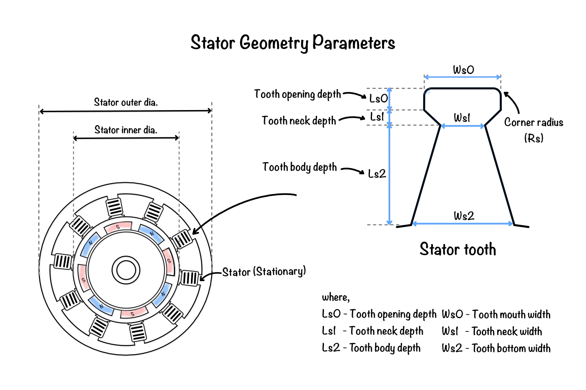
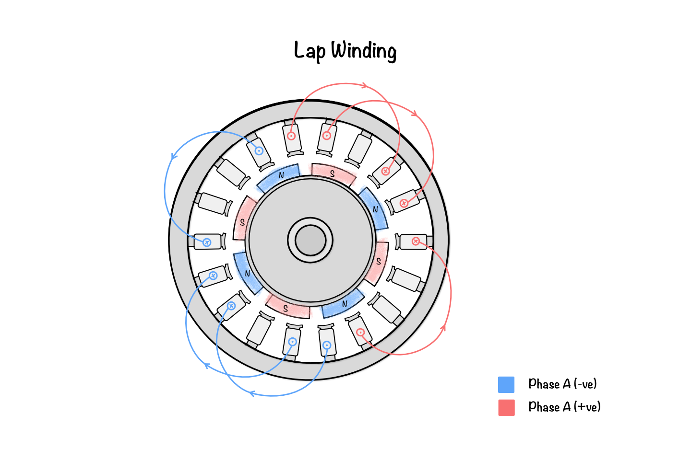
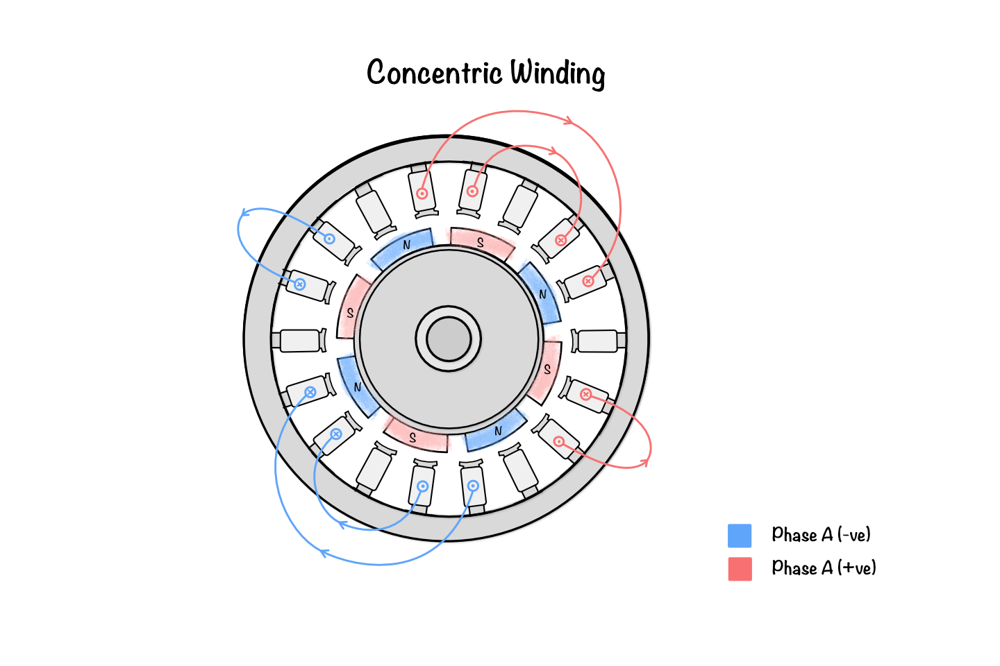

# Geometry of the stator

Have you ever wondered why two motors of the same size can produce vastly different torque or efficiency? One of the primary reasons lies in the design of the stator. Although it never rotates, the stator generates the rotating magnetic field that drives the rotor and largely determines the electromagnetic performance of the machine.

The stator consists of laminated electrical steel containing uniformly distributed teeth that accommodate the stator windings. Its geometry directly influences magnetic flux distribution, winding arrangement, torque production, efficiency, and thermal performance. Within this software, the stator geometry is defined parametrically, enabling different stator configurations to be created by modifying a set of geometric parameters.

## What are the main parts of the stator?

The stator consists of two primary magnetic components together with the winding system that produces the rotating magnetic field.

**Figure 1:** Stator parameter illustration showing the stator yoke, stator teeth, rotor, and shaft within a radial flux BLDC machine. The figure identifies the outer and inner stator diameters and highlights how the stator geometry defines the magnetic circuit and winding space. These parameters are fundamental to defining the machine’s air-gap, magnetic loading, and overall electromagnetic performance.
## Stator yoke

The stator yoke forms the outer magnetic path of the machine. It provides mechanical rigidity while carrying magnetic flux between adjacent stator teeth. The yoke thickness must be sufficient to prevent magnetic saturation during operation.

## Stator teeth

The stator teeth extend radially towards the air gap and define the geometry that accommodates the stator windings. Their dimensions strongly influence magnetic loading, tooth saturation, leakage flux, cogging torque, and the available conductor area.

## Stator tooth types

**Figure 2:** Stator tooth type examples showing parallel tooth, tapered, capsule, slotless, parallel slot, and form-wound profiles. The illustration demonstrates how different tooth shapes alter the slot opening, winding volume, and magnetic flux path. Choosing the right tooth geometry helps balance manufacturability, cogging torque, magnetic saturation, and winding accommodation.

The geometry of the stator teeth significantly influences the electromagnetic performance of a BLDC machine, affecting magnetic flux distribution, winding accommodation, cogging torque, leakage flux, manufacturability, and thermal characteristics. To support a wide range of machine designs, the software provides several predefined stator tooth geometries.

The currently supported stator tooth types are:

- Tapered Slot
- Form Wound
- Slotless
- Capsule
- Parallel Slot
- Parallel Tooth
- Parallel Tooth (Square Base)

Each tooth type is generated using the parametric geometry described in the following sections, allowing the machine geometry to be customised while maintaining a consistent electromagnetic model.

The detailed tooth dimensions are defined using the parametric geometry described below.

## How is the stator geometry defined?

The software generates the stator using a set of geometric parameters. These parameters describe the dimensions of the slot, tooth, insulation, and wedge regions. By modifying these values, different stator slot types can be created while preserving the overall machine geometry.

The following parameters are used to construct the stator geometry.

## Stator geometry parameters

**Figure 3:** Stator geometry parameter diagram showing tooth opening depth, tooth neck depth, tooth body depth, and slot width dimensions. The figure links the dimensional parameters to the physical slot and tooth shape used to generate the stator geometry. These values directly affect magnetic flux distribution, slot leakage, and coil accommodation in the finite element model.
### Stator inner radius

The stator inner radius defines the inner cylindrical surface of the stator facing the air gap. It establishes the air-gap diameter and directly influences the magnetic loading and effective machine radius.

### Stator outer radius

The stator outer radius defines the external boundary of the laminated stator core. Together with the stator inner radius, it determines the yoke thickness and the available magnetic cross-sectional area.

### Tooth opening depth (LS0)

It defines the radial length of the tooth tip adjacent to the air gap. This region controls the slot opening profile and significantly influences leakage flux, cogging torque, and air-gap flux distribution.

### Tooth neck depth (LS1)

Neck Length specifies the radial height of the narrow transition region between the tooth tip and the main tooth body. It controls the magnetic flux concentration entering the tooth while affecting mechanical strength.

### Tooth body depth (LS2)

Body Length defines the radial length of the main tooth section extending towards the stator yoke. It determines the available winding depth and contributes to the magnetic path through the stator.

### Tooth mouth width (WS0)

Head Width specifies the circumferential width of the tooth tip adjacent to the air gap. It influences the slot opening, magnetic fringing, leakage flux, and cogging torque.

### Tooth neck width (WS1)

Neck Width defines the circumferential width of the tooth neck immediately below the tooth tip. This parameter controls the transition of magnetic flux from the tooth tip into the main tooth body.

### Tooth bottom width (WS2)

Bottom Width specifies the width of the tooth where it joins the stator yoke. It determines the magnetic cross-sectional area available for carrying flux and influences tooth saturation.

### Bottom fillet radius (RS)

Fillet Radius defines the radius used to blend adjacent tooth surfaces. Rounded corners improve manufacturability, reduce stress concentration, and produce smoother magnetic flux distribution compared with sharp corners.

### Wedge depth

Wedge depth specifies the radial space allocated for the slot wedge located near the slot opening. The wedge mechanically retains the winding conductors and provides additional electrical insulation where required.

### Wedge insert

The wedge insert height defines the supporting section beneath the slot wedge. It ensures secure conductor retention while maintaining the desired tooth geometry.

### Wedge thickness

Wedge thickness specifies the thickness of the slot wedge used to secure the winding conductors. It affects the mechanical integrity of the winding retention system while slightly modifying the effective slot opening.

### Insulation tooth width

Insulation tooth width defines the width of the insulation layer separating the winding conductors from the laminated tooth surface. Adequate insulation ensures electrical isolation while reducing the effective conductor area available within the slot.

### Sleeve thickness

Sleeve thickness represents the thickness of the insulating slot liner surrounding the winding conductors. It provides electrical insulation between the copper winding and the laminated steel core while protecting the insulation system during manufacturing and operation.

### Stator windings

The stator windings are insulated conductors placed inside the stator slots to produce the rotating magnetic field when energised by a three-phase current. Their arrangement determines the magnetic field distribution, winding factor, induced back EMF, torque production, efficiency, and harmonic content of the machine.

The software allows the winding configuration to be defined parametrically, enabling different winding layouts to be created for various motor topologies.

## Stator winding parameters
### Windings per phase

Specifies the total number of stator windings allocated to each electrical phase. Together with the number of slots and poles, this parameter determines the winding distribution and phase sequence of the machine.

Increasing the number of windings per phase generally increases the generated magnetomotive force (MMF), resulting in higher flux linkage and torque capability, while also affecting the winding resistance and copper losses.

### Winding type

Defines the physical arrangement of the stator coils within the slots. The software currently supports three winding configurations.

#### Lap winding

In a lap winding, adjacent coils overlap each other and are distributed around the stator circumference. This arrangement provides a uniform magnetic field distribution and is widely used in distributed winding BLDC and synchronous machines.

#### Concentric winding

A concentric winding consists of multiple coils having different diameters but sharing a common centre. These windings are simpler to manufacture and are commonly used in fractional-slot and concentrated winding machines.

#### Custom winding

The custom winding option allows users to define their own winding layout instead of selecting a predefined arrangement. This provides flexibility for modelling specialised winding configurations and performing custom electromagnetic studies.

### Winding construction

Specifies the physical construction of the conductors used in the stator winding.

#### Stranded conductor

A stranded conductor consists of multiple thin insulated wires connected in parallel to form a single conductor. This construction offers greater flexibility during manufacturing and helps reduce AC losses caused by skin and proximity effects.

#### Hair-pin conductor
A hairpin conductor is manufactured from rectangular copper conductors that are bent into a hairpin shape before being inserted into the stator slots and welded together. Hairpin windings provide a high slot fill factor, low DC resistance, and excellent manufacturing repeatability, making them well suited for high-power traction motors and industrial drives.

### Parallel paths

Defines the number of electrically parallel current paths within each phase winding. Multiple parallel paths reduce current density and winding resistance, allowing higher current ratings without increasing conductor temperature.

### Coil pitch

Coil pitch represents the angular separation between the two sides of a coil measured in slot pitches. It influences the winding factor, harmonic content, induced voltage, and torque characteristics of the machine.

### Copper slot fill
Copper slot fill represents the percentage of the available slot area occupied by copper conductors. The remaining space is occupied by insulation, slot liners, wedges, and manufacturing clearances.

A higher copper slot fill generally reduces winding resistance and improves torque capability. However, excessively high fill factors may increase manufacturing difficulty, reduce insulation thickness, and adversely affect thermal management.

The electromagnetic behaviour of the windings is analysed in [Electromagnetic analysis of a BLDC Motor](09_em_analysis_of_bldc_motor.md). The material properties assigned to each stator component are described in [Material Definition](08_material_definition.md).
## Summary
The electromagnetic performance of the stator is strongly governed by its geometric dimensions. Parameters such as slot width, slot depth, tooth width, slot opening, and insulation dimensions directly influence magnetic flux distribution, conductor accommodation, leakage flux, saturation, and overall machine performance. The parametric approach adopted in this software enables rapid generation and optimisation of different stator slot configurations while maintaining consistent electromagnetic modelling.