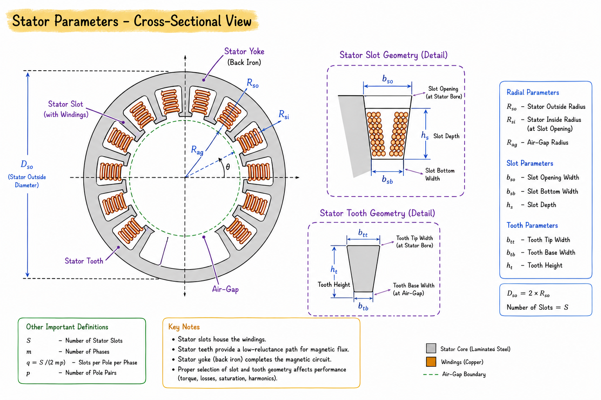
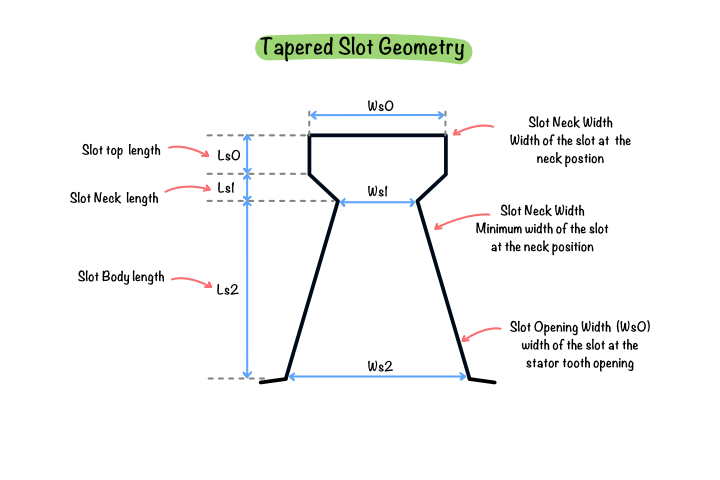
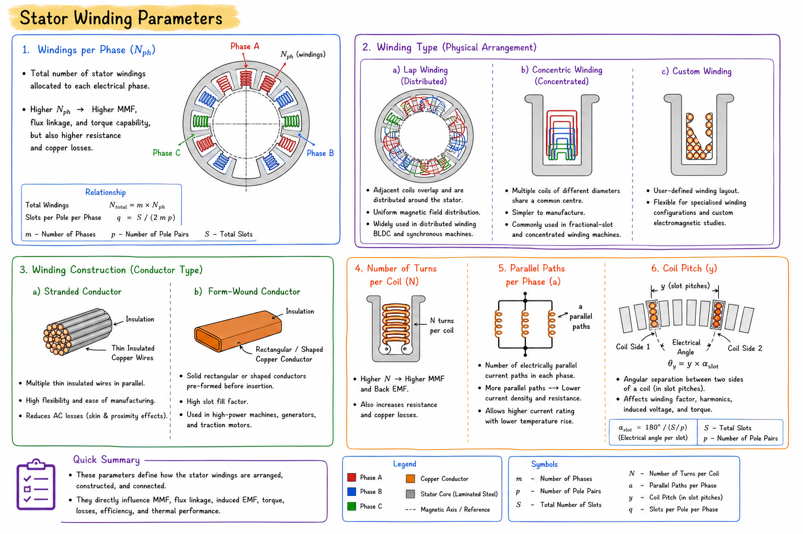

# Geometry of the stator

The stator is the stationary part of an electric motor and forms the primary magnetic circuit responsible for producing the rotating magnetic field. It consists of laminated electrical steel containing uniformly distributed slots that accommodate the stator windings. The geometry of the stator directly influences magnetic flux distribution, winding arrangement, electromagnetic torque, efficiency, and thermal performance.

Within this software, the stator geometry is defined parametrically. Each geometric parameter controls a specific feature of the stator and allows different slot configurations to be generated while maintaining manufacturing constraints.

## What are the main parts of the stator?

The stator consists of three primary components that together form the electromagnetic structure of the motor.
### Stator yoke

The stator yoke forms the outer magnetic path of the machine. It provides mechanical rigidity while carrying magnetic flux between adjacent statator teeth. The yoke thickness must be sufficient to prevent magnetic saturation during operation.

### Stator teeth

The stator teeth extend radially towards the air gap and guide magnetic flux from the yoke into the air gap. The geometry of the teeth strongly influences magnetic loading, cogging torque, leakage flux, and tooth saturation.

### Stator slots

Slots are cavities machined between adjacent stator teeth to accommodate the winding conductors and insulation. Their geometry determines the available copper area, winding arrangement, slot fill factor, and electromagnetic performance of the motor.

## How is the stator geometry defined?

The software generates the stator using a set of geometric parameters. These parameters describe the dimensions of the slot, tooth, insulation, and wedge regions. By modifying these values, different stator slot types can be created while preserving the overall machine geometry.

The following parameters are used to construct the stator geometry.

## Stator geometry parameters

**Figure 1:** Stator Parameters

**Figure 2:** Slot parameters close-up view

### Slot width
The slot width represents the circumferential width of the slot measured across its main body. It determines the space available for accommodating conductors and insulation in slot geometries having a constant slot width.

### Slot width (bottom)
**Symbol:** bs1

The bottom slot width is measured at the base of the slot where it joins the stator yoke. It is primarily used in tapered slot geometries and controls the convergence of the slot walls towards the bottom.

### Slot width (top)

**Symbol:** bs2

The top slot width is measured near the tooth tip close to the air gap. It determines the width of the upper slot opening in tapered slot configurations and influences leakage flux around the slot opening.

### Slot depth

**Symbol:** hs2

Slot depth is the radial distance from the slot opening to the bottom of the slot. Increasing the slot depth increases the available conductor area, allowing higher current-carrying capability while also affecting tooth dimensions.

### Slot corner radius

The slot corner radius defines the fillet radius at the lower corners of the slot. Rounded corners reduce stress concentration during manufacturing and produce smoother magnetic flux distribution compared to sharp corners.

### Tooth width

Tooth width is the circumferential width of each stator tooth measured at its base. It determines the magnetic cross-sectional area available for carrying flux and has a significant influence on tooth saturation and magnetic loading.

### Tooth tip depth

**Symbol:** hs0

The tooth tip depth defines the radial height of the narrow tooth section located between the slot opening and the main slot body. This region controls slot leakage flux and influences cogging torque characteristics.

### Slot opening

**Symbol:** bs0

The slot opening is the width of the slot at the air-gap interface. It determines the ease of conductor insertion during manufacturing and significantly affects slot leakage inductance, cogging torque, and air-gap flux distribution.

### Tooth tip angle

The tooth tip angle specifies the inclination of the tooth tip relative to the slot walls. Adjusting this angle modifies the slot opening profile and influences both manufacturability and magnetic field distribution near the air gap.

### Wedge depth

Wedge depth defines the radial space reserved for the slot wedge positioned at the slot opening. The wedge mechanically retains the winding conductors and provides additional electrical insulation where required.

### Wedge insert

The wedge insert height specifies the vertical dimension of the insert supporting the slot wedge. It ensures secure conductor retention while maintaining the required slot geometry.

### Wedge thickness

The wedge thickness represents the thickness of the slot wedge itself. This parameter affects the mechanical strength of the winding retention system and slightly modifies the effective slot opening.

### Insulation tooth width

This parameter specifies the width of the insulating tooth section used in slotless or specially insulated stator configurations. It ensures adequate electrical isolation between adjacent winding regions.

### Sleeve thickness

**Symbol:** hs1

Sleeve thickness represents the thickness of the slot liner or insulation sleeve surrounding the conductors. It provides electrical insulation between the winding and laminated stator core while reducing the effective conductor area available within the slot.

### Stator windings

The stator windings are insulated conductors placed inside the stator slots to produce the rotating magnetic field when energised by a three-phase current. Their arrangement determines the magnetic field distribution, winding factor, induced back EMF, torque production, efficiency, and harmonic content of the machine.

The software allows the winding configuration to be defined parametrically, enabling different winding layouts to be created for various motor topologies.

## Stator winding parameters

**Figure 3**: Stator winding parameters
### Windings per phase

Specifies the total number of stator windings allocated to each electrical phase. Together with the number of slots and poles, this parameter determines the winding distribution and phase sequence of the machine.

Increasing the number of windings per phase generally increases the generated magnetomotive force (MMF), resulting in higher flux linkage and torque capability, while also affecting the winding resistance and copper losses.

### Winding type

Defines the physical arrangement of the stator coils within the slots. The software currently supports three winding configurations.

#### Lap winding

In a lap winding, adjacent coils overlap each other and are distributed around the stator circumference. This arrangement provides a uniform magnetic field distribution and is widely used in distributed winding BLDC and synchronous machines.

#### Concentric winding

A concentric winding consists of multiple coils having different diameters but sharing a common centre. These windings are simpler to manufacture and are commonly used in fractional-slot and concentrated winding machines.

#### Custom winding

The custom winding option allows users to define their own winding layout instead of selecting a predefined arrangement. This provides flexibility for modelling specialised winding configurations and performing custom electromagnetic studies.

### Winding construction

Specifies the physical construction of the conductors used in the stator winding.

#### Stranded conductor

A stranded conductor consists of multiple thin insulated wires connected in parallel to form a single conductor. This construction offers greater flexibility during manufacturing and helps reduce AC losses caused by skin and proximity effects.

#### Form-wound conductor

Form-wound conductors are manufactured from solid rectangular or shaped copper conductors that are preformed before insertion into the stator slots. They provide a high slot fill factor and are commonly used in high-power industrial machines, generators, and traction motors.

### Number of turns per coil

Specifies the number of conductor turns contained within each stator coil. Increasing the number of turns increases the magnetomotive force and induced back EMF, but also increases winding resistance and copper losses.

### Parallel paths

Defines the number of electrically parallel current paths within each phase winding. Multiple parallel paths reduce current density and winding resistance, allowing higher current ratings without increasing conductor temperature.

### Coil pitch

Coil pitch represents the angular separation between the two sides of a coil measured in slot pitches. It influences the winding factor, harmonic content, induced voltage, and torque characteristics of the machine.

## Summary

The electromagnetic performance of the stator is strongly governed by its geometric dimensions. Parameters such as slot width, slot depth, tooth width, slot opening, and insulation dimensions directly influence magnetic flux distribution, conductor accommodation, leakage flux, saturation, and overall machine performance. The parametric approach adopted in this software enables rapid generation and optimisation of different stator slot configurations while maintaining consistent electromagnetic modelling.