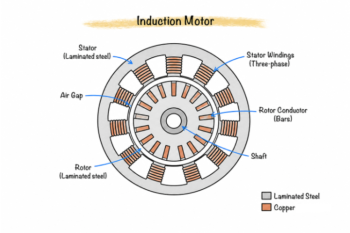
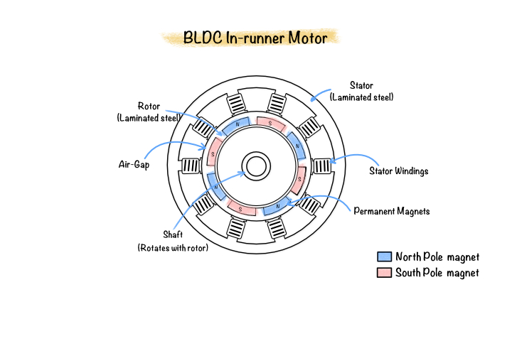
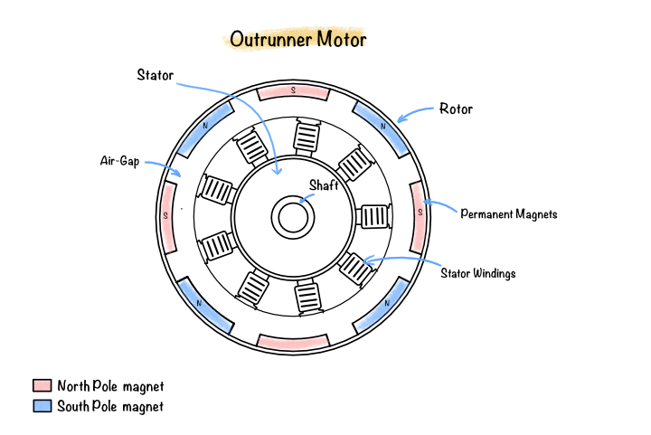
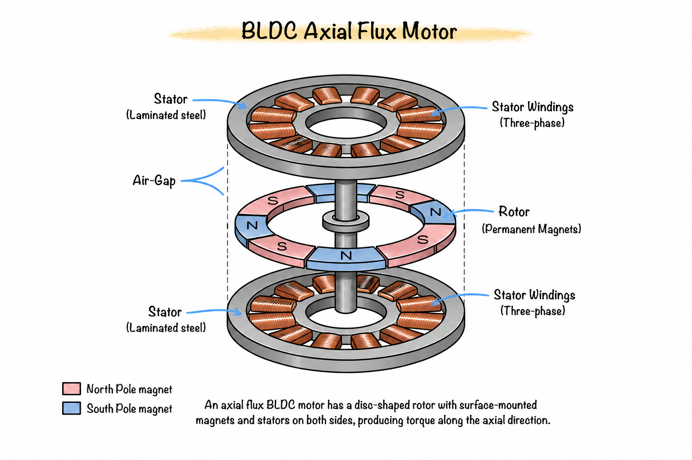

# Electrical Machine Fundamentals

Electrical machines are electromechanical energy conversion devices that convert electrical energy into mechanical energy (motor operation) or mechanical energy into electrical energy (generator operation). Their operation is governed by Maxwell's equations, Faraday's law of electromagnetic induction, and the Lorentz force law.

In motor applications, electrical current flowing through stator windings produces a magnetic field. The interaction between this stator field and the rotor magnetic field generates electromagnetic torque, causing the rotor to rotate. Electrical machines are fundamental components in electric vehicles, industrial automation, robotics, aerospace, renewable energy systems, and household appliances.

This chapter introduces the operating principles of electrical machines, the major machine classifications, and the Brushless DC (BLDC) machine used throughout this manual.

## Working Principle of Electrical Machines

The operation of every electrical machine is based on two fundamental electromagnetic phenomena:

- Electromagnetic induction
- Lorentz force

Together, these principles enable energy conversion between electrical and mechanical domains.

### Electromagnetic Induction

According to Faraday's Law, a changing magnetic flux linking a conductor induces an electromotive force (EMF).

$$
e=-N\frac{d\Phi}{dt}
$$

where

- $e$ = induced voltage (V)
- $N$ = number of turns
- $\Phi$ = magnetic flux (Wb)

In electric machines, the relative motion between the rotor magnetic field and stator windings continuously changes the magnetic flux linkage, producing back electromotive force (Back-EMF).

### Lorentz Force

A current-carrying conductor placed inside a magnetic field experiences a force given by

$$
\mathbf{F}=I(\mathbf{L}\times\mathbf{B})
$$

where

- $I$ = conductor current
- $\mathbf{L}$ = conductor length vector
- $\mathbf{B}$ = magnetic flux density

The combined force acting on all conductors produces electromagnetic torque that rotates the rotor.

### Electromechanical Energy Conversion

Motor operation follows the sequence

Electrical Energy

↓

Current in Stator Windings

↓

Magnetic Field Generation

↓

Rotor-Stator Magnetic Interaction

↓

Electromagnetic Torque

↓

Mechanical Rotation

Generator operation follows the reverse process, where mechanical rotation produces electrical energy through electromagnetic induction.

### Rotating Magnetic Field

Three-phase AC currents displaced by 120° electrical generate a rotating magnetic field inside the stator.

The synchronous speed of this field is

$$
N_s=\frac{120f}{P}
$$

where

- $N_s$ = synchronous speed (rpm)
- $f$ = electrical frequency (Hz)
- $P$ = number of poles

The rotating magnetic field continuously interacts with the rotor to produce torque.

### Torque Production

Electromagnetic torque is produced whenever two magnetic fields attempt to align.

In permanent magnet machines, the rotor magnetic field is produced by permanent magnets while the stator magnetic field is produced by three-phase currents. Their interaction generates continuous torque over one electrical cycle.

## Types of Electrical Machines

Electrical machines are commonly classified according to the method used to generate the rotor magnetic field.

### DC Machines

DC machines use brushes and a mechanical commutator to switch current through the rotor windings.

Characteristics

- Simple speed control
- High starting torque
- Requires regular maintenance
- Brush wear limits lifetime

Applications

- Cranes
- Hoists
- Laboratory drives

### Induction Machines

Induction machines use electromagnetic induction to generate rotor currents without electrical connections to the rotor.

Characteristics

- Rugged construction
- Low maintenance
- No permanent magnets
- Rotor operates with slip

Figure: Induction Motor
Applications

- Industrial motors
- Pumps
- Compressors
- Fans

### Synchronous Machines

In synchronous machines, the rotor rotates exactly at synchronous speed with the rotating magnetic field.

Rotor excitation may be provided by

- Permanent magnets
- DC field windings

Characteristics

- Constant speed
- High efficiency
- High power density

Applications

- Power generation
- Industrial drives
- Marine propulsion

### Permanent Magnet Synchronous Machines (PMSM)

PMSMs replace field windings with permanent magnets mounted on or embedded inside the rotor.

Characteristics

- High efficiency
- High torque density
- Smooth torque
- Sinusoidal back-EMF

Applications

- Electric vehicles
- Robotics
- CNC machines
- Aerospace

### Brushless DC Machines (BLDC)

BLDC machines also employ permanent magnets but are electronically commutated instead of using mechanical brushes.

Unlike conventional DC motors, the current switching is performed by an electronic inverter based on rotor position.

Characteristics

- Brushless construction
- High efficiency
- High reliability
- Low maintenance
- High torque-to-weight ratio
- Wide speed range

Applications

- Electric vehicles
- Drones
- Industrial automation
- Medical equipment
- Cooling fans
- Home appliances

### Switched Reluctance Machines (SRM)

Switched reluctance machines generate torque by moving the rotor toward the position of minimum magnetic reluctance.

Characteristics

- Simple rotor
- No magnets
- Robust construction
- High-speed capability
- Higher torque ripple

Applications

- Industrial drives
- Pumps
- Aerospace systems

### Comparison of Machine Types

| Machine | Rotor Excitation | Brushes | Efficiency | Torque Density | Maintenance |
|----------|-----------------|----------|------------|---------------|-------------|
| DC | Field winding | Yes | Medium | Medium | High |
| Induction | Induced current | No | High | Medium | Low |
| PMSM | Permanent magnets | No | Very High | Very High | Low |
| BLDC | Permanent magnets | No | Very High | High | Very Low |
| SRM | Reluctance | No | High | Medium | Very Low |

## Brushless DC (BLDC) Machines

A Brushless DC (BLDC) motor is a permanent magnet synchronous machine in which electronic switching replaces the mechanical commutator used in conventional DC motors.

The stator contains distributed or concentrated three-phase windings, while the rotor contains permanent magnets arranged with alternating north and south poles.

An electronic inverter energizes the stator phases in sequence according to the rotor position, producing a rotating magnetic field that drives the rotor.

### Construction

A BLDC motor consists of

- Stator
- Rotor
- Permanent magnets
- Three-phase windings
- Shaft
- Airgap
- Bearings
- Electronic inverter

The stator generates the rotating magnetic field, while the rotor follows this field due to magnetic attraction and repulsion.

### Principle of Operation

The operating sequence is

1. Three-phase currents energize the stator windings.
2. The stator produces a rotating magnetic field.
3. Permanent magnets align with the rotating field.
4. Electromagnetic torque is generated.
5. The inverter continuously commutates the stator currents according to rotor position.

Unlike brushed DC motors, commutation is entirely electronic.

### Advantages

- High efficiency
- High power density
- High torque density
- Brushless operation
- Low maintenance
- Low acoustic noise
- Long operating life
- Excellent dynamic response
- High-speed capability

### Limitations

- Requires electronic controller
- Higher manufacturing cost
- Permanent magnet cost
- Demagnetization risk at high temperature

### BLDC Motor Configurations

BLDC motors are primarily classified according to the direction of magnetic flux.

### Radial Flux BLDC Motors

In radial flux machines, the magnetic flux travels radially between the rotor and stator.

The rotor and stator are concentric cylinders separated by a small airgap. This is the most widely used BLDC configuration because of its mature manufacturing process and mechanical robustness.

Characteristics

- Cylindrical geometry
- Radial magnetic flux
- Simple cooling
- Mature manufacturing technology
- Suitable for high-speed operation

### Inrunner BLDC Motor

In an inrunner motor also known as inner rotor motor, the rotor is located inside the stator.

The rotor has a relatively small diameter, resulting in a low moment of inertia and excellent high-speed performance.

Characteristics

- Rotor inside stator
- Small rotor diameter
- High rotational speed
- Fast acceleration
- Lower output torque
- Better cooling of stator windings

Figure : In-runner/ BLDC Motor
Applications

- Drones
- Electric tools
- CNC spindles
- Industrial actuators

### Outrunner BLDC Motor

In an outrunner motor, the rotor surrounds the stator.

The larger rotor diameter increases the torque arm, enabling higher torque production at lower rotational speeds.

Characteristics

- Rotor outside stator
- Large rotor diameter
- High torque
- Lower operating speed
- Higher rotor inertia
- Excellent torque density

Figure : Outer runner BLDC motor

Applications

- Electric bicycles
- UAV propulsion
- Robotics
- Direct-drive systems

### Axial Flux BLDC Motors

In axial flux machines, the magnetic flux travels parallel to the shaft axis instead of radially.

The stator and rotor are arranged as flat discs, producing a pancake-shaped motor with a much shorter axial length.

Characteristics

- Axial magnetic flux
- Disc-shaped geometry
- Short axial length
- High torque density
- High power density
- Reduced weight
- Excellent cooling potential

Because torque is proportional to the effective rotor radius, axial flux machines can generate higher torque for the same outer diameter than many radial flux machines.
Figure :

Applications

- Electric vehicles
- Aircraft propulsion
- Wheel hub motors
- Industrial servo drives
- High-performance traction systems

### Comparison of BLDC Configurations

| Feature | Radial Inrunner | Radial Outrunner | Axial Flux |
|----------|----------------|-----------------|------------|
| Rotor Position | Inside stator | Outside stator | Disc rotor |
| Flux Direction | Radial | Radial | Axial |
| Speed Capability | Very High | Medium | Medium |
| Torque Density | Medium | High | Very High |
| Rotor Inertia | Low | High | Medium |
| Cooling | Excellent | Moderate | Excellent |
| Typical Applications | Spindles, drones | E-bikes, robotics | EVs, aerospace, traction |

## Relevance to This Manual

The simulation framework developed in this manual focuses on a **surface-mounted radial flux BLDC motor** with a cylindrical stator, cylindrical rotor, and surface-mounted permanent magnets. The finite element formulation, electromagnetic equations, excitation strategy, transient rotor motion, and post-processing methods presented in the following chapters are based on this motor topology.