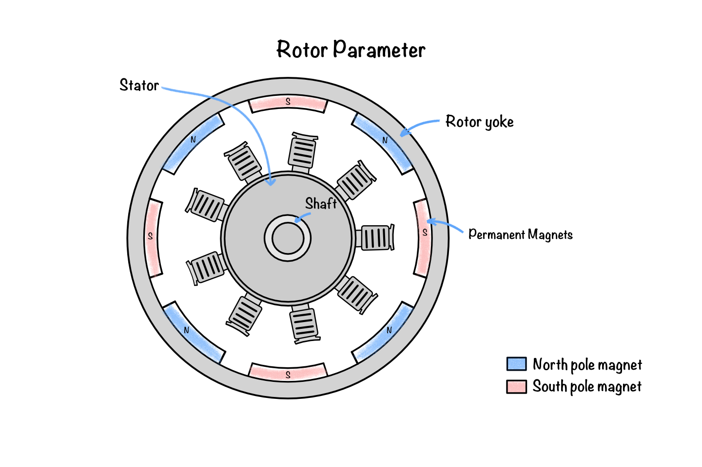
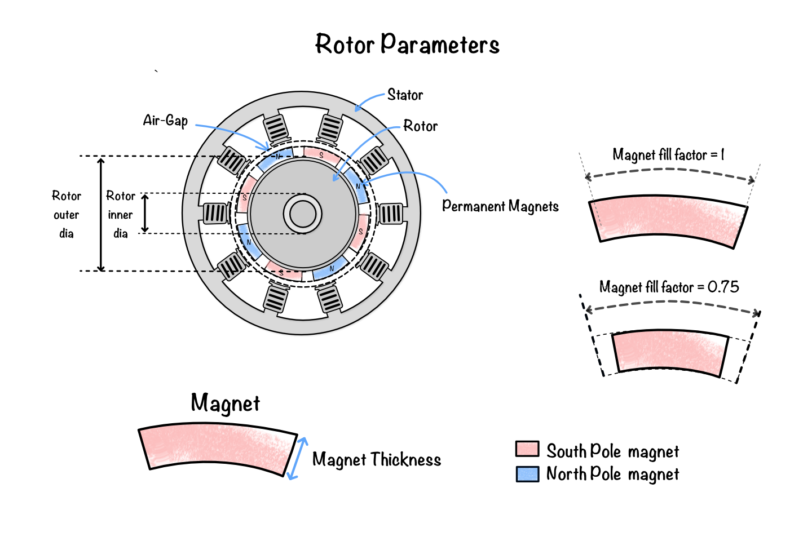

# Geometry of the rotor

Have you ever wondered why some motors deliver exceptionally high torque while others are designed for extremely high rotational speeds? A significant part of the answer lies in the rotor. By carrying the permanent magnets that interact with the rotating magnetic field produced by the stator, the rotor governs the electromagnetic forces responsible for torque production. Its geometry directly influences the air-gap flux distribution, Back EMF, efficiency, cogging torque, and the overall performance of the machine.

Within this software, the rotor is defined using a parametric geometry. Each parameter controls a specific geometric feature, enabling different rotor configurations to be generated and optimised while preserving the desired electromagnetic and mechanical characteristics.

The operating principle of the rotor is introduced in [Permanent magnet BLDC machine theory](04_permanent_magnet_bldc_machine_theory.md).
## What are the main parts of the rotor?

The rotor consists of several components that together generate the magnetic field required for motor operation.

**Figure 1:** Cross-sectional view of the rotor showing the rotor yoke, alternating pole permanent magnets, air gap, and shaft. The illustration highlights the surface-mounted magnet arrangement and the magnetic return path through the laminated steel yoke. It emphasises how the rotor geometry and magnet placement determine the air-gap flux distribution and torque-producing field interaction.
### Rotor yoke

The rotor yoke forms the magnetic core of the rotor and provides the return path for magnetic flux flowing between adjacent permanent magnets. It also provides mechanical support for the magnets and shaft while maintaining sufficient cross-sectional area to prevent magnetic saturation.

### Permanent magnets

Permanent magnets are mounted on the outer surface of the rotor in a surface-mounted permanent magnet (SPM) BLDC machine. These magnets establish the rotor's excitation field without requiring external electrical excitation. Their dimensions, shape, material properties, and arrangement strongly influence the air-gap flux density, Back EMF, torque capability, and cogging torque of the machine.

The magnetic properties of permanent magnets are discussed in [Material definition](08_material_definition.md).

## How is the rotor geometry defined?

The software constructs the rotor using a set of geometric parameters describing the permanent magnets, rotor core, shaft, and air gap. These parameters determine both the electromagnetic behaviour and the mechanical characteristics of the machine.

**Figure 2:** Detailed rotor parameter diagram showing magnet thickness, magnet reduction, magnet arc angle, segmented magnet layout, rotor diameter, shaft diameter, shaft hole diameter, banding thickness, and air-gap. The figure identifies the key parametric dimensions that shape the rotor’s magnetic circuit and mechanical structure. These parameters are critical for controlling magnetic loading, back EMF, cogging torque, and the structural integrity of the rotor assembly.

The following parameters are used to define the rotor geometry.
### Magnet thickness

Magnet thickness specifies the radial thickness of each permanent magnet mounted on the rotor. Increasing the magnet thickness generally increases the available magnetic flux until the magnetic circuit approaches saturation, beyond which additional magnet material provides little improvement in performance.

### Rotor inner radius

The rotor inner radius defines the inner boundary of the rotor core adjacent to the shaft. Together with the rotor outer radius, it determines the thickness of the laminated rotor core and influences the mechanical strength of the rotating assembly.

### Rotor outer radius

The rotor outer radius defines the external boundary of the rotor core, excluding the permanent magnets. This parameter determines the effective rotor size and, together with the stator inner radius, establishes the machine air-gap.

Increasing the rotor outer radius generally increases the effective torque-producing radius but reduces the available air-gap clearance.

### Magnet fill factor

The magnet fill factor specifies the fraction of each magnetic pole occupied by permanent magnet material. It controls the effective magnet coverage around the rotor circumference and therefore influences the air-gap flux distribution, magnetic loading, Back EMF waveform, torque production, and cogging torque.

### Air-gap radius

The air-gap radius defines the mean radius at which the electromagnetic interaction between the stator and rotor occurs. It is one of the most important geometric parameters because electromagnetic torque is produced across the air gap.

The air-gap radius is determined by the relative dimensions of the stator and rotor and directly influences the air-gap flux density, magnetic reluctance, torque capability, and machine efficiency. A larger effective air-gap radius generally increases the torque-producing lever arm, while the air-gap length itself governs the magnetic coupling between the stator and rotor.

The influence of rotor geometry on torque and Back EMF is evaluated in [Electromagnetic analysis of a BLDC Motor](09_em_analysis_of_bldc_motor.md).
## Summary

The rotor geometry governs both the electromagnetic and mechanical performance of a BLDC motor. Parameters such as magnet thickness, magnet arc, air-gap length, rotor diameter, and shaft dimensions directly influence magnetic flux distribution, Back EMF, torque production, cogging torque, and mechanical strength. By defining these parameters parametrically, the software enables rapid development and optimisation of rotor designs while maintaining accurate electromagnetic simulations.