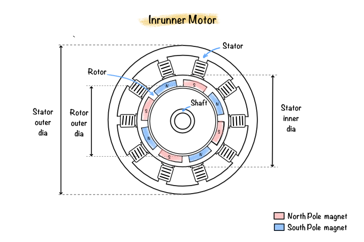
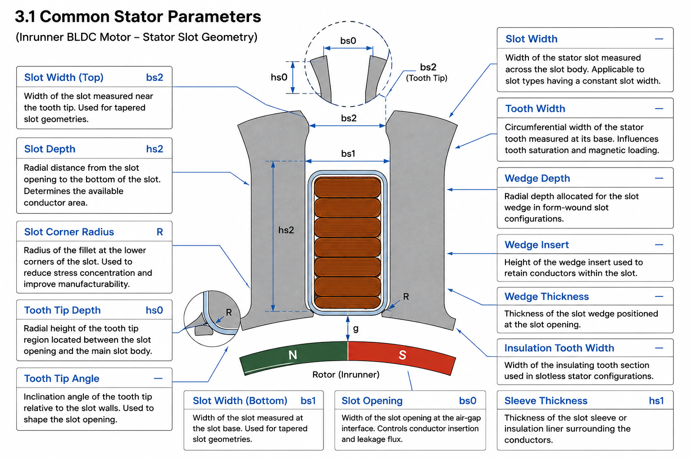
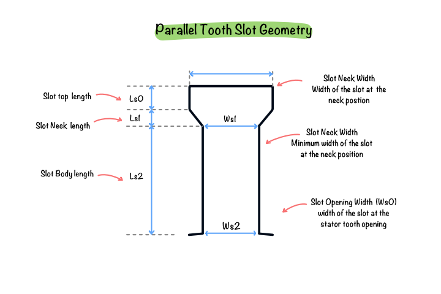
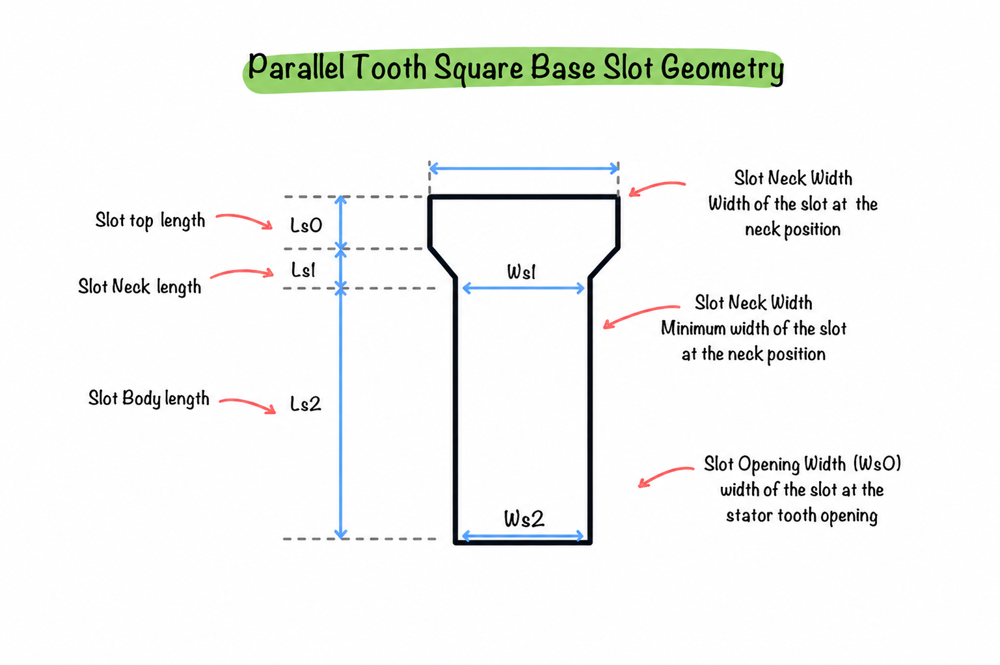
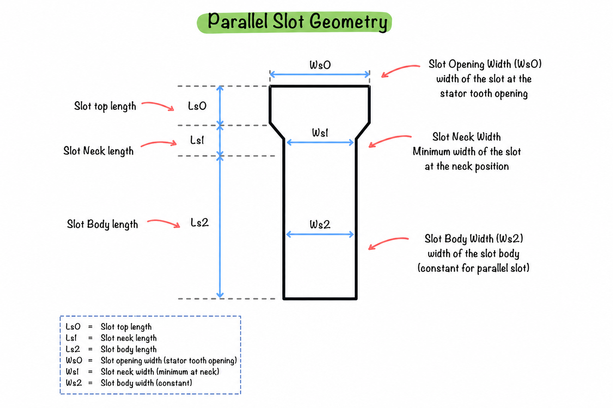
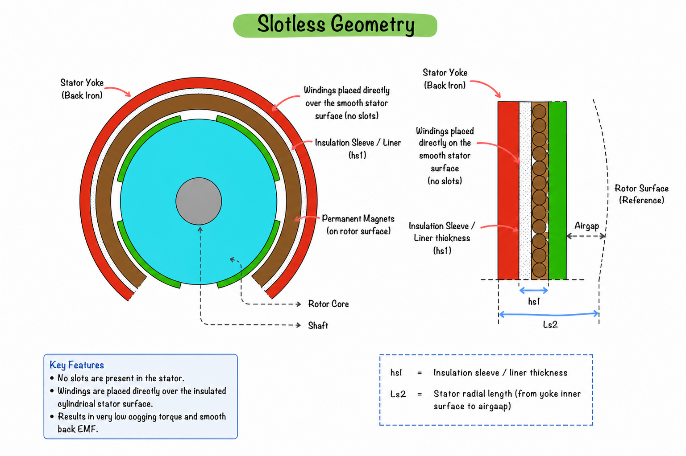
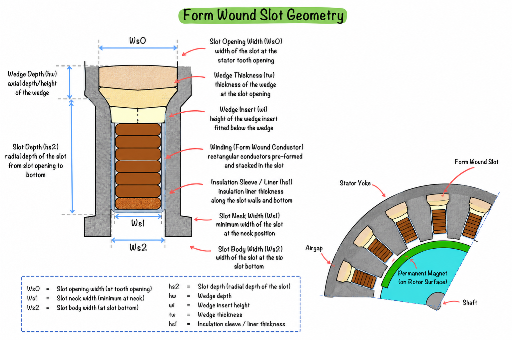
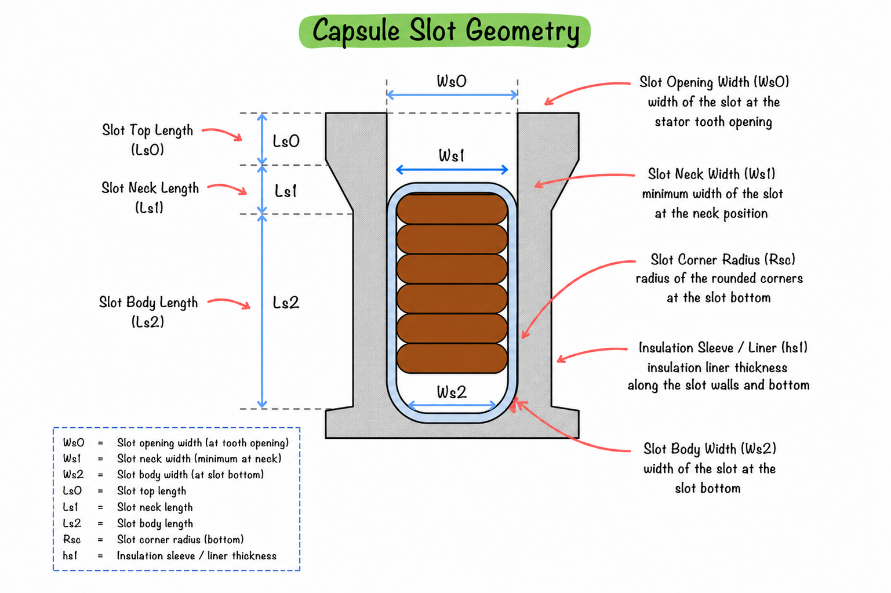
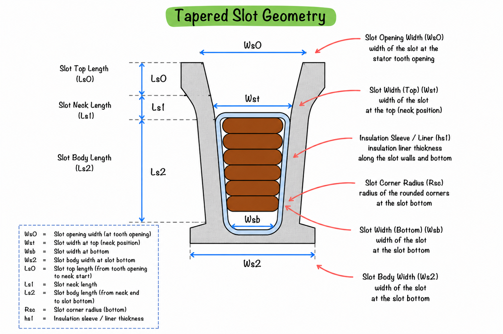

# Motor Geometry and Components

The **Surface Parallel Inrunner BLDC Motor** is a permanent magnet synchronous machine (PMSM) configuration in which the rotor is positioned inside the stator bore and carries permanent magnets mounted on its outer surface. The stator surrounds the rotor and contains the electrical windings housed inside stator slots.

Unlike an outrunner configuration where the rotor rotates around the stator, an inrunner motor places the rotating assembly at the center of the machine. This configuration provides lower rotor inertia, improved mechanical rigidity, and excellent high-speed performance, making it suitable for industrial drives, electric vehicles, robotics, aerospace actuators, machine tools, and servo applications.

In the **Surface Parallel** topology, the permanent magnets are bonded directly onto the outer surface of the rotor with their magnetization oriented radially while the magnet faces remain parallel to the rotor surface. This rotor construction offers a simple manufacturing process, good electromagnetic performance, and relatively low production cost.

The electromagnetic characteristics of the machine are highly dependent on its geometric configuration. Parameters such as stator slot geometry, rotor topology, cooling ducts, shaft construction, and permanent magnet dimensions directly influence torque production, cogging torque, magnetic saturation, winding accommodation, cooling capability, and manufacturing complexity.

The geometry editor of the simulation software allows these machine features to be configured through predefined geometry templates. Each template requires a set of geometric parameters that completely define the machine cross-section.

This chapter describes every geometric option available for the **Surface Parallel Inrunner BLDC Motor**, explains the significance of each parameter, and provides the theoretical basis for the available slot configurations.

---

## Geometry Overview

The geometry editor for the Surface Parallel Inrunner BLDC Motor consists of five major groups of geometric definitions.

1. **Slot Type**
2. **Rotor Type**
3. **Stator Duct Type**
4. **Rotor Duct Type**
5. **Shaft Type**

Each group controls a different part of the machine geometry and collectively defines the complete electromagnetic model used during simulation.

**Figure 7.1:** Diagram of an inrunner motor seen from top

---

### Slot Types

The slot type determines the geometry of the stator teeth and winding slots. It influences:

- Available copper area
- Tooth saturation
- Leakage flux
- Cogging torque
- Manufacturability
- Winding insertion

The following slot geometries are available.

| Sl. No. | Slot Type |
|------:|--------------------------|
| 1 | Parallel Tooth |
| 2 | Parallel Tooth Square Base |
| 3 | Parallel Slot |
| 4 | Slotless |
| 5 | Form Wound |
| 6 | Tapered Slot |

---

### Rotor Types

The rotor type determines the permanent magnet arrangement and rotor core construction.

The following rotor topologies are available.

| Sl. No. | Rotor Type |
|------:|----------------------|
| 1 | Surface Radial |
| 2 | Surface Parallel |
| 3 | Surface Breadloaf |
| 4 | Surface Flat |
| 5 | Inset Radial |
| 6 | Inset Parallel |
| 7 | Inset Breadloaf |
| 8 | Embedded Radial |
| 9 | Embedded Parallel |
| 10 | Embedded Breadloaf |
| 11 | Interior Flat (Web) |
| 12 | Interior Flat (Simple) |
| 13 | Interior V (Simple) |
| 14 | Interior V (Web) |
| 15 | Interior U Shape |
| 16 | Spoke |

---

### Stator Duct Types

Cooling ducts may be introduced within the stator laminations to improve heat dissipation.

The following duct geometries are supported.

| Sl. No. | Duct Type |
|------:|-------------------------|
| 1 | None |
| 2 | Rectangular lem H Divider |
| 3 | Circular lem H Divider |
| 4 | Circular Duct |
| 5 | Rectangular Duct |

---

### Rotor Duct Types

Rotor ducts improve rotor cooling by providing ventilation paths through the rotor core.

Available rotor duct configurations are listed below.

| Sl. No. | Rotor Duct Type |
|------:|-------------------|
| 1 | None |
| 2 | Circular Ducts |
| 3 | Shaft Spokes |
| 4 | Arc Ducts |
| 5 | Rectangular Ducts |

---

### Shaft Types

The rotor shaft provides mechanical support for the rotating assembly.

Two shaft configurations are available.

| Sl. No. | Shaft Type |
|------:|------------|
| 1 | Solid Shaft |
| 2 | Spider Shaft |

---

## Geometry Parameters

Each geometry option requires one or more geometric parameters. Some parameters are common to all slot types, whereas others are specific to a particular geometry.

The following sections define the parameters used throughout the geometry editor.

---

### Common Stator Parameters

| Parameter | Symbol | Description |
|:--------------------:|:-----:|----------------------------------------------------------------------------------------------------------------------------------|
| Slot Width | — | Width of the stator slot measured across the slot body. Applicable to slot types having a constant slot width. |
| Slot Width (Bottom) | **bs1** | Width of the slot measured at the slot base. Used for tapered slot geometries. |
| Slot Width (Top) | **bs2** | Width of the slot measured near the tooth tip. Used for tapered slot geometries. |
| Slot Depth | **hs2** | Radial distance from the slot opening to the bottom of the slot. Determines the available conductor area. |
| Slot Corner Radius | — | Radius of the fillet at the lower corners of the slot. Used to reduce stress concentration and improve manufacturability. |
| Tooth Width | — | Circumferential width of the stator tooth measured at its base. Influences tooth saturation and magnetic loading. |
| Tooth Tip Depth | **hs0** | Radial height of the tooth tip region located between the slot opening and the main slot body. |
| Slot Opening | **bs0** | Width of the slot opening at the air-gap interface. Controls conductor insertion and leakage flux. |
| Tooth Tip Angle | — | Inclination angle of the tooth tip relative to the slot walls. Used to shape the slot opening. |
| Wedge Depth | — | Radial depth allocated for the slot wedge in form-wound slot configurations. |
| Wedge Insert | — | Height of the wedge insert used to retain conductors within the slot. |
| Wedge Thickness | — | Thickness of the slot wedge positioned at the slot opening. |
| Insulation Tooth Width | — | Width of the insulating tooth section used in slotless stator configurations. |
| Sleeve Thickness | **hs1** | Thickness of the slot sleeve or insulation liner surrounding the conductors. |

**Figure 7.2:** Parameters used in the software

---

### Common Rotor Parameters

The following parameters define the geometry of the rotor and permanent magnets used in the machine. These parameters determine the magnetic loading, air-gap flux distribution, mechanical strength, and electromagnetic performance of the motor.

| Parameter | Symbol | Description |
|:-------------------:|:----:|------------------------------------------------------------------------------------------------------------------------------------------------------------------------------------------------------------|
| Magnet Thickness | — | Radial thickness of the permanent magnet measured from the rotor surface to its outer face. Increasing this parameter generally increases the air-gap flux density until magnetic saturation occurs. |
| Magnet Reduction | — | Reduction applied to the magnet dimensions relative to the nominal geometry. This parameter is commonly used to reduce cogging torque and optimize the air-gap flux distribution. |
| Magnet Arc | — | Electrical angular span occupied by each permanent magnet. It influences the air-gap flux waveform, back EMF, cogging torque, and torque ripple. |
| Magnet Segments | — | Number of individual magnet pieces used to form one magnetic pole. Magnet segmentation improves manufacturability and reduces eddy current losses within the magnets. |
| Rotor Diameter | — | Outside diameter of the rotor core excluding the air-gap. This parameter directly affects the air-gap radius and electromagnetic torque production. |
| Airgap | — | Radial clearance between the stator bore and the rotor surface. The air-gap is one of the most critical machine dimensions as it determines the magnetic reluctance of the machine. |
| Banding Thickness | — | Thickness of the retaining sleeve or band used to secure the permanent magnets during high-speed operation. |
| Shaft Diameter | — | Outside diameter of the rotor shaft providing mechanical support to the rotating assembly. |
| Shaft Hole Diameter | — | Diameter of the central bore in a hollow shaft configuration. A value of zero represents a solid shaft. |

---

### Stator Duct Parameters

Stator ducts are incorporated within the stator core to improve heat dissipation by providing ventilation paths through the laminated stack. The following parameters define the geometry of the stator cooling ducts.

| Parameter | Symbol | Description |
|:------------------:|:----:|---------------------------------------------------------------------------------------------------------------------------------------|
| Duct Layers | — | Number of cooling duct layers distributed along the axial length of the stator core. |
| Duct Diameter | — | Diameter of circular cooling ducts. Applicable only for circular duct geometries. |
| Duct Channels | — | Number of equally spaced ducts present in each cooling duct layer. |
| Duct Height | — | Radial height of rectangular cooling ducts. |
| Duct Width | — | Tangential width of rectangular cooling ducts. |
| Duct Corner Radius | — | Radius of the rounded corners used in rectangular duct geometries to reduce stress concentration and improve manufacturability. |
| Duct Angle | — | Angular position of the duct measured with respect to the stator reference axis. |

---

### Rotor Duct Parameters

Rotor ducts provide cooling passages through the rotor core, allowing improved airflow and heat removal during machine operation. Depending on the selected duct type, different geometric parameters become available.

| Parameter | Symbol | Description |
|:------------------------:|:----:|-------------------------------------------------------------------------------------------------------------------|
| Rotor Duct Layers | — | Number of rotor duct layers distributed along the axial direction of the rotor stack. |
| Rotor Duct Channels | — | Number of equally spaced rotor ducts provided within each duct layer. |
| Rotor Duct Angle | — | Angular position of the rotor ducts with respect to the rotor reference axis. |
| Rotor Duct Diameter | — | Diameter of circular rotor ducts. Applicable for circular duct geometries. |
| Rotor Duct Radial Diameter | — | Radial diameter of the duct measured along the radial direction of the rotor. |
| Rotor Duct Inner Diameter | — | Diameter measured at the inner end of the rotor duct adjacent to the shaft. |
| Rotor Duct Depth | — | Radial depth of the rotor duct measured from the rotor surface towards the shaft. |
| Rotor Duct Corner Radius | — | Radius applied to the corners of rectangular rotor ducts. |
| Rotor Duct Web Width | — | Thickness of the steel web remaining between adjacent rotor ducts to maintain rotor structural integrity. |

---

### Shaft Parameters

The shaft provides mechanical support for the rotor assembly and transmits the developed electromagnetic torque to the external load. Depending on the selected shaft type, additional parameters may become available.

| Parameter | Symbol | Description |
|:----------------------:|:----:|-------------------------------------------------------------------------------------------------------------------------------------------------|
| Shaft Diameter | — | Outside diameter of the rotor shaft. This parameter defines the primary mechanical support for the rotor assembly. |
| Shaft Hole Diameter | — | Diameter of the central bore in a hollow shaft. A value of zero corresponds to a solid shaft. |
| Number of Shaft Spokes | — | Number of radial spokes connecting the shaft hub to the rotor core in a spider shaft configuration. |
| Shaft Spoke Thickness | — | Tangential thickness of each shaft spoke. Increasing this parameter improves structural rigidity but reduces the available cooling area. |
| Shaft Spoke Radial Depth | — | Radial length of each shaft spoke measured from the shaft hub to the rotor core. |

---

## Slot Type Descriptions

The slot type defines the geometry of the stator teeth and winding slots. It determines the available conductor area, magnetic flux path, leakage flux, cogging torque, winding manufacturability, and thermal characteristics of the machine.

Each slot geometry is optimized for different applications and manufacturing requirements. The following sections describe the available slot types supported by the geometry editor.

### Common Parameters for All Slot Types

Regardless of the selected slot geometry, the following parameters are common to all stator slot configurations and are available in the geometry editor.

| Parameter | Symbol | Description |
|--------------------------|--------|----------------------------------------------------------------------------------------------------------|
| Stator Lamination Diameter | — | Outside diameter of the stator lamination stack. |
| Stator Bore | — | Inner diameter of the stator, defining the air-gap boundary. |
| Sleeve Thickness | hs1 | Thickness of the slot insulation sleeve or liner separating the conductors from the stator core. |

These parameters are common to every slot geometry and are therefore not repeated within the individual slot type descriptions. Only the geometry-specific parameters unique to each slot type are listed in the following sections.

---

### Parallel Tooth

#### Description

The Parallel Tooth slot consists of stator teeth with parallel side walls extending from the tooth root towards the tooth tip. The slot body has a constant width throughout its depth, while the tooth tip geometry controls the slot opening at the air-gap.

This is one of the most widely used stator slot geometries due to its simple construction, ease of manufacturing, and balanced electromagnetic performance. The constant tooth width provides a relatively uniform magnetic flux distribution while allowing adequate space for the winding conductors.

#### Characteristics

- Parallel tooth walls throughout the slot depth.
- Constant slot width.
- Simple lamination punching and manufacturing.
- Good balance between copper area and tooth cross-sectional area.
- Suitable for concentrated and distributed windings.

#### Required Parameters

- Slot Width
- Tooth Width
- Slot Depth
- Tooth Tip Depth
- Slot Opening
- Tooth Tip Angle
- Sleeve Thickness

#### Geometry

**Figure 7.3:** Parallel Tooth Slot Geometry

---

### Parallel Tooth Square Base

#### Description

The Parallel Tooth Square Base slot is a variation of the Parallel Tooth geometry in which the slot base is formed with sharp corners rather than rounded transitions. The tooth walls remain parallel while the square slot bottom maximizes the available conductor area within the slot.

This slot geometry is commonly selected when maximizing copper fill factor is more important than minimizing local magnetic flux concentration.

#### Characteristics

- Parallel tooth walls.
- Square slot base.
- Larger conductor accommodation than rounded slot geometries.
- Higher achievable slot fill factor.
- Slightly higher magnetic flux concentration near the slot corners.

#### Required Parameters

- Tooth Width
- Slot Depth
- Tooth Tip Depth
- Slot Opening
- Tooth Tip Angle
- Sleeve Thickness

#### Geometry

**Figure 7.4:** Parallel Tooth Square Base Geometry

---

### Parallel Slot

#### Description

The Parallel Slot geometry maintains parallel slot walls throughout the entire slot depth while allowing the tooth width to vary accordingly. Unlike the Parallel Tooth geometry, the slot dimensions remain constant instead of the tooth dimensions.

This configuration provides a uniform slot cross-section, making it suitable for applications requiring simplified conductor insertion and consistent winding distribution.

#### Characteristics

- Parallel slot walls.
- Uniform slot cross-section.
- Improved winding insertion.
- Consistent conductor packing.
- Moderate magnetic loading.

#### Required Parameters

- Slot Width
- Slot Depth
- Tooth Tip Depth
- Slot Opening
- Tooth Tip Angle
- Sleeve Thickness

#### Geometry

**Figure 7.5:** Parallel Slot

---

### Slotless

#### Description

The Slotless stator eliminates conventional winding slots entirely. Instead, the windings are placed around an insulated cylindrical stator surface without discrete tooth structures. This removes slotting effects from the magnetic circuit and produces an almost perfectly smooth air-gap.

Slotless machines exhibit extremely low cogging torque and excellent back-EMF quality, making them particularly suitable for precision servo systems and high-speed applications.

Since no physical slots are present, the available copper area is generally lower than that of slotted stators.

#### Characteristics

- No stator slots.
- No tooth tips.
- Extremely low cogging torque.
- Very smooth air-gap flux distribution.
- Lower slot fill factor than slotted machines.
- Excellent high-speed performance.

#### Required Parameters

- Insulation Tooth Width
- Slot Depth
- Sleeve Thickness

#### Geometry

**Figure 7.6:** Slotless geometry

---

### Form Wound

#### Description

The Form Wound slot is specifically designed for pre-formed rectangular conductors. The conductors are manufactured separately and inserted into the stator slots before the slot opening is closed using wedges.

The slot geometry incorporates dedicated wedge features to securely retain the windings during machine operation. Form wound slots are widely used in medium and large electrical machines where high copper fill factors and improved thermal performance are required.

#### Characteristics

- Designed for rectangular conductors.
- Uses slot wedges to retain windings.
- High copper fill factor.
- Improved thermal performance.
- Suitable for medium and high-power machines.

#### Required Parameters

- Slot Width
- Slot Depth
- Wedge Depth
- Wedge Insert
- Wedge Thickness
- Sleeve Thickness

#### Geometry

**Figure 7.7:** Form Wound Slot geometry

---

### Capsule

#### Description

The Capsule slot is characterized by a slot body with rounded upper and lower corners, producing a capsule-shaped cross-section. The rounded transitions reduce magnetic flux concentration around the slot corners while also minimizing stress concentration during lamination punching.

The smoother geometry also improves insulation placement by eliminating sharp edges that could damage conductor insulation during manufacturing.

#### Characteristics

- Rounded slot corners.
- Reduced magnetic saturation near slot edges.
- Improved insulation protection.
- Lower stress concentration.
- Good manufacturability.

#### Required Parameters

- Slot Width
- Slot Depth
- Slot Corner Radius
- Tooth Tip Depth
- Slot Opening
- Tooth Tip Angle
- Sleeve Thickness

#### Geometry

**Figure 7.8:** Capsule Slot geometry

---

### Tapered Slot

#### Description

The Tapered Slot has a variable slot width along its radial depth, with different widths defined at the top and bottom of the slot. The tapered geometry allows the designer to optimize both the magnetic tooth width near the air-gap and the available conductor area deeper within the slot.

This slot type provides greater flexibility for balancing magnetic loading, copper fill factor, and tooth saturation compared to constant-width slot geometries.

#### Characteristics

- Variable slot width.
- Independent top and bottom slot dimensions.
- Improved design flexibility.
- Better optimization of copper area and tooth saturation.
- Widely used in high-performance electrical machines.

#### Required Parameters

- Slot Width (Top)
- Slot Width (Bottom)
- Slot Depth
- Slot Corner Radius
- Tooth Tip Depth
- Slot Opening
- Tooth Tip Angle
- Sleeve Thickness

#### Geometry

**Figure 7.9:** Tapered Slot geometry