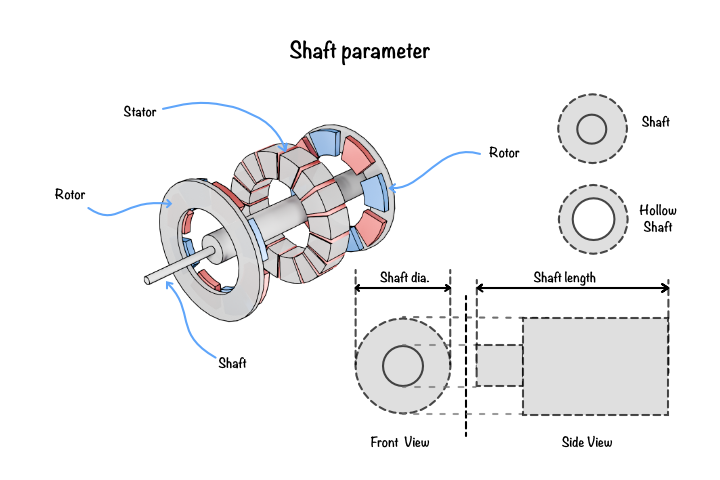

# Geometry of the shaft

The shaft is the central mechanical component of the rotor assembly that supports the rotor core and transmits the developed electromagnetic torque to the external load. In addition to providing structural integrity, the shaft maintains rotor alignment during operation and withstands the mechanical stresses generated by centrifugal forces and transmitted torque.

The software defines the shaft using a parametric geometry, allowing different shaft configurations to be generated depending on the mechanical requirements of the machine. Depending on the selected shaft type, additional geometric parameters become available for defining the shaft structure.

The shaft forms an integral part of the rotor assembly described in [Geometry of the rotor](06_rotor_params.md).

## What are the different shaft configurations?

The software supports multiple shaft configurations to accommodate different mechanical and manufacturing requirements.

### Solid shaft

A solid shaft consists of a continuous cylindrical section extending through the centre of the rotor. It provides maximum mechanical strength and torsional rigidity, making it suitable for applications requiring high torque transmission and structural robustness.

### Hollow shaft

A hollow shaft contains a central bore that reduces the overall rotor mass and rotational inertia while maintaining sufficient mechanical strength. Hollow shafts are commonly used in applications where weight reduction, improved cooling, or cable routing through the shaft is required.

### Spider shaft

A spider shaft consists of a central hub connected to the rotor core through multiple radial spokes. This configuration significantly reduces rotor weight while maintaining structural support. Spider shafts are commonly employed in large electrical machines where reduced inertia and improved ventilation are desirable.

## How is the shaft geometry defined?

The shaft geometry is defined using a set of parameters describing its dimensions and structural features. Depending on the selected shaft configuration, additional parameters become available for hollow or spider shaft designs.

**Figure 1:** Shaft geometry parameters for solid, hollow, and spider shaft configurations. The diagram illustrates shaft diameter, shaft hole diameter, spoke count, spoke thickness, and spoke radial depth, showing how these dimensions affect the mechanical support and inertia of the rotor assembly. This helps explain the trade-offs between strength, weight, cooling, and manufacturability in different shaft designs.

The following parameters are used to construct the shaft geometry.

## Shaft geometry parameters

### Shaft diameter

The shaft diameter specifies the outside diameter of the rotor shaft. It provides the primary mechanical support for the rotor assembly and determines the shaft's ability to transmit torque while resisting bending and torsional stresses.

### Shaft hole diameter

The shaft hole diameter defines the diameter of the central bore in a hollow shaft configuration. A value of zero represents a solid shaft, whereas larger values reduce rotor mass and rotational inertia while providing space for cooling channels or internal routing.

### Number of shaft spokes

Specifies the number of radial spokes connecting the shaft hub to the rotor core in a spider shaft configuration. Increasing the number of spokes generally improves structural rigidity and load distribution while increasing the overall rotor mass.

### Shaft spoke thickness

The shaft spoke thickness represents the tangential width of each spoke. Thicker spokes increase the mechanical strength and stiffness of the rotor assembly but reduce the available open area for cooling and weight reduction.

### Shaft spoke radial depth

The shaft spoke radial depth defines the radial length of each spoke measured from the shaft hub to the rotor core. This parameter determines the overall spoke geometry and influences both the structural integrity and mass distribution of the rotor assembly.

## Summary

The shaft provides the mechanical foundation of the rotor assembly by supporting the rotor core and transmitting the developed torque to the external load. Parameters such as shaft diameter, bore diameter, and spoke dimensions directly influence the strength, stiffness, inertia, and manufacturability of the rotor. The parametric shaft model enables the software to generate a variety of shaft configurations suitable for different electric machine applications while maintaining accurate electromagnetic and mechanical representations.