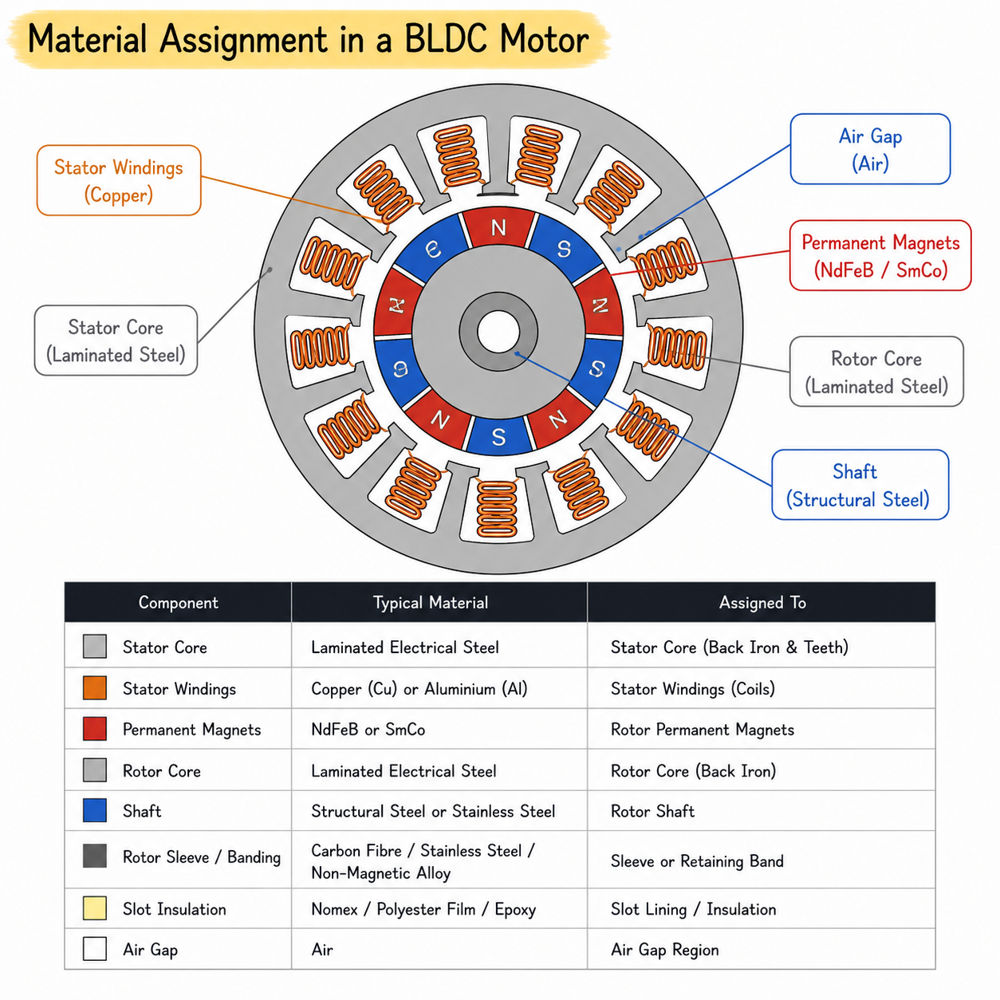

# Material definition

The electromagnetic performance of an electrical machine depends not only on its geometry but also on the material properties assigned to each component. Different materials exhibit different magnetic, electrical, thermal, and mechanical characteristics, which directly influence magnetic flux distribution, losses, efficiency, torque production, and overall machine performance.

Within this software, each machine component is assigned an appropriate material based on its intended function. The material database contains the electromagnetic properties required by the finite element solver, including relative permeability, electrical conductivity, magnetic saturation characteristics, remanent flux density, coercivity, and other material-specific parameters.

The machine components to which these materials are assigned are described in [Geometry of the Stator](05_stator_parameters.md), [Geometry of the Rotor](06_rotor_params.md), and [Geometry of the Shaft](07_shaft_params.md).

## What are the important materials used in a BLDC motor?

A BLDC motor consists of several components, each requiring materials with specific electromagnetic and mechanical properties. Selecting the appropriate material ensures efficient magnetic flux transmission, low losses, reliable mechanical operation, and long service life.

The stator and rotor cores are manufactured from laminated electrical steel to provide a low-reluctance magnetic path while minimizing eddy current losses. Permanent magnets establish the excitation field, copper conductors carry the phase currents, and insulating materials provide electrical isolation between conductive components.

Together, these materials determine the magnetic, electrical, thermal, and mechanical performance of the machine and therefore play a critical role in electromagnetic analysis.

## Why are these materials used?

Different components of a BLDC motor perform different functions and therefore require materials with unique physical properties. A material suitable for carrying magnetic flux may be unsuitable for conducting electrical current, while a good electrical conductor may produce excessive magnetic losses if used as the magnetic core.

Magnetic components such as the stator and rotor require materials with high magnetic permeability and low hysteresis losses to efficiently guide magnetic flux. In contrast, winding conductors require high electrical conductivity to minimize resistive losses, while permanent magnets must possess high remanence and coercivity to maintain a stable magnetic field.

Mechanical components such as shafts and retaining sleeves are selected primarily for their structural strength and dimensional stability rather than their electromagnetic properties. Similarly, insulating materials are chosen for their high dielectric strength and thermal resistance to prevent electrical breakdown between conductors and the magnetic core.

Selecting appropriate materials for each component improves efficiency, reduces losses, enhances torque production, and increases the operational reliability of the electrical machine.

## Material assignment for machine components

The following table summarizes the materials commonly assigned to each component of a surface-mounted permanent magnet BLDC motor.

**Figure 1:** Material assignment in a BLDC motor showing the stator core, rotor core, permanent magnets, windings, shaft, retaining sleeve, slot insulation, and air gap. The diagram links each machine component to the typical materials used and highlights their functional role in the electromagnetic model. This emphasises that material selection is critical for controlling magnetic flux paths, resistive losses, mechanical support, and insulation performance.

| Machine Component | Typical Material | Primary Purpose |
|-------------------|------------------|-----------------|
| Stator Core | Laminated Electrical Steel (e.g., M19, M270-35A, M235-35A) | Provides a low-reluctance path for magnetic flux while minimizing core losses. |
| Rotor Core | Laminated Electrical Steel | Completes the magnetic circuit and supports the permanent magnets. |
| Permanent Magnets | NdFeB (Neodymium-Iron-Boron), SmCo (Samarium-Cobalt) | Produces the permanent excitation field required for torque generation. |
| Stator Windings | Copper (Cu) or Aluminium (Al) | Carries the phase currents and generates the rotating magnetic field. |
| Shaft | Structural Steel or Stainless Steel | Provides mechanical support and transmits torque to the external load. |
| Rotor Sleeve / Banding | Carbon Fibre, Stainless Steel, or Non-Magnetic Alloy | Retains the permanent magnets during high-speed operation. |
| Slot Insulation | Nomex, Polyester Film, Epoxy Insulation | Electrically isolates the conductors from the stator core. |
| Air Gap | Air | Provides magnetic coupling between the stator and rotor while allowing mechanical rotation. |

## What material properties are important for electromagnetic analysis?

The finite element solver requires several material properties to accurately model the electromagnetic behaviour of each component. These properties determine how the material responds to electric and magnetic fields during simulation.

For magnetic materials, the most important properties are relative permeability, magnetic permeability, B-H characteristics, saturation flux density, and electrical conductivity. These properties govern magnetic flux distribution, magnetic saturation, hysteresis behaviour, and eddy current losses.

For permanent magnets, additional parameters such as remanent flux density, coercive field strength, recoil permeability, and magnetization direction are required. These properties define the strength and orientation of the permanent magnetic field.

Electrical conductors are primarily characterized by their electrical conductivity, resistivity, and temperature coefficient, while insulating materials are defined by their dielectric strength and electrical resistivity.

These properties appear directly in the constitutive relations presented in [Finite Element Solver](11_fem_solver.md). Governing electromagnetic equations involving these material properties are summarised in [Electromagnetic Appendix](12_electromagnetics_appendix.md).

## Summary

Accurate material modelling is fundamental to reliable electromagnetic simulation. While the geometry defines the physical shape of the machine, the assigned material properties determine how magnetic flux, electric current, and electromagnetic forces develop within each component.

By combining appropriate geometry with realistic material properties, the finite element solver can accurately predict machine characteristics such as magnetic flux density, back EMF, torque, losses, efficiency, and magnetic saturation.