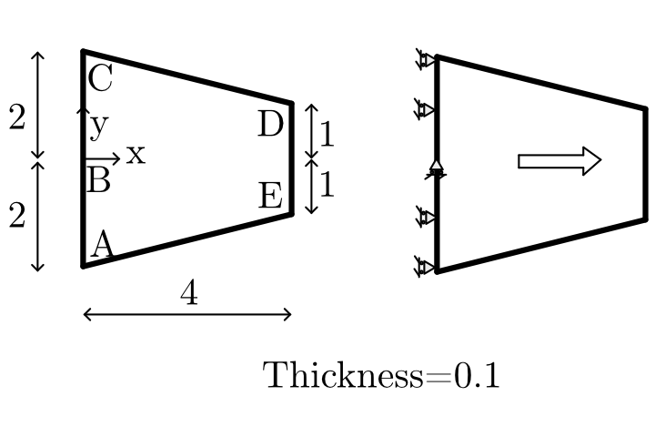
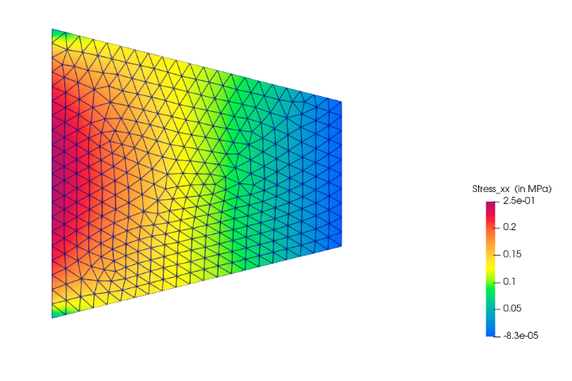
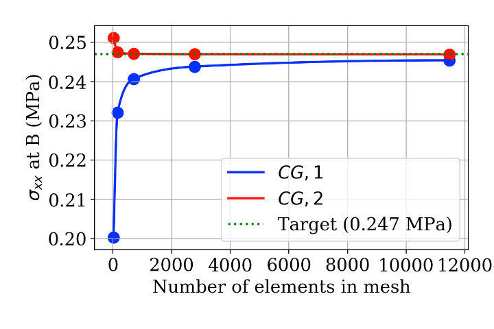

# 2.1 Tapered Membrane Under Gravity Load
 
## Objective
  
This practice problem validates a linear elastic membrane solver using the NAFEMS tapered membrane benchmark from report LSB2.
  
The objective is to compute the direct normal stress, $\sigma_{xx}$, at Point B and compare it with the published NAFEMS reference value.
  
This case is useful for checking plane stress behavior, load application on an inclined or tapered domain, boundary constraint handling, and mesh convergence.

  

**Figure 1.** Definition of validation problem

## Problem Overview
  
The model consists of a tapered membrane subjected to a gravity loading
  
Because the membrane height reduces along its length, the stress is expected to increase toward the narrower loaded edge.
  
The benchmark checks whether the numerical solver can capture this stress variation accurately under linear elastic plane stress assumptions.
  
## Benchmark Source
  
| Field            | Value                                  |
| ---------------- | -------------------------------------- |
| Benchmark origin | NAFEMS report LSB2                     |
| Unit system      | m, kN                                  |
| Analysis type    | Linear elastic membrane analysis       |
| Primary output   | Direct stress $\sigma_{xx}$ at Point B |
| Reference value  | 0.247 MPa (mesh refinement)            |
## Geometry
  
The geometry is a two-dimensional tapered membrane. The membrane has a length of 4 m. Its height varies from 4m at one end to 2 m at the other end. A constant thickness of 0.1 m is assigned to the membrane for plane stress analysis.
  
| Parameter     | Value                      |
| ------------- | -------------------------- |
| Length        | $4$ m                      |
| Height        | Tapers from $4$ m to $2$ m |
| Thickness     | $0.1$ m                    |
| Geometry type | 2D tapered membrane        |

## Material Properties
  
The material is assumed to be homogeneous, isotropic, and linearly elastic.
  
These assumptions are appropriate for this benchmark because the goal is to validate the finite element formulation rather than material nonlinearity.

  
| Property                 | Value                    |
| ------------------------ | ------------------------ |
| Young’s modulus, $(E)$   | $210 \times 10^3$ MPa    |
| Poisson’s ratio, $(\nu)$ | $0.3$                    |
| Material model           | Linear elastic isotropic |
## Loading Conditions
  
A Uniform acceleration of 9.81 m/s² in global x-direction (gravity loading)
  
| Load type      | Value      |
| -------------- | ---------- |
| Load direction | Horizontal |
| Loaded edge    | DE         |
| Gravity load   | 9.81 m/s²  |
  
## Boundary Conditions
  
The boundary conditions prevent rigid body motion while allowing the membrane to deform under the applied end load.

Edge AC: zero displacement in x-direction and Point B: zero displacement in y-direction

| Location | Constraint                           |
| -------- | ------------------------------------ |
| Edge AC  | Zero displacement in the x-direction |
| Point B  | Zero displacement in the y-direction |
  
## Finite Element Setup
  
The problem is solved using plane stress finite elements.

Both quadrilateral and triangular elements can be used for this benchmark. In this study, Continuous Galerkin elements of degree 1 and degree 2 are compared.
  
| Item                    | Description                              |
| ----------------------- | ---------------------------------------- |
| Element family          | Continuous Galerkin                      |
| Element degrees studied | CG1 and CG2                              |
| Element type            | Plane stress triangles or quadrilaterals |
| Initial mesh            | 2 × 2 uniform mesh                       |
| Quantity monitored      | $\sigma_{xx}$ at Point B                 |

## Stress Distribution
  
Figure 2 shows the computed $\sigma_{xx}$ stress distribution for the tapered membrane using a mesh with $159$ elements.
  
The stress increases along the loading direction as the membrane becomes narrower.
  
The smooth variation of stress across the domain indicates a stable finite element solution.
  

**Figure 2.** Direct stress $\sigma_{xx}$ distribution in the tapered membrane.

## Mesh Convergence Study
  
The stress at Point B was evaluated using progressively refined meshes.
  
The purpose of the convergence study is to verify that the computed stress approaches the NAFEMS reference value as the mesh density increases.
  
Both CG1 and CG2 formulations were tested to compare the influence of interpolation degree on convergence.
  
## Continuous Galerkin Degree 1 Results
  

| Number of Elements in Mesh | Target $\sigma_{xx}$ | $\sigma_{xx}$ (MPa) | Error (%) |
| -------------------------: | -------------------: | ------------------: | --------- |
|                         24 |                0.247 |             0.20026 | 18.92%    |
|                        159 |                0.247 |              0.2321 | 6.03%     |
|                        712 |                0.247 |             0.24070 | 2.55%     |
|                       2782 |                0.247 |             0.24382 | 0.29%     |
|                      11472 |                0.247 |             0.24542 | 0.64%     |
  
## Continuous Galerkin Degree 2 Results

| Number of Elements in Mesh | Target $\sigma_{xx}$ | $\sigma_{xx}$ (MPa) | Error (%) |
| -------------------------: | -------------------: | ------------------: | --------- |
|                         24 |                0.247 |             0.25115 | 1.68%     |
|                        159 |                0.247 |             0.24747 | 0.19%     |
|                        712 |                0.247 |             0.24708 | 0.03%     |
|                       2782 |                0.247 |             0.24698 | 0.01%     |
|                      11472 |                0.247 |             0.24695 | 0.02%     |
  
Quadratic elements (`CG2`) demonstrate drastically superior convergence compared to linear elements (`CG1`).
  
## Convergence Plot
  
Figure 3 compares the mesh convergence behavior of CG1 and CG2 elements against the NAFEMS reference value.
  
Both formulations approach the benchmark value of 0.247MPa as the mesh is refined.
  
The final results show that both element formulations produce essentially the same converged solution.

**Figure 3.** Mesh convergence of $\sigma_{xx}$ at Point B compared with the NAFEMS reference value.
 
## Converged Result
  
**Convergence Rate:** Quadratic elements (`CG2`) demonstrate drastically superior convergence compared to linear elements (`CG1`).
- **Efficiency:** The `CG2` formulation achieves highly accurate results (0.19% error) with only **159 elements**. In contrast, the `CG1` formulation requires **11,472 elements** to drop below a 1% error threshold (0.64%).
- **Calculation Cost:** Calculation Cost is Less in CG2 than CG1.

 Continuous Galerkin Degree 2 Results

| Quantity                          |     Value |
| --------------------------------- | --------: |
| Computed $\sigma_{xx}$ at Point B | 0.247 MPa |
| NAFEMS benchmark value            | 0.247 MPa |
| Relative error                    |     0.19% |

Continuous Galerkin Degree 1 Results

| Quantity                          |     Value |
| --------------------------------- | --------: |
| Computed $\sigma_{xx}$ at Point B | 0.247 MPa |
| NAFEMS benchmark value            | 0.247 MPa |
| Relative error                    |     0.64% |
  
## Interpretation of Results

  The computed stress converges toward the benchmark value with mesh refinement.
  
The CG2 formulation reaches high accuracy with fewer nodes, while CG1 requires additional mesh refinement to achieve comparable accuracy.
 
For sufficiently fine meshes, both formulations converge to the same final stress value.
  
## Validation Statement
  
The Linear Elastic Membrane Solver successfully reproduces the NAFEMS tapered membrane benchmark.
  
The converged stress at Point B is $0.247$ MPa, compared with the reference value of $0.247$ MPa.
  
The relative error of $0.19\%$ confirms that the solver implementation is accurate for this linear elastic membrane problem with Continuous Galerkin Degree 2 Results and 0.64% Continuous Galerkin Degree 1 Results
  
## Conclusion

  This practice problem validates the solver for a tapered membrane subjected to gravity load.
  
The results confirm correct implementation of plane stress behavior, distributed loading, displacement constraints, stress recovery, and mesh convergence.

 This benchmark provides confidence for applying the solver to more complex structural validation cases.