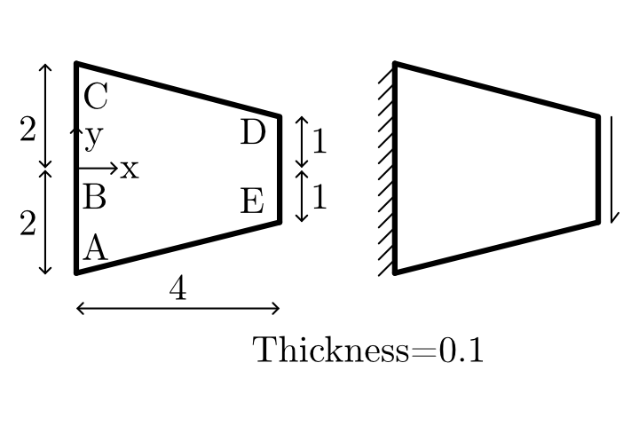
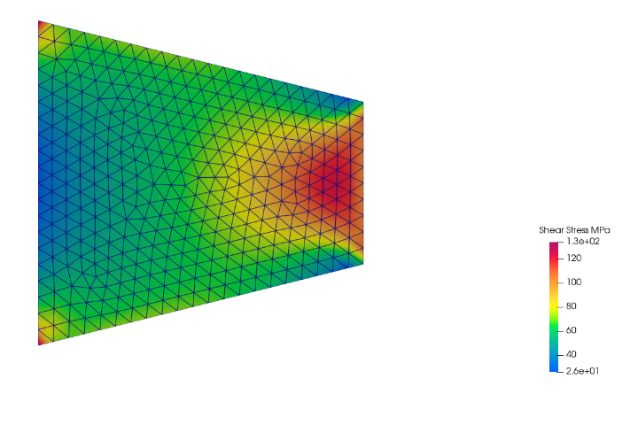
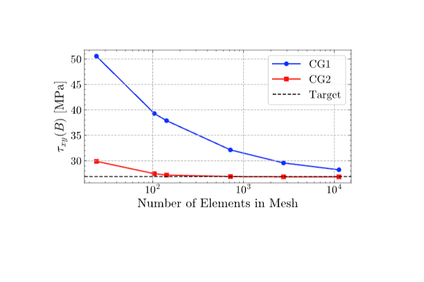

# 3.1 Tapered Membrane Under Edge Shear
  
## Objective
 
This practice problem validates a linear elastic membrane solver using the NAFEMS tapered membrane benchmark from report LSB2.
  
The objective is to compute the Shear stress σxy at point B and compare it with the published NAFEMS reference value.
  
This case is useful for checking plane stress behavior, load application on an inclined or tapered domain, boundary constraint handling, and mesh convergence.

  

**Figure 1.** Definition of validation problem
## Problem Overview
  
The model consists of a tapered membrane subjected to a uniformly Uniform surface shear traction of 100 MPa in vertical (y) direction.
  
Because the membrane height Length = 4, Left height = 4 (2+2), Right height = 2 (1+1), Thickness = 0.1.
  
The benchmark checks whether the numerical solver can capture this stress variation accurately under linear elastic plane stress assumptions.
  
## Benchmark Source
  
| Field            | Value                                  |
| ---------------- | -------------------------------------- |
| Benchmark origin | NAFEMS report LSB2                     |
| Unit system      | m, kN                                  |
| Analysis type    | Linear elastic membrane analysis       |
| Primary output   | Direct stress $\sigma_{xy}$ at Point B |
| Reference value  | 26.9MPa                                |
## Geometry
  
The geometry is a two-dimensional tapered membrane. The Length = 4, Left height = 4 (2+2), Right height = 2 (1+1), Thickness = 0.1
  
| Parameter     | Value                      |
| ------------- | -------------------------- |
| Length        | $4$ m                      |
| Height        | Tapers from $2$ m to $1$ m |
| Thickness     | $0.1$ m                    |
| Geometry type | 2D tapered membrane        |
## Material Properties
  
The material is assumed to be homogeneous, isotropic, and linearly elastic.
  
These assumptions are appropriate for this benchmark because the goal is to validate the finite element formulation rather than material nonlinearity.
  
| Property                 | Value                    |
| ------------------------ | ------------------------ |
| Young’s modulus, $(E)$   | $210 \times 10^3$ MPa    |
| Poisson’s ratio, $(\nu)$ | $0.3$                    |
| Material model           | Linear elastic isotropic |

## Loading Conditions
  
A uniformly  surface shear traction of 100 MPa in vertical (y) direction
   
| Load type              | Value    |
| ---------------------- | -------- |
| Load direction         | Vertical |
| Surface shear traction | DE       |
| Shear load             |  100 MPa |
 
## Boundary Conditions
  
The boundary conditions prevent rigid body motion while allowing the membrane to deform under the surface shear traction.Fully fixed along edge AC

| Location | Constraint                |
| -------- | ------------------------- |
| Edge AC  | Fully fixed along edge AC |
 
## Finite Element Setup
  
The problem is solved using plane stress finite elements.
  
Both quadrilateral and triangular elements can be used for this benchmark. In this study, Continuous Galerkin elements of degree 1 and degree 2 are compared.
  
| Item                    | Description                              |
| ----------------------- | ---------------------------------------- |
| Element family          | Continuous Galerkin                      |
| Element degrees studied | CG1 and CG2                              |
| Element type            | Plane stress triangles or quadrilaterals |
| Initial mesh            | 2 × 2 uniform mesh                       |
| Quantity monitored      | Shear stress σxy at point B              |
## Stress Distribution

  Figure 2 shows the computed shear stress distribution for the tapered membrane using the CG1 mesh with 718 nodes. The stress field exhibits a non-uniform distribution, with the highest shear stresses occurring near the loaded edge of the membrane. The stress contours remain smooth throughout the domain, indicating stable numerical behavior and proper stress recovery.
  

**Figure 2.** Direct stress $\sigma_{xy}$ distribution in the tapered membrane.

## Mesh Convergence Study

 The maximum shear stress was evaluated for progressively refined meshes using both Continuous Galerkin Degree 1 (CG1) and Degree 2 (CG2) finite elements.
 
The stress at Point B was evaluated using progressively refined meshes.

The purpose of the convergence study is to verify that the computed stress approaches the NAFEMS reference value as the mesh density increases.
  
Both CG1 and CG2 formulations were tested to compare the influence of interpolation degree on convergence.
  
## Continuous Galerkin Degree 1 Results

| Number of Nodes | Maximum Shear Stress (MPa) | Error (%) |
| --------------- | -------------------------- | --------- |
| 24              | 50.57                      | 87.99     |
| 104             | 39.28                      | 46.04     |
| 142             | 37.88                      | 40.83     |
| 718             | 32.13                      | 19.45     |
| 2760            | 29.57                      | 9.91      |
| 11250           | 28.22                      | 4.92      |
  
The CG1 formulation requires a finer mesh to achieve comparable accuracy.

## Continuous Galerkin Degree 2 Results
  
| Number of Nodes | Maximum Shear Stress (MPa) | Error (%) |
| --------------- | -------------------------- | --------- |
| 24              | 29.88                      | 11.08     |
| 104             | 27.46                      | 2.08      |
| 142             | 27.18                      | 1.06      |
| 718             | 26.89                      | 0.03      |
| 2760            | 26.84                      | 0.21      |
| 11250           | 26.83                      | 0.25      |
  
Both CG1 and CG2 formulations converge towards the NAFEMS reference value of 26.9 MPa with mesh refinement. The CG2 formulation reaches the benchmark solution more rapidly, while the CG1 formulation requires a finer mesh to achieve comparable accuracy.
  
## Convergence Plot
  
Figure 3 compares the mesh convergence behavior of CG1 and CG2 elements against the NAFEMS reference value.
  
Both formulations approach the benchmark value of 26.9 MPa as the mesh is refined.
 
The final results show that both element formulations produce essentially the same converged solution.
  

**Figure 3.** Mesh convergence of $\sigma_{xy}$ at Point B compared with the NAFEMS reference value.

  
## Converged Result
  
 The finest mesh produced a Shear stress value of $26.9 $ MPa at Point B.
  
 This result is in excellent agreement with the NAFEMS benchmark value of $26.9 $ MPa.
  
| Quantity                          |     Value |
| --------------------------------- | --------: |
| Computed $\sigma_{xy}$ at Point B | 26.9  MPa |
| NAFEMS benchmark value            | 26.9  MPa |
| Relative error                    |     0.25% |
  
## Interpretation of Results

The computed stress converges toward the benchmark value with mesh refinement.
  
The CG2 formulation reaches high accuracy with fewer nodes, while CG1 requires additional mesh refinement to achieve comparable accuracy.
  
For sufficiently fine meshes, both formulations converge to the same final stress value.
  
## Validation Statement
  
The Linear Elastic Membrane Solver successfully reproduces the NAFEMS tapered membrane benchmark.
  
The converged stress at Point B is $26.83$ MPa, compared with the reference value of $26.83$ MPa.
  
The relative error of $0.25\%$ confirms that the solver implementation is accurate for this linear elastic membrane problem.
  
## Conclusion
  
The developed finite element membrane solver successfully reproduces the NAFEMS shear stress benchmark solution. Both CG1 and CG2 formulations exhibit systematic convergence towards the reference value of 26.90 MPa. The finest CG2 mesh produced a maximum shear stress of 26.83 MPa, corresponding to a relative error of only 0.25%. The excellent agreement with the benchmark verifies the correctness of the finite element formulation, boundary condition implementation, loading definition, and stress recovery procedures