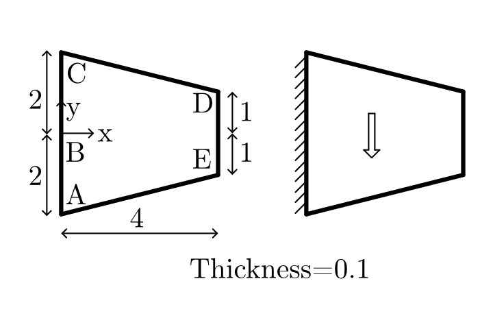
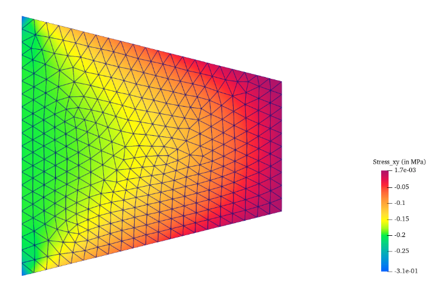
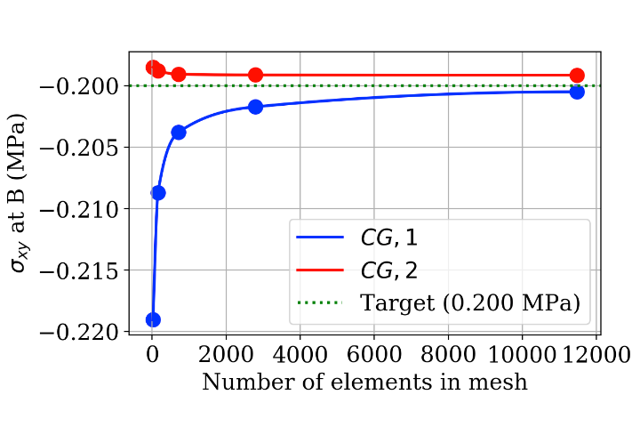

# 4.1 Tapered Cantilever Gravity Load
  
## Objective
 
This practice problem validates a linear elastic membrane solver using the NAFEMS tapered membrane benchmark from report LSB2.
  
The objective is to compute the Shear stress σxy at point B and compare it with the published NAFEMS reference value.
  
This case is useful for checking plane stress behavior, load application on an inclined or tapered domain, boundary constraint handling, and mesh convergence.

  

**Figure 1.** Definition of validation problem
## Problem Overview
  
The model consists of a tapered Acceleration of 9.81 m/s² in vertical y-direction (gravity load)
  
Tapered plate, length = 4, left height = 4 (2+2), right height = 2 (1+1), Thickness = 0.1
  
The benchmark checks whether the numerical solver can capture this stress variation accurately under linear elastic plane stress assumptions.
  
## Benchmark Source
  
| Field            | Value                                  |
| ---------------- | -------------------------------------- |
| Benchmark origin | NAFEMS report LSB2                     |
| Unit system      | m, kN                                  |
| Analysis type    | Linear elastic membrane analysis       |
| Primary output   | Direct stress $\sigma_{xy}$ at Point B |
| Reference value  | -0.200 MPaMPa                          |
## Geometry
  
The geometry is a two-dimensional tapered membrane. The Length = 4, Left height = 4 (2+2), Right height = 2 (1+1), Thickness = 0.1
  
| Parameter     | Value                      |
| ------------- | -------------------------- |
| Length        | $4$ m                      |
| Height        | Tapers from $2$ m to $1$ m |
| Thickness     | $0.1$ m                    |
| Geometry type | 2D tapered membrane        |
## Material Properties
  
The material is assumed to be homogeneous, isotropic, and linearly elastic.
  
These assumptions are appropriate for this benchmark because the goal is to validate the finite element formulation rather than material nonlinearity.
  
| Property                 | Value                    |
| ------------------------ | ------------------------ |
| Young’s modulus, $(E)$   | $210 \times 10^3$ MPa    |
| Poisson’s ratio, $(\nu)$ | $0.3$                    |
| Material model           | Linear elastic isotropic |

## Loading Conditions
  
Acceleration of 9.81 m/s² in vertical y-direction (gravity load)
   
| Load type      | Value    |
| -------------- | -------- |
| Load direction | Vertical |
| Gravity Load   | 9.81     |
 
## Boundary Conditions
  
The boundary conditions prevent rigid body motion while allowing the membrane to deform under the surface shear traction.Fully fixed along edge AC

| Location | Constraint                |
| -------- | ------------------------- |
| Edge AC  | Fully fixed along edge AC |
 
## Finite Element Setup
  
The problem is solved using plane stress finite elements.
  
Both quadrilateral and triangular elements can be used for this benchmark. In this study, Continuous Galerkin elements of degree 1 and degree 2 are compared.
  
| Item                    | Description                              |
| ----------------------- | ---------------------------------------- |
| Element family          | Continuous Galerkin                      |
| Element degrees studied | CG1 and CG2                              |
| Element type            | Plane stress triangles or quadrilaterals |
| Initial mesh            | 2 × 2 uniform mesh                       |
| Quantity monitored      | Shear stress σxy at point B              |
## Stress Distribution

  Figure 2 shows the computed shear stress distribution for the tapered membrane using the CG1 mesh with 718 nodes. The stress field exhibits a non-uniform distribution, with the highest shear stresses occurring near the loaded edge of the membrane. The stress contours remain smooth throughout the domain, indicating stable numerical behavior and proper stress recovery.
  

**Figure 2.** Direct stress $\sigma_{xy}$ distribution in the tapered membrane.

## Mesh Convergence Study

 The maximum shear stress was evaluated for progressively refined meshes using both Continuous Galerkin Degree 1 (CG1) and Degree 2 (CG2) finite elements.
 
The stress at Point B was evaluated using progressively refined meshes.

The purpose of the convergence study is to verify that the computed stress approaches the NAFEMS reference value as the mesh density increases.
  
Both CG1 and CG2 formulations were tested to compare the influence of interpolation degree on convergence.
  
## Continuous Galerkin Degree 1 Results

| Number of Elements in Mesh | Target $\sigma_{xy}$ | $\sigma_{xy}$ at B (in MPa) | Error % |
| :------------------------- | -------------------- | --------------------------- | ------- |
| 24                         | -0.200               | -0.21902                    | 9.51%   |
| 159                        | -0.200               | -0.20868                    | 4.34%   |
| 712                        | -0.200               | -0.20379                    | 1.90%   |
| 2782                       | -0.200               | -0.20172                    | 0.86%   |
| 11472                      | -0.200               | -0.20050                    | 0.25%   |

  
The CG1 formulation requires a finer mesh to achieve comparable accuracy.

## Continuous Galerkin Degree 2 Results
  
| **Number of Elements in Mesh** | Target $\sigma_{xx}$ | $\sigma_{xx}$ at B (in MPa) | **Error (%)** |
| ------------------------------ | -------------------- | --------------------------- | ------------- |
| 24                             | -0.200               | -0.19849                    | 0.75%         |
| 159                            | -0.200               | -0.19878                    | 0.61%         |
| 712                            | -0.200               | -0.19907                    | 0.47%         |
| 2782                           | -0.200               | -0.19913                    | 0.44%         |
| 11472                          | -0.200               | -0.19914                    | 0.43%         |
  
Both CG1 and CG2 formulations converge towards the NAFEMS reference value of -0.200 MPa with mesh refinement. The CG2 formulation reaches the benchmark solution at 11472 elements, while the CG1 formulation also reaches the benchmark solution at  11472 elements
  
## Convergence Plot
  
Figure 3 The Solver were solved using 5 varying mesh densities for both 1st-degree (Linear) and 2nd-degree (Quadratic) Continuous Galerkin (CG) elements.
- Target is $\sigma_{xy}$ at B(0,0)  = -0.200 MPa 
  

**Figure 3.** Mesh convergence of $\sigma_{xy}$ at Point B compared with the NAFEMS reference value.

  
## Converged Result
  
 Both element types converge toward the NAFEMS target of **−0.200 MPa**, but through very different paths:

- **CG,1 (linear):** Converged value is **−0.2005 MPa** at 11 472 elements — error of **0.25%**. This is the best result achieved and it is still approaching the target asymptotically from below.
- **CG,2 (quadratic):** Appears to plateau at approximately **−0.1991 MPa** — error of **0.43%**. Remarkably, this level of accuracy was already achieved at just 24 elements (0.75% error), with almost no further improvement beyond that.
  
| Quantity                          |     Value |
| --------------------------------- | --------: |
| Computed $\sigma_{xy}$ at Point B | 26.9  MPa |
| NAFEMS benchmark value            | 26.9  MPa |
| Relative error                    |     0.25% |
  
## Interpretation of Results

The convergence graph tells a clear story about element quality. Linear elements (CG,1) are overly stiff — they lock up and underestimate stress magnitudes, requiring enormous mesh refinement to recover accuracy. The blue curve shows a classic asymptotic climb toward the target, only reaching ~0.25% error after using nearly 500× more elements than the coarsest mesh. Quadratic elements (CG,2), by contrast, capture the stress gradient through the tapered geometry with far fewer degrees of freedom, sitting within 1% of the target from the very first mesh density tested.

The slight plateau in the CG,2 result (stalling near −0.1991 rather than reaching exactly −0.200) is worth noting. This could reflect a minor superconvergence limitation at point B specifically, or a small systematic effect of the triangular element geometry at that location.
  
## Validation Statement
  
This simulation is validated against the NAFEMS LSB2 standard benchmark. Both element formulations reproduce the reference shear stress σ_xy = −0.200 MPa at point B within engineering accuracy, confirming correctness of the solver implementation, material input, boundary conditions, and loading for linear elastic plane stress problems.
  
## Conclusion
 For this class of problem — linear elastic membrane with body force loading and a stress singularity-free point of interest — **quadratic (CG,2) elements are unambiguously superior**. A mesh of 150–700 elements gives sub-1% accuracy, whereas linear elements need 10 000+ elements to achieve the same. In practice, CG,2 should be the default choice unless constrained by solver capability or explicit requirements for linear elements.

