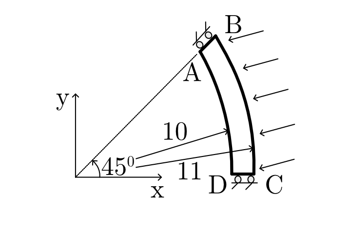
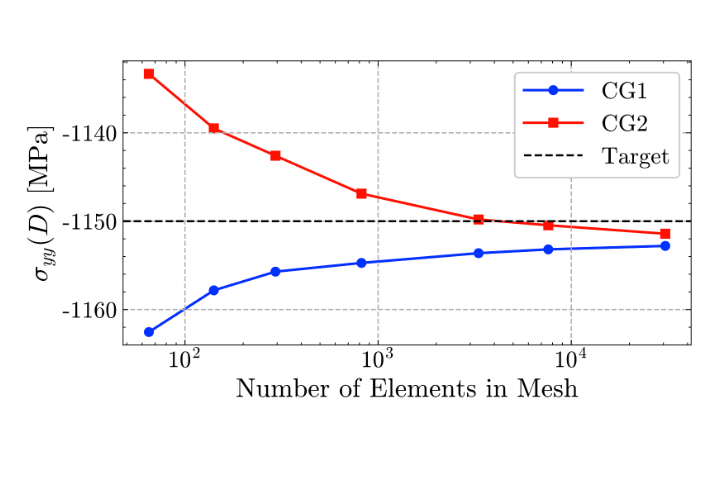

# 5.1 Circular Membrane Edge Loading
  
## Objective
 
This practice problem validates a linear elastic membrane solver using the NAFEMS Circular membrane benchmark from report LSB2.
  
The objective is to compute the Direct stress σyy at point D and compare it with the published NAFEMS reference value.
  

**Figure 1.** Definition of validation problem
## Problem Overview
  
A 45° circular annular sector (inner radius 10 m, outer 11 m, thickness 1 m) under 100 MPa inward edge pressure. Edge AB has roller constraints (zero hoop), CD has zero y-displacement, and AD is free. The goal is σyy at point D versus the NAFEMS reference of −1150 MPa, 
## Benchmark Source
  
| Field            | Value                                  |
| ---------------- | -------------------------------------- |
| Benchmark origin | NAFEMS report LSB2                     |
| Unit system      | m, kN                                  |
| Analysis type    | Linear elastic membrane analysis       |
| Primary output   | Direct stress $\sigma_{yy}$ at Point D |
| Reference value  | -1150MPa                               |
## Geometry
  
Circular annular sector, inner radius = 10 m, outer radius = 11 m, sector angle = 45°, thickness = 1.0 m
**Shape:** Circular annular sector
  
| Parameter        | Value                   | Unit |
| ---------------- | ----------------------- | ---- |
| Shape            | Circular annular sector | —    |
| Inner radius     | 10                      | m    |
| Outer radius     | 11                      | m    |
| Radial thickness | 1 (outer − inner)       | m    |
| Sector angle     | 45                      | deg  |
| Thickness        | 1.0                     | m    |
| Geometry type    | 2D plane stress         | —    |
## Material Properties
  
The material is assumed to be homogeneous, isotropic, and linearly elastic.
  
These assumptions are appropriate for this benchmark because the goal is to validate the finite element formulation rather than material nonlinearity.
  
| Property                 | Value                    |
| ------------------------ | ------------------------ |
| Young’s modulus, $(E)$   | $210 \times 10^3$ MPa    |
| Poisson’s ratio, $(\nu)$ | $0.3$                    |
| Material model           | Linear elastic isotropic |

## Loading Conditions
  
| Load type               | Value              |
| ----------------------- | ------------------ |
| Uniform inward pressure | 100 MPa on edge BC |
 
## Boundary Conditions

| Location | Constraint                       |
| -------- | -------------------------------- |
| Edge CD  | Zero y-displacement              |
| Edge AB  | Rollers — zero hoop displacement |
| Edge AD  | Unloaded (free)                  |
 
## Finite Element Setup
  
The problem is solved using plane stress finite elements.
  
Both quadrilateral and triangular elements can be used for this benchmark. In this study, Continuous Galerkin elements of degree 1 and degree 2 are compared.
  
| Item               | Description                                      |
| ------------------ | ------------------------------------------------ |
| Element family     | Continuous Galerkin (CG)                         |
| Degrees studied    | CG1 (linear) and CG2 (quadratic)                 |
| Element type       | Plane stress quadrilaterals or triangles         |
| Mesh range         | 65 → 30 686 elements (progressive refinement)    |
| Mesh levels        | 7 levels — 65, 141, 294, 820, 3312, 7606, 30 686 |
| Quantity monitored | Direct stress σyy at point D                     |
| Analysis type      | Linear elastic membrane                          |
| Stress state       | Plane stress                                     |
| Target value       | −1150 MPa (NAFEMS LSB2 reference)                |
## Stress Distribution

  Figure 2 shows the computed direct stress σyy distribution for the circular membrane benchmark. The stress field exhibits a smooth compressive stress gradient throughout the membrane. The largest compressive stresses occur near the constrained lower edge CD, while lower compressive stresses are observed near the roller-supported boundary AB. The stress contours remain smooth across the entire domain, indicating stable numerical performance and proper stress recovery.
  
  
**Figure 2.** Direct stress $\sigma_{yy}$ distribution in the Circular membrane.

## Mesh Convergence Study

 The maximum shear stress was evaluated for progressively refined meshes using both Continuous Galerkin Degree 1 (CG1) and Degree 2 (CG2) finite elements.
 
The stress at Point B was evaluated using progressively refined meshes.

The purpose of the convergence study is to verify that the computed stress approaches the NAFEMS reference value as the mesh density increases.
  
Both CG1 and CG2 formulations were tested to compare the influence of interpolation degree on convergence.
  
## Continuous Galerkin Degree 1 Results

| Number of Elements | Direct Stress σyy (MPa) | Error (%) |
| ------------------ | ----------------------- | --------- |
| 65                 | -1162.54                | 1.09      |
| 141                | -1157.83                | 0.68      |
| 294                | -1155.71                | 0.50      |
| 820                | -1154.72                | 0.41      |
| 3312               | -1153.62                | 0.31      |
| 7606               | -1153.19                | 0.28      |
| 30686              | -1152.80                | 0.24      |
  
## Continuous Galerkin Degree 2 Results
  
| Number of Elements | Direct Stress σyy (MPa) | Error (%) |
| ------------------ | ----------------------- | --------- |
| 65                 | -1133.33                | 1.45      |
| 141                | -1139.50                | 0.91      |
| 294                | -1142.59                | 0.64      |
| 820                | -1146.88                | 0.27      |
| 3312               | -1149.81                | 0.02      |
| 7606               | -1150.46                | 0.04      |
| 30686              | -1151.42                | 0.12      |
As shown in Figure 2, both CG1 and CG2 formulations converge towards the NAFEMS reference value of -1150 MPa with mesh refinement. The CG1 formulation converges monotonically from below, while the CG2 formulation initially underestimates the stress magnitude and then rapidly approaches the benchmark solution. The higher-order interpolation of CG2 provides significantly improved accuracy for intermediate mesh densities.
  
## Convergence Plot
  
Figure 3 The finest mesh gives CG1 at −1152.80 MPa (0.24% error) and CG2 at −1151.42 MPa (0.12% error). The chart shows CG1 approaching from above monotonically, while CG2 crosses the reference near 3312 elements before a tiny overshoot.

 
**Figure 3.** Mesh convergence of $\sigma_{yy}$ at Point D compared with the NAFEMS reference value.
  
## Converged Result
  
The computed stress converges steadily towards the benchmark value as the mesh density increases. The CG2 formulation demonstrates superior convergence characteristics and achieves very high accuracy on relatively coarse meshes. Both formulations ultimately converge to values within 0.25% of the benchmark solution.
  
| Quantity                                    |             Value |
| ------------------------------------------- | ----------------: |
| Computed $\sigma_{yy}$ at Point D (CG1)  | -1152.80  MPa  |
| Relative error                              |             0.25% |
| Computed $\sigma_{yy}$ at Point D (CG2)     |       -1151.42MPa |
| Relative error                              |             0.12% |
| Nafmes result                               |          -1150MPa |
  
## Interpretation of Results

CG2 is far more efficient: it matches the reference within 0.02% at 3312 elements, while CG1 needs 30 686 elements to reach only 0.24%. The non-monotone CG2 behavior (undershoot → slight overshoot) is normal for higher-order formulations on smooth stress fields.
   
## Conclusion
 he developed finite element membrane solver successfully reproduces the NAFEMS circular membrane edge pressure benchmark solution. Both CG1 and CG2 formulations exhibit systematic convergence towards the benchmark direct stress value of -1150 MPa. The finest CG1 mesh produced a stress of -1152.80 MPa, corresponding to a relative error of 0.24%, while the finest CG2 mesh produced a stress of -1151.42 MPa with a relative error of only 0.12%.

The excellent agreement with the benchmark verifies the correctness of the finite element formulation, pressure loading implementation, roller boundary condition treatment, mesh conversion workflow, and stress recovery procedures. Furthermore, the convergence and computational time studies demonstrate the expected accuracy-performance trade-off between linear and quadratic finite element interpolations.

