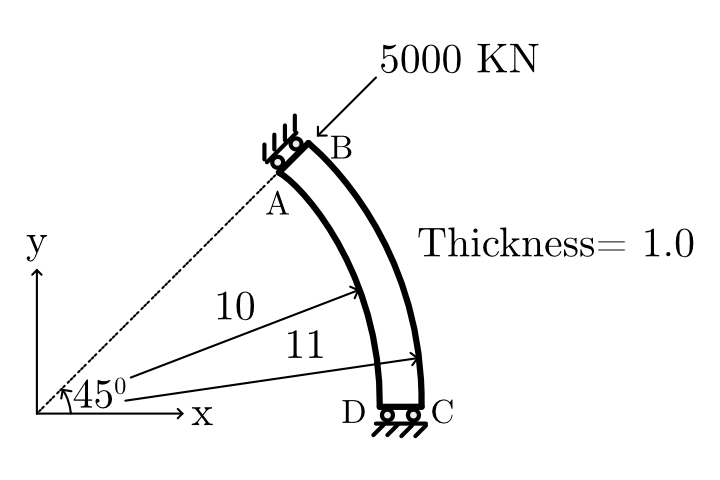
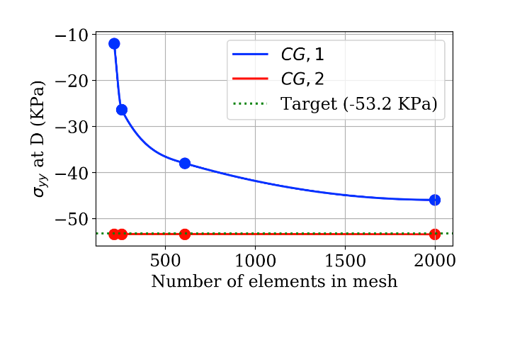

# 6.1 Circular Membrane Point Loading
  
## Objective
 
This practice problem validates a linear elastic membrane solver using the NAFEMS Circular membrane benchmark from report LSB2.
  
The objective is to compute the Direct stress σyy at point D and compare it with the published NAFEMS reference value.
  
This case is useful for checking plane stress behavior, load application on an inclined or tapered domain, boundary constraint handling, and mesh convergence.

**Figure 1.** Definition of validation problem
## Problem Overview
  
Benchmark problem for a circular membrane with a point load at point B, showing geometry, loading, boundary conditions, material properties, element types, and mesh details.

## Benchmark Source
  
| Field            | Value                                  |
| ---------------- | -------------------------------------- |
| Benchmark origin | NAFEMS report LSB2                     |
| Unit system      | m, kN                                  |
| Analysis type    | Linear elastic membrane analysis       |
| Primary output   | Direct stress $\sigma_{yy}$ at Point D |
| Reference value  | -53.2 KPa                              |
## Geometry
  
Circular annular sector, inner radius = 10 m, outer radius = 11 m, sector angle = 45°, thickness = 1.0 m
**Shape:** Circular annular sector
  
| Parameter        | Value                   | Unit |
| ---------------- | ----------------------- | ---- |
| Shape            | Circular annular sector | —    |
| Inner radius     | 10                      | m    |
| Outer radius     | 11                      | m    |
| Radial thickness | 1 (outer − inner)       | m    |
| Sector angle     | 45                      | deg  |
| Thickness        | 1.0                     | m    |
| Geometry type    | 2D plane stress         | —    |
## Material Properties
  
The material is assumed to be homogeneous, isotropic, and linearly elastic.
  
These assumptions are appropriate for this benchmark because the goal is to validate the finite element formulation rather than material nonlinearity.
  
| Property                 | Value                    |
| ------------------------ | ------------------------ |
| Young’s modulus, $(E)$   | $210 \times 10^3$ MPa    |
| Poisson’s ratio, $(\nu)$ | $0.3$                    |
| Material model           | Linear elastic isotropic |
## Loading Conditions
  
| Load type     | Value                                 |
| ------------- | ------------------------------------- |
| Point load of | 50x10^2 KN radially inward at point B |
 
## Boundary Conditions

| Location | Constraint                              |
| -------- | --------------------------------------- |
| Edge AB  | on rollers with zero hoop displacement. |
| Edge CD  | zero y displacement.                    |
 
## Finite Element Setup
  
The problem is solved using plane stress finite elements.
  
Both quadrilateral and triangular elements can be used for this benchmark. In this study, Continuous Galerkin elements of degree 1 and degree 2 are compared.
  
| Field               | Value                                                                        |
| ------------------- | ---------------------------------------------------------------------------- |
| Origin              | NAFEMS report LSB2                                                           |
| Units               | M, KN                                                                        |
| Analysis Type       | Linear elastic membrane                                                      |
| Geometry            | Thickness = 1.0                                                              |
| Loading             | Point load of 50×10² KN radially inward at point B                           |
| Boundary Conditions | Edge AB on rollers with zero hoop displacement. Edge CD zero y displacement. |
| Material Properties | Isotropic, E = 210×10³ MPa, ν = 0.3                                          |
| Element Types       | Plane stress quadrilaterals or triangles                                     |
| Meshes              | Coarse 8 × 1 Uniform mesh, Fine 16 × 2                                       |
| Output              | Direct stress σyy at D                                                       |
| Target              | −53.2 KPa (mesh refinement)                                                  |
## Stress Distribution

  Figure 2 shows The direct stress σyy distribution across the membrane, with concentration developing near the loaded edge and point D, consistent with the expected benchmark response.
  
  

**Figure 2.** Direct stress $\sigma_{yy}$ distribution in the Circular membrane.

## Mesh Convergence Study

 Stress results and percentage error relative to the NAFEMS target value, across increasing mesh element counts, for Continuous Galerkin interpolation of degree 1 and degree 2
 
The converged solution is taken at the finest mesh (1999 elements):

- **CG 1:** σyy = −52.55 KPa, Error = 1.22%
- **CG 2:** σyy = −53.39 KPa, Error = 0.36%

CG 2 reaches a stable, converged value well within engineering tolerance at all tested mesh densities, while CG 1 only approaches acceptable accuracy at the finest mesh  
## Continuous Galerkin Degree 1 Results

| No. of Elements | Calculated $\sigma_{yy}$​ (KPa) | Target $\sigma_{yy}$​ ​ (KPa) | **Error (%)** |
| --------------- | ------------------------------- | ----------------------------- | ------------- |
| 215             | -36.38                          | -53.2                         | 31.61%        |
| 256             | -43.01                          | -53.2                         | 19.15%        |
| 608             | -50.21                          | -53.2                         | 5.62%         |
| **1999**        | **-52.55**                      | **-53.2**                     | **1.22%**     |
  
## Continuous Galerkin Degree 2 Results
  
| **No. of Elements** | **Calculated σyy​ (KPa)** | **Target σyy​ (KPa)** | **Error (%)** |
| ------------------- | ------------------------- | --------------------- | ------------- |
| 215                 | -53.35                    | -53.2                 | 0.29%         |
| 256                 | -53.38                    | -53.2                 | 0.34%         |
| 608                 | -53.40                    | -53.2                 | 0.38%         |
| **1999**            | **-53.39**                | **-53.2**             | **0.36%**     |
  
## Convergence Plot
  
Figure 3 The finest mesh gives **CG 1:** σyy = −52.55 KPa, Error = 1.22% and **CG 2:** σyy = −53.39 KPa, Error = 0.36% 

**Figure 3.** Mesh convergence of $\sigma_{yy}$ at Point D compared with the NAFEMS reference value.
  
## Converged Result

The converged solution is taken at the finest mesh (1999 elements):

- **CG 1:** σyy = −52.55 KPa, Error = 1.22%
- **CG 2:** σyy = −53.39 KPa, Error = 0.36%

CG 2 reaches a stable, converged value well within engineering tolerance at all tested mesh densities, while CG 1 only approaches acceptable accuracy at the finest mesh.
  
| Quantity                                    |         Value |
| ------------------------------------------- | ------------: |
| Computed $\sigma_{yy}$ at Point D (CG1)  | 52.55 KPa  |
| Relative error                              |         1.22% |
| Computed $\sigma_{yy}$ at Point D (CG2)     |    -53.39 KPa |
| Relative error                              |         0.36% |
| Nafmes result                               |     -53.2 KPa |
  
## Interpretation of Results

- **CG 1** exhibits high sensitivity to mesh density, requiring nearly 2,000 elements to bring the error down to **1.22%**. This reflects the lower-order element's limited capacity to capture the stress gradient near point B and D without significant refinement.
- **CG 2** maintains an error well under **0.5%** across all mesh densities tested, indicating a highly stable and accurate formulation for this specific loading condition and geometry. The quadratic interpolation captures the stress concentration effectively even on coarser meshes.
   
   ## Validation Statement
   
   The computed σyy results are validated against the NAFEMS LSB2 target value of −53.2 KPa. The CG 2 formulation achieves agreement within 0.36% even at coarse mesh densities, and CG 1 converges to within 1.22% at the finest mesh tested (1999 elements). Both formulations are therefore considered validated against the benchmark, with CG 2 demonstrating superior convergence behavior.
## Conclusion
 The finite element model of the circular membrane under a radial point load was successfully validated against the NAFEMS IC 6 (LSB2) benchmark. Mesh convergence studies confirm that:

1. CG 2 (quadratic) elements provide accurate, mesh-independent results with error consistently below 0.4%, making them the preferred choice for this class of stress-concentration problem.
   
2. CG 1 (linear) elements require substantially finer meshes (~2000 elements) to achieve comparable accuracy (1.22% error).

