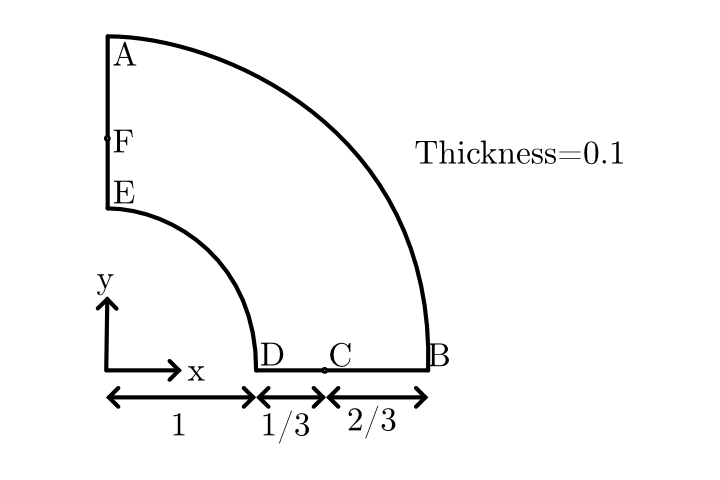
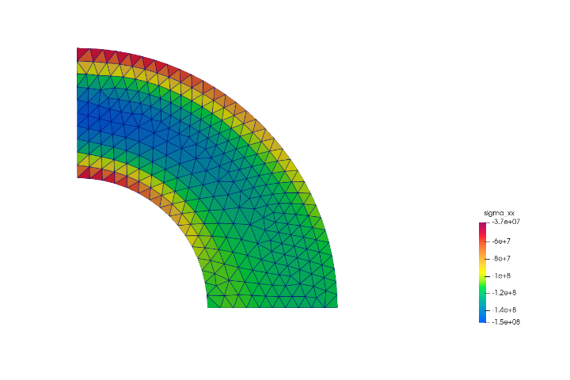
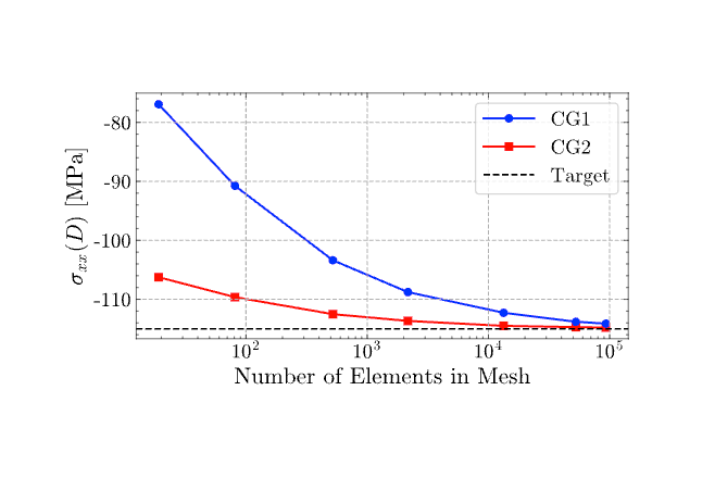

# 7.1 Circular Membrane Point Loading
  
## Objective
 
This practice problem validates a linear elastic membrane solver using the NAFEMS Circular membrane benchmark from report LSB2.
  
The objective is to compute the Direct stress σxx at point D and compare it with the published NAFEMS reference value.
  

**Figure 1.** Definition of validation problem
## Problem Overview
  
Benchmark problem for a circular membrane with a Temp load showing geometry, loading, boundary conditions, material properties, element types, and mesh details.

## Benchmark Source
  
| Field            | Value                                  |
| ---------------- | -------------------------------------- |
| Benchmark origin | NAFEMS report LSB2                     |
| Unit system      | m, kN                                  |
| Analysis type    | Linear elastic membrane analysis       |
| Primary output   | Direct stress $\sigma_{xx}$ at Point D |
| Reference value  | -115 MPa                               |
## Geometry
  **Shape:** Circular Membrane Parabolic 
  
| Parameter | Value | Unit |
| --------- | ----- | ---- |
| Thickness | 0.1   | m    |

## Material Properties
  
The material is assumed to be isotropic, and linearly elastic.
  
These assumptions are appropriate for this benchmark because the goal is to validate the finite element formulation rather than material nonlinearity.
  
| Property                 | Value                    |
| ------------------------ | ------------------------ |
| Young’s modulus, $(E)$   | $210 \times 10^3$ MPa    |
| Poisson’s ratio, $(\nu)$ | $0.3$                    |
| Material model           | Linear elastic isotropic |
| α                        | 2.3 × 10⁻⁴ /°C           |
## Loading Conditions
  
| Load type | Value                                                 |
| --------- | ----------------------------------------------------- |
| Temp load | T = 10(r − 1)(2 − r) °C, uniform around circumference |
 
## Boundary Conditions

| Location | Constraint                   |
| -------- | ---------------------------- |
| Edge AB  | fully fixed                  |
| Edge BCD | symmetry (no y-displacement) |
| Edge EFA | symmetry (no x-displacement) |
| Edge DE  | fully fixed                  |
 
## Finite Element Setup
  
The problem is solved using plane stress finite elements.
  
Both quadrilateral and triangular elements can be used for this benchmark. In this study, Continuous Galerkin elements of degree 1 and degree 2 are compared.
  
| Field               | Value                                                                                                |
| ------------------- | ---------------------------------------------------------------------------------------------------- |
| Origin              | NAFEMS report LSB2                                                                                   |
| Units               | M, KN                                                                                                |
| Analysis Type       | Linear elastic membrane                                                                              |
| Geometry            | Circular membrane, thickness = 0.1 m                                                                 |
| Loading             | T = 10(r − 1)(2 − r) °C, uniform around circumference                                                |
| Boundary Conditions | Edge AB: fully fixed; Edge BCD: symmetry (no y-displacement); Edge EFA: symmetry (no x-displacement) |
| Material Properties | Isotropic — E = 210 × 10³ MPa, ν = 0.3, α = 2.3 × 10⁻⁴ /°C                                           |
| Element Types       | Plane stress quadrilaterals or triangles                                                             |
| Meshes              | Coarse: 4 × 2; Fine: 8 × 4 (halving of coarse mesh)                                                  |
| Output              | Direct stress σ_xx at point D                                                                        |
| Target              | −115 MPa                                                                                             |
## Stress Distribution

The computed direct stress σ_xx field over the quarter annular membrane domain exhibits the following characteristics:

- **Compressive stress throughout:** Thermal expansion is restrained by the fixed and symmetry boundary conditions, resulting in compressive stresses across the entire domain.
- **Maximum compression near constrained boundaries:** The largest compressive stress magnitudes are concentrated near the radially constrained edges (Edge AB and the symmetry edges).
- **Lower magnitudes in the central region:** Stresses diminish towards the interior of the membrane away from the fixed boundaries.
- **Smooth contours:** Stress contours remain spatially smooth throughout the domain, indicating numerically stable behaviour and correct implementation of the thermoelastic constitutive model.
  

**Figure 2.** Direct stress $\sigma_{xx}$ distribution in the Circular membrane.

## Mesh Convergence Study

The direct stress σ_xx at point D was evaluated across a sequence of progressively refined meshes using two finite element formulations: **Continuous Galerkin Degree 1 (CG1)** and **Continuous Galerkin Degree 2 (CG2)**. 
## Continuous Galerkin Degree 1 Results

CG1 converges monotonically from below, requiring a large number of elements to approach the reference value.

| Number of Elements | Direct Stress σxx​ (MPa) | Error (%) |
| ------------------ | ------------------------ | --------- |
| 19                 | -76.93                   | 33.10     |
| 81                 | -90.76                   | 21.08     |
| 521                | -103.38                  | 10.10     |
| 2164               | -108.77                  | 5.41      |
| 13330              | -112.28                  | 2.36      |
| 52603              | -113.80                  | 1.04      |
| 93172              | -114.12                  | 0.77      |
  
## Continuous Galerkin Degree 2 Results

  CG2 achieves significantly higher accuracy on coarse meshes and converges to the benchmark value much more rapidly than CG1.

| Number of Elements | Direct Stress σxx​ (MPa) | Error (%) |
| ------------------ | ------------------------ | --------- |
| 19                 | -106.25                  | 7.61      |
| 81                 | -109.63                  | 4.67      |
| 521                | -112.52                  | 2.16      |
| 2164               | -113.66                  | 1.16      |
| 13330              | -114.50                  | 0.44      |
| 52603              | -114.72                  | 0.25      |
| 93172              | -114.79                  | 0.19      |
  
## Convergence Plot
  
Figure 3  Computed Stress — CG1 (93172 elements)−114.12 MPa
Computed Stress — CG2 (93172 elements)−114.79 MPa

**Figure 3.** Mesh convergence of $\sigma_{xx}$ at Point D compared with the NAFEMS reference value.
  
## Converged Result

|Quantity|Value|
|---|---|
|Benchmark (Analytic) Stress|−115.00 MPa|
|Computed Stress — CG1 (93172 elements)|−114.12 MPa|
|CG1 Relative Error|0.77 %|
|Computed Stress — CG2 (93172 elements)|−114.79 MPa|
|CG2 Relative Error|0.19 %|
  
## Interpretation of Results
**CG1 (Linear Elements)**

- Convergence is gradual and monotonically increasing in magnitude toward −115 MPa.
- On coarse meshes (19 elements), the error exceeds 33%, indicating that linear elements are insufficient for capturing the smooth stress field under distributed thermal loading without significant mesh refinement.
- Even at 93172 elements, the CG1 result (−114.12 MPa) retains a relative error of 0.77%, reflecting the fundamental accuracy limitation of first-order interpolation in thermoelastic problems.

**CG2 (Quadratic Elements)**

- CG2 elements deliver markedly superior accuracy at equivalent mesh densities.
- At only 19 elements, CG2 already achieves a 7.61% error — far better than CG1's 33.10% at the same resolution.
- At the finest mesh (93172 elements), CG2 produces −114.79 MPa with a relative error of only 0.19%, approaching the analytic solution closely.

   
   ## Validation Statement
   
The thermoelastic finite element solver has been successfully verified against the NAFEMS LSB2 circular membrane benchmark (Test No. 07). Both CG1 and CG2 formulations produce results that converge systematically toward the analytic reference of −115 MPa. The finest-mesh CG2 result of −114.79 MPa (error: 0.19%) and the finest-mesh CG1 result of −114.12 MPa (error: 0.77%)
## Conclusion
The CG2 formulation achieves a relative error of **0.19%** at the finest mesh, confirming excellent agreement with the analytic solution. The CG1 formulation achieves **0.77%** error at the same resolution, reflecting the inherently slower convergence of linear elements for smooth thermoelastic problems.

