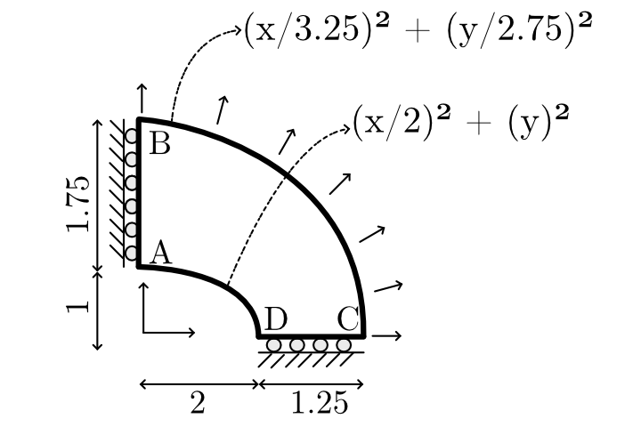
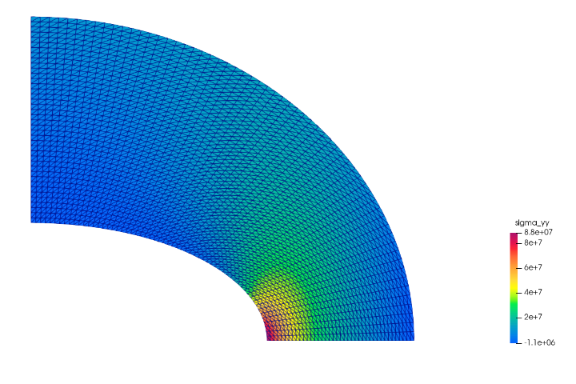
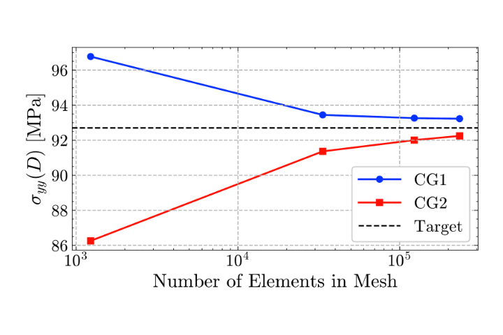
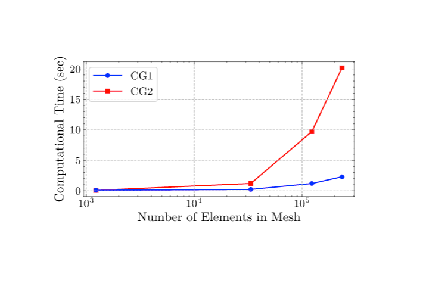

# 9.1 Elliptic Membrane
  
## Objective
 
This practice problem validates a linear elastic membrane solver using the NAFEMS elliptic membrane benchmark from report LSB2.
  
The objective is to compute the Direct stress σyy at point D and compare it with the published NAFEMS reference value.
  

**Figure 1.** Definition of validation problem
## Problem Overview
  
Benchmark problem for a eliptical membrane with a point load at point D, showing geometry, loading, boundary conditions, material properties, element types, and mesh details.

## Benchmark Source
  
| Field            | Value                                  |
| ---------------- | -------------------------------------- |
| Benchmark origin | NAFEMS report LSB2                     |
| Unit system      | m, kN                                  |
| Analysis type    | Linear elastic membrane analysis       |
| Primary output   | Direct stress $\sigma_{yy}$ at Point D |
| Reference value  | 92.7 MPa                               |
## Geometry
  **Shape:** Elliptic Membrane
  
| Parameter                | Value                     | Unit |
| ------------------------ | ------------------------- | ---- |
| Geometry — Outer Ellipse | (x/3.25)² + (y/2.75)² = 1 | m    |
| Geometry — Inner Ellipse | (x/2)² + y² = 1           | m    |
## Material Properties
  
The material is assumed to be isotropic, and linearly elastic.
  
These assumptions are appropriate for this benchmark because the goal is to validate the finite element formulation rather than material nonlinearity.
  
| Property                 | Value                    |
| ------------------------ | ------------------------ |
| Young’s modulus, $(E)$   | $210 \times 10^3$ MPa    |
| Poisson’s ratio, $(\nu)$ | $0.3$                    |
| Material model           | Linear elastic isotropic |

## Loading Conditions
  
| Load type                                 | Value |
| ----------------------------------------- | ----- |
| Uniform outward traction on outer edge BC | 10MPa |
 
## Boundary Conditions

| Location | Constraint                                |
| -------- | ----------------------------------------- |
| Edge AB  | symmetry about y-axis (no x-displacement) |
| Edge CD  | symmetry about x-axis (no y-displacement) |
 
## Finite Element Setup
  
The problem is solved using plane stress finite elements.
  
Both quadrilateral and triangular elements can be used for this benchmark. In this study, Continuous Galerkin elements of degree 1 and degree 2 are compared.
 
| Field               | Value                                                                      |
| ------------------- | -------------------------------------------------------------------------- |
| Origin              | NAFEMS report LSB2                                                         |
| Units               | M, KN                                                                      |
| Analysis Type       | Linear elastic membrane                                                    |
| Geometry            | Outer Ellipse \|(x/3.25)² + (y/2.75)² = 1 , Inner Ellipse  (x/2)² + y² = 1 |
| Loading             | Uniform outward traction on outer edge BC 10 MPa                           |
| Boundary Conditions | Edge AB: symmetry about y-axis; Edge CD: symmetry about x-axis             |
| Material Properties | Isotropic — E = 210 × 10³ MPa, ν = 0.3                                     |
| Element Types       | Plane stress quadrilaterals or triangles                                   |
| Output              | Direct stress σ_yy at point D                                              |
| Target              | 92.7MPa                                                                    |
## Stress Distribution

The computed σ_yy stress field remains smooth across the domain. Elevated stress concentrations are observed near the inner elliptical boundary, consistent with physical expectations due to increased curvature effects at that region. The stress contours confirm:

- Correct implementation of the uniform outward traction boundary condition on the outer edge.

**Figure 2.** Direct stress $\sigma_{yy}$ distribution in the eliptical membrane.

## Mesh Convergence Study

Direct stress σ_yy at point D was evaluated at four mesh refinement levels for both CG1 and CG2 formulations.
## Continuous Galerkin Degree 1 Results

CG1 converges monotonically from below, requiring a large number of elements to approach the reference value.

Both formulations exhibit systematic convergence toward the NAFEMS reference value of 92.7 MPa. CG1 approaches from above while CG2 approaches from below. On coarse meshes, CG1 is more accurate; however, CG2 demonstrates superior asymptotic convergence and achieves slightly better accuracy on the finest mesh.

|Number of Elements|σ_yy (MPa)|Error (%)|
|---|---|---|
|1,229|96.770|4.39|
|33,442|93.442|0.80|
|123,132|93.259|0.60|
|234,638|93.227|0.57|

## Continuous Galerkin Degree 2 Results

  CG2 achieves significantly higher accuracy on coarse meshes and converges to the benchmark value much more rapidly than CG1.

| Number of Elements | σ_yy (MPa) | Error (%) |
| ------------------ | ---------- | --------- |
| 1,229              | 86.259     | 6.95      |
| 33,442             | 91.364     | 1.44      |
| 123,132            | 92.004     | 0.75      |
| 234,638            | 92.245     | 0.49      |

## Convergence Plot
  
Figure 3  Both formulations achieve errors below 1% on the finest mesh. CG2 yields slightly better agreement with the benchmark.

**Figure 3.** Mesh convergence of $\sigma_{yy}$ at Point D compared with the NAFEMS reference value.
  
## Converged Result

| Quantity                | Value      |
| ----------------------- | ---------- |
| NAFEMS Reference Stress | 92.70 MPa  |
| CG1 Computed Stress     | 93.227 MPa |
| CG1 Relative Error      | 0.57 %     |
| CG2 Computed Stress     | 92.245 MPa |
| CG2 Relative Error      | 0.49 %     |
  
Computational Cost

The CG2 formulation requires substantially higher computational effort due to the increased number of degrees of freedom from quadratic interpolation.

|Number of Elements|CG1 Time (s)|CG2 Time (s)|
|---|---|---|
|1,229|0.0121|0.0272|
|33,442|0.2130|1.0858|
|123,132|1.8479|7.1658|
|234,638|2.3020|19.1365|
## Interpretation of Results
**CG1 (Linear Elements)**

- - **CG1** converges monotonically from above, with a relatively rapid initial reduction in error. On coarse meshes (1229 elements), CG1 outperforms CG2; however, its convergence rate is lower asymptotically.

**CG2 (Quadratic Elements)**

- **CG2** initially overestimates the error on coarse meshes (6.95% at 1229 elements) due to the sensitivity of quadratic shape functions to mesh quality. However, it converges at a higher rate and surpasses CG1 accuracy on finer meshes.

   
   ## Validation Statement
   
The finite element membrane solver has been validated against the NAFEMS elliptic membrane benchmark (Test No. 09, LSB2). Both CG1 and CG2 formulations converge systematically to the reference value of 92.7 MPa with mesh refinement. On the finest mesh:

- CG1 achieves a relative error of **0.57%**.
- CG2 achieves a relative error of **0.49%**
## Conclusion
The developed FE membrane solver successfully reproduces the NAFEMS elliptic membrane benchmark solution (Test No. 09). Both CG1 and CG2 formulations exhibit systematic, monotonic convergence toward the NAFEMS reference direct stress σ_yy = 92.7 MPa at point D.

- The finest CG1 mesh (234,638 elements) yields σ_yy = **93.227 MPa** with a relative error of **0.57%**.
- The finest CG2 mesh (234,638 elements) yields σ_yy = **92.245 MPa** with a relative error of **0.49%**.
