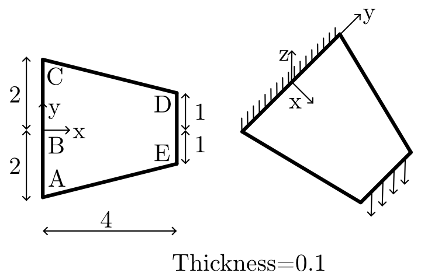
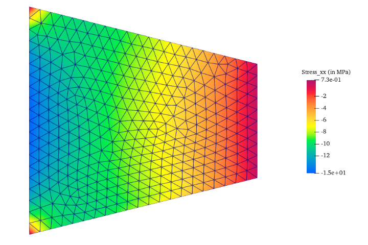
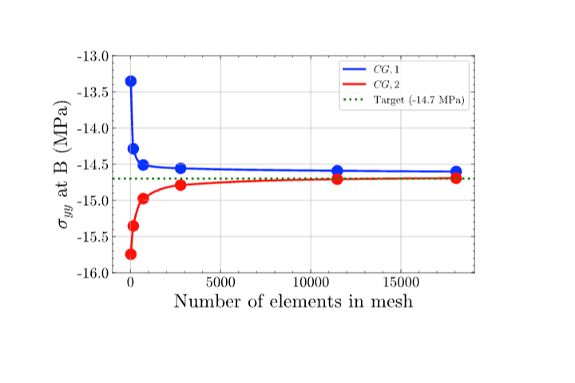

# 10.1 Tappered Plate Edge Shear
  
## Objective
 To validate a finite element implementation for the linear elastic analysis of a tapered flat plate subjected to uniform edge shear loading. The primary goal is to compute the direct stress σ_xx at Point B on the top surface and compare it against the NAFEMS benchmark target value of **−14.7 MPa**, assessed through a systematic mesh convergence study using both first-order (CG1) and second-order (CG2) interpolation schemes.
  

**Figure 1.** Definition of validation problem
## Problem Overview
  
Engineering benchmark sheet for a tapered plate edge shear problem, including geometry, loading, boundary conditions, material properties, element types, mesh, and output target.

## Benchmark Source
  
| Field            | Value                                       |
| ---------------- | ------------------------------------------- |
| Benchmark origin | NAFEMS report LSB2                          |
| Unit system      | m, kN                                       |
| Analysis type    | Linear elastic flat plate                   |
| Primary output   | Direct stress σxx on top surface at point B |
| Reference value  | -14.7 MPa                                   |
## Geometry

  **Shape:** Tapered Plate Edge Shear
  
| Parameter     | Value | Unit |
| ------------- | ----- | ---- |
| Tapered plate | 0.1   | m    |
## Material Properties
  
The material is assumed to be isotropic, and linearly elastic.
  
These assumptions are appropriate for this benchmark because the goal is to validate the finite element formulation rather than material nonlinearity.
  
| Property                 | Value                    |
| ------------------------ | ------------------------ |
| Young’s modulus, $(E)$   | $210 \times 10^3$ MPa    |
| Poisson’s ratio, $(\nu)$ | $0.3$                    |
| Material model           | Linear elastic isotropic |

## Loading Conditions
  
| Load type      | Value                                   |
| -------------- | --------------------------------------- |
| Vertical shear | 10KN/M in the z-direction along edge DE |
 
## Boundary Conditions

| Location | Constraint                                |
| -------- | ----------------------------------------- |
| Edge ABC | fully fixed                               |
 
## Finite Element Setup
  
The problem is solved using plane stress finite elements.
  
Both quadrilateral and triangular elements can be used for this benchmark. In this study, Continuous Galerkin elements of degree 1 and degree 2 are compared.
 
## Stress Distribution

The computed σ_yy stress field remains smooth across the domain. Elevated stress concentrations are observed near the inner elliptical boundary, consistent with physical expectations due to increased curvature effects at that region. The stress contours confirm:

- Correct implementation of the uniform outward traction boundary condition on the outer edge.

**Figure 2.** Direct stress $\sigma_{xx}$ distribution in the eliptical membrane.

## Mesh Convergence Study

The normal stress σ_xx​ at Point B was evaluated across a range of mesh densities using CG1 (first-order) and CG2 (second-order) interpolation, and compared with the NAFEMS target of **−14.7 MPa**.
## Continuous Galerkin Degree 1 Results

| Number of Elements | Target $\sigma_{xx}$ (MPa) | Computed $\sigma_{xx}$ (MPa) | Error (%) |
| ------------------ | -------------------------- | ---------------------------- | --------- |
| 24                 | −14.700                    | −13.353                      | 9.16      |
| 159                | −14.700                    | −14.286                      | 2.82      |
| 712                | −14.700                    | −14.510                      | 1.29      |
| 2782               | −14.700                    | −14.557                      | 0.97      |
| 11472              | −14.700                    | −14.590                      | 0.75      |
| 18064              | −14.700                    | −14.602                      | 0.67      |
## Continuous Galerkin Degree 2 Results

| Number of Elements | Target $\sigma_{xx}$ (MPa) | Computed $\sigma_{xx}$ (MPa) | Error (%) |
| ------------------ | -------------------------- | ---------------------------- | --------- |
| 24                 | −14.700                    | −15.745                      | 7.11      |
| 159                | −14.700                    | −15.353                      | 4.44      |
| 712                | −14.700                    | −14.976                      | 1.88      |
| 2782               | −14.700                    | −14.790                      | 0.61      |
| 11472              | −14.700                    | −14.708                      | 0.05      |
| 18064              | −14.700                    | −14.694                      | 0.04      |

## Convergence Plot
  Solver Runtime vs. Mesh Size
  
| Number of Elements | CG1 Runtime (s) | CG2 Runtime (s) |
| ------------------ | --------------- | --------------- |
| 24                 | 0.1044          | 0.1473          |
| 159                | 0.0986          | 0.2019          |
| 712                | 0.1830          | 0.2647          |
| 2782               | 0.5474          | 0.5886          |
| 11472              | 2.7927          | 2.3484          |
| 18064              | 5.6560          | 4.1345          |

**Figure 3.** Mesh convergence of $\sigma_{xx}$ at Point B compared with the NAFEMS reference value.
  
## Converged Result

| Formulation | Elements | Computed $\sigma_{xx}$ (MPa) | Error (%) |
| ----------- | -------- | ---------------------------- | --------- |
| CG1         | 18064    | −14.602                      | 0.67      |
| CG2         | 18064    | −14.694                      | 0.04      |
| **Target**  | —        | **−14.700**                  | —         |

The CG2 formulation at 18064 elements yields a computed stress of **−14.694 MPa**, achieving an error of only **0.04%** relative to the NAFEMS benchmark.
  
## Interpretation of Results

- **G1 behaviour:** The first-order scheme approaches the target from below (under-predicts magnitude), with error reducing from 9.16% at the coarsest mesh to 0.67% at the finest.
- **CG2 behaviour:** The second-order scheme initially over-predicts the stress magnitude at coarse meshes ( −15.745 MPa at 24 elements), then converges rapidly toward the target, achieving near-exact agreement at fine meshes.
- **Convergence rate:** CG2 converges significantly faster than CG1 for the same number of elements — at 11472 elements, CG2 achieves 0.05% error compared to 0.75% for CG1.
   
   ## Validation Statement
   
Both CG1 and CG2 finite element formulations successfully reproduced the NAFEMS benchmark result for the tapered plate edge shear problem. The CG2 formulation at the finest mesh (18064 elements) produced a stress of **−14.694 MPa**, deviating from the target of **−14.700 MPa** by less than **0.05%**. This level of agreement confirms that the finite element implementation is correctly formulated and numerically consistent with established benchmark standards.
## Conclusion
- Mesh refinement systematically improved the accuracy of the computed $\sigma_{xx}$​ stress at Point B for both interpolation orders.
- Both CG1 and CG2 formulations converged toward the NAFEMS benchmark value of **−14.7 MPa**.
- The CG2 (second-order) formulation demonstrated faster convergence and lower discretization error at equivalent mesh densities, making it the preferred choice for this class of plate-bending problems.
- The benchmark target was approached to within **0.04%** error using CG2 at 18064 elements and **0.67%** using CG1 at the same density.