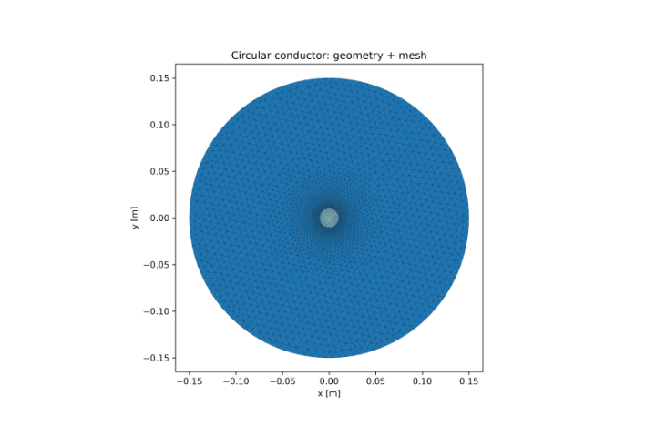
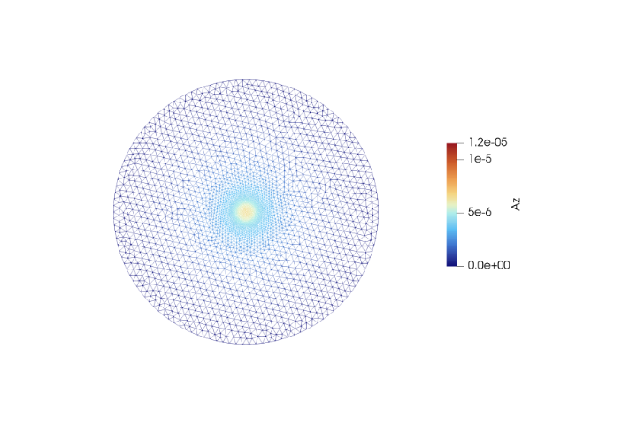
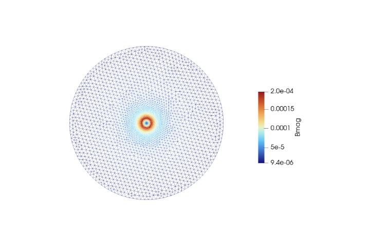
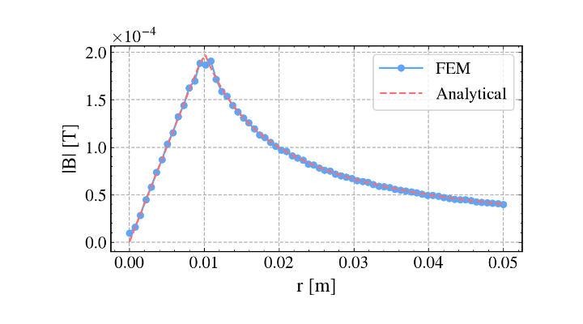
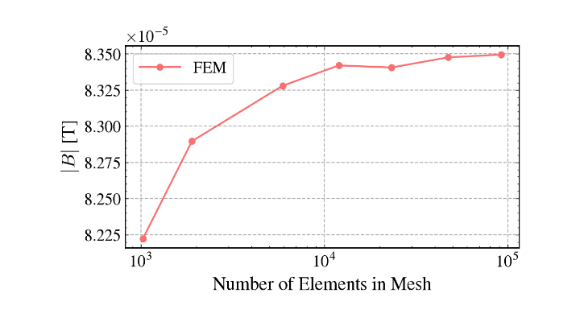

# Validation Case 1: Circular Current-Carrying Conductor

## Objective

This validation case verifies the magnetic field solution both inside and outside a uniformly current-carrying cylindrical conductor.

Unlike the previous benchmark, this case validates the transition across the conductor-air interface and the correct representation of the magnetic field within the current-carrying region.

## Physics Being Validated

- Interior magnetic field
- Exterior magnetic field
- Uniform current density
- Continuity across material interface
- Magnetic vector potential
- Curl operator

## Problem Description

A circular conductor carrying a uniformly distributed current is surrounded by air.

The magnetic field increases linearly inside the conductor and follows an inverse radial decay outside the conductor.

## Governing Equations

Inside the conductor

$$
B(r)=\frac{\mu_0 I r}{2\pi a^2}
$$

Outside the conductor

$$
B(r)=\frac{\mu_0 I}{2\pi r}
$$

## Geometry

 **Figure 1. Geometry and mesh**

The computational domain consists of a circular current-carrying conductor surrounded by air. A refined triangular mesh is used near the conductor to accurately capture the high magnetic field gradients, while a coarser mesh is employed farther away to improve computational efficiency.

## Magnetic Vector Potential

 **Figure 2. Magnetic vector potential**

The magnetic vector potential (Az) reaches its maximum value within the conductor and decreases smoothly toward the outer air boundary. This continuous distribution confirms the correct solution of the magnetostatic governing equation across the entire computational domain.

## Magnetic Flux Density

 **Figure 3. Magnetic flux density**
 
The magnetic flux density is strongest near the conductor surface, where it reaches its maximum value, and decreases with increasing distance from the conductor. The contour distribution follows the expected circular magnetic field produced by a uniformly distributed current.

## FEM vs Analytical Comparison

 **Figure 4. Comparison of analytical and numerical magnetic field**

The FEM results closely match the analytical solution obtained from Ampère's law for both the conductor interior and exterior regions. The excellent agreement demonstrates the accuracy of the finite element formulation and magnetic field reconstruction.

## Convergence Results

*Figure 5: Mesh convergence plot for the conductor*
The mesh convergence study demonstrates that the computed magnetic flux density rapidly approaches a stable value as the number of finite elements increases. The nearly horizontal response for finer meshes indicates that the numerical solution has become mesh independent.
## Validation Results

| Quantity   | Value    |
| ---------- | -------- |
| Mean Error | 0.67 %   |
| RMSE       | 5.86e-07 |

## Interpretation

The computed magnetic field accurately reproduces the expected linear variation inside the conductor and the inverse radial decay outside the conductor.

The smooth transition across the conductor boundary confirms the correct implementation of the current density distribution and field reconstruction.

## Validation Statement

The solver accurately reproduces the analytical solution for a uniformly current-carrying cylindrical conductor.

## Conclusion

This benchmark extends the previous validation by verifying both the interior and exterior magnetic field behaviour of the magnetostatic formulation.