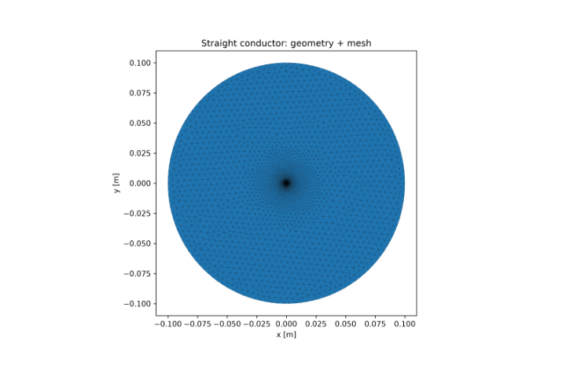
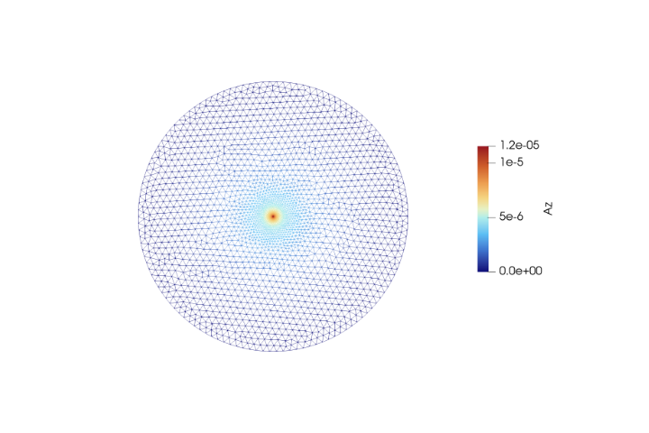
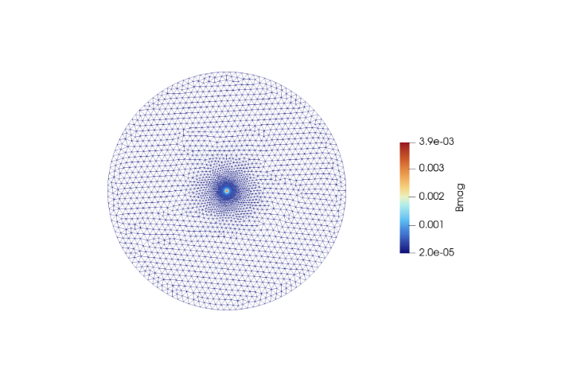
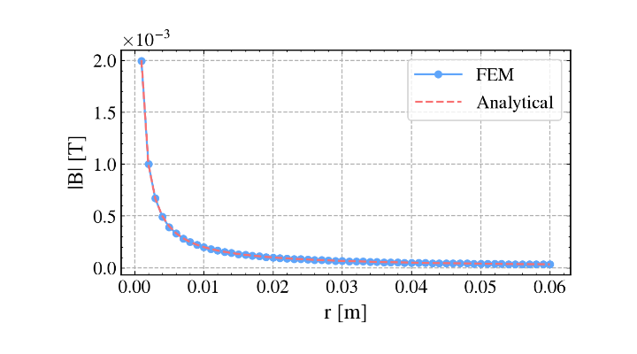
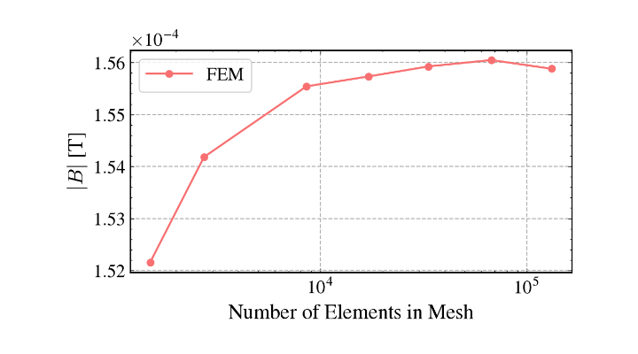

# Validation Case 2: Infinite Straight Current-Carrying Conductor

## Objective

This validation case verifies the correctness of the 2D magnetostatic finite element solver by comparing the computed magnetic field surrounding a current-carrying conductor with the analytical solution obtained from Ampère's Law.

The benchmark validates the implementation of the magnetic vector potential formulation, current density source term, magnetic flux density computation, and finite element assembly.

## Physics Being Validated

This benchmark validates:

- Magnetostatic formulation
- Magnetic vector potential ($A_z$)
- Current density implementation
- Magnetic flux density computation
- Curl operator
- Material assignment
- Boundary conditions
- Agreement with Ampère's Law

## Problem Description

An infinitely long cylindrical conductor carrying a uniform current is placed at the centre of a circular air domain.

The current flows along the z-direction while the magnetic field circulates around the conductor.

Because the geometry is invariant along the axial direction, the problem is solved using a two-dimensional cross-sectional model.

## Governing Equation

The magnetostatic equation solved is

$$
\nabla \cdot \left( \nu \nabla A_z \right) = -J_z
$$

where

- $A_z$ is the magnetic vector potential
- $\nu = 1/\mu$
- $J_z$ is the applied current density

The magnetic flux density is computed as

$$
\mathbf{B}=\nabla \times A_z
$$

## Analytical Solution

Outside the conductor,

$$
B(r)=\frac{\mu_0 I}{2\pi r}
$$

which serves as the reference solution for validation.

## Geometry

| Parameter        | Value                                         |
| ---------------- | --------------------------------------------- |
| Conductor radius | `A_THIN`                                      |
| Air radius       | `R_AIR`                                       |
| Geometry         | Circular conductor inside circular air domain |

## Material Properties

| Region    | Relative Permeability |
| --------- | --------------------- |
| Air       | 1.0                   |
| Conductor | 1.0                   |

## Boundary Conditions

Outer circular boundary

$$
A_z=0
$$

Current density is uniformly applied inside the conductor.

## Solver Configuration

| Item           | Value                             |
| -------------- | --------------------------------- |
| Solver         | 2D Magnetostatic FEM              |
| Unknown        | Magnetic Vector Potential ($A_z$) |
| Element Type   | Continuous Galerkin               |
| Field Computed | $A_z$, $\mathbf{B}$               |

## Geometry and Mesh
 

*Figure 1. Geometry and computational mesh.*

The model consists of an infinitely long straight current-carrying conductor placed at the center of a circular air domain. A finer triangular mesh is generated near the conductor to accurately resolve the strong magnetic field gradients, while a coarser mesh is used farther away for computational efficiency.

## Magnetic Vector Potential

*Figure 2. Magnetic vector potential ($A_z$).*

The magnetic vector potential ($A_z$) attains its highest value at the conductor center and decreases smoothly toward the outer boundary. The contour demonstrates the expected radial variation of the potential resulting from the applied current density.

## Magnetic Flux Density

*Figure 3. Magnetic flux density magnitude.*

The magnetic flux density is highest near the conductor surface and decreases with increasing radial distance in accordance with Ampère's Law. The circular contour pattern represents the magnetic field generated around the straight current-carrying conductor.

## FEM vs Analytical Comparison

*Figure 4. Comparison between FEM and analytical solution.*

The FEM-computed magnetic field closely follows the analytical solution throughout the computational domain. The near-perfect overlap of the two curves confirms the accuracy of the finite element implementation for magnetostatic field computation.

## Convergence Plots

*Figure 5. Mesh convergence plot for the conductor*

The mesh convergence study demonstrates that the computed magnetic flux density rapidly approaches a stable value as the number of finite elements increases. The nearly horizontal response for finer meshes indicates that the numerical solution has become mesh independent.

## Validation Results

| Quantity | Value |
|----------|-------|
| Mean Error | 0.63 % |
| RMSE | 1.21e-06 |
| Analytical Reference | Ampère's Law |

## Interpretation

The computed magnetic field follows the expected inverse radial variation predicted by Ampère's Law.

The numerical solution closely overlaps the analytical solution throughout the exterior region, confirming the correct implementation of the finite element formulation and magnetic field computation.

## Validation Statement

The magnetostatic solver successfully reproduces the analytical magnetic field of an infinitely long current-carrying conductor.

The agreement with Ampère's Law validates the implementation of the governing equations, current density source, magnetic vector potential formulation, and magnetic flux density reconstruction.

## Conclusion

This benchmark validates the core magnetostatic formulation used by the BLDC motor solver and establishes confidence in the implementation before applying the solver to rotating electrical machines.