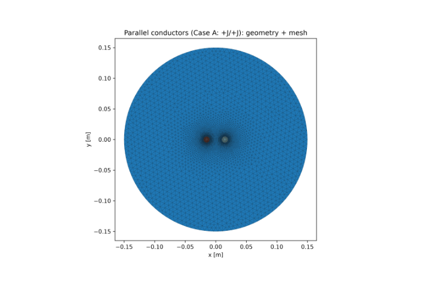
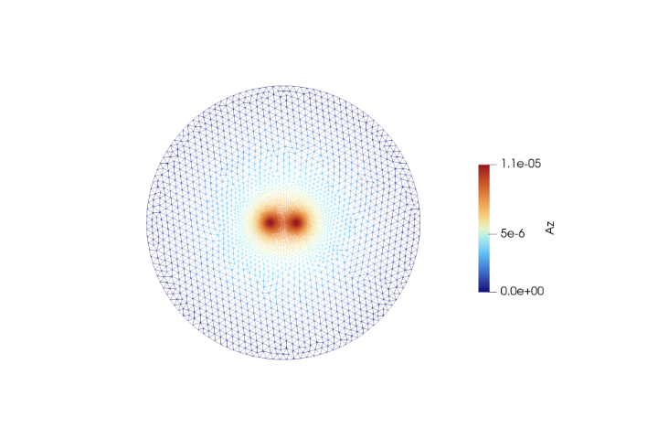
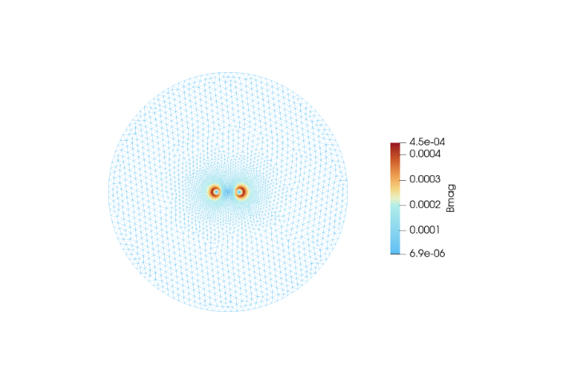
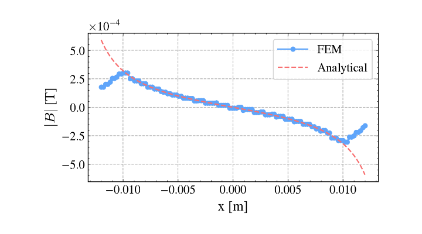
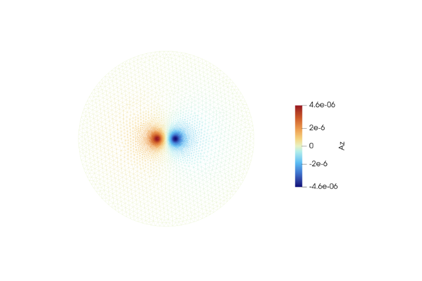
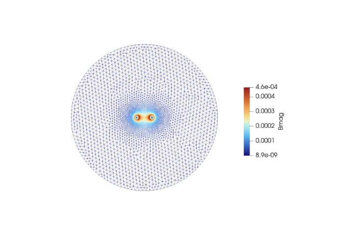
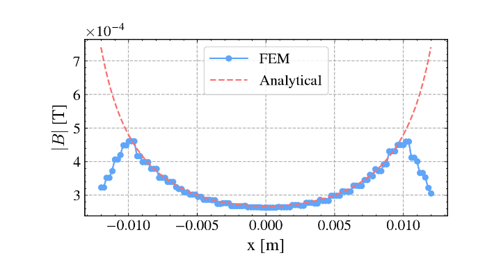
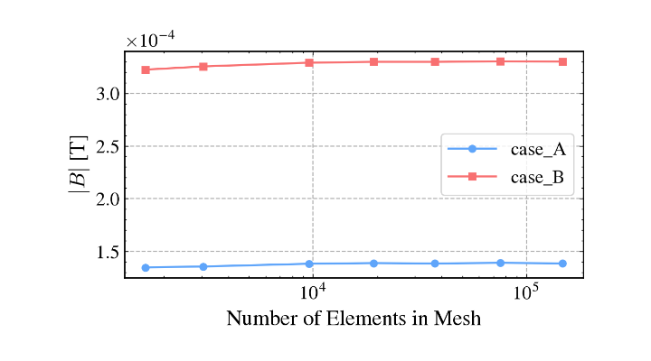

# Validation Case 3: Two Parallel Current-Carrying Conductors

## Objective

This validation case verifies the ability of the 2D magnetostatic finite element solver to accurately model the interaction of magnetic fields generated by multiple current-carrying conductors.

The benchmark validates the implementation of multiple current source regions, the superposition principle, and the magnetic vector potential formulation by comparing the numerical solution with the analytical magnetic field obtained from the superposition of two infinitely long current-carrying conductors.

Two current configurations are considered:

- **Case A:** Parallel currents (+J / +J)
- **Case B:** Opposite currents (+J / -J)

## Physics Being Validated

This benchmark validates the following components of the magnetostatic solver:

- Multiple current source implementation
- Superposition of magnetic fields
- Magnetic vector potential formulation
- Magnetic flux density computation
- Curl operator implementation
- Material assignment
- Finite element formulation
- Agreement with analytical solution

## Problem Description

Two infinitely long cylindrical conductors are placed inside a circular air domain.

Each conductor carries a uniform current density. Two current configurations are investigated:

- **Case A:** Both conductors carry current in the same direction.
- **Case B:** The conductors carry equal currents in opposite directions.

The magnetic field produced by the conductors is compared against the analytical solution obtained by superposition of the magnetic fields generated by two infinite line currents.

## Governing Equation

The magnetostatic formulation solved is

$$
\nabla \cdot \left(\nu \nabla A_z\right) = -J_z
$$

where

- $A_z$ is the magnetic vector potential,
- $\nu=1/\mu$ is the magnetic reluctivity,
- $J_z$ is the applied current density.

The magnetic flux density is obtained as

$$
\mathbf{B}=\nabla\times A_z
$$

The analytical magnetic field is computed using the superposition principle,

$$
\mathbf{B}
=
\mathbf{B}_1+\mathbf{B}_2
$$

where each individual field is given by Ampère's Law for an infinitely long current-carrying conductor.

## Geometry

| Parameter | Description |
|-----------|-------------|
| Geometry | Two circular conductors inside circular air domain |
| Current configurations | +J/+J and +J/-J |
| Material | Air and conductor ($\mu_r=1$) |

## Material Properties

| Region | Relative Permeability |
|--------|------------------------|
| Air | 1.0 |
| Conductors | 1.0 |

## Boundary Conditions

The outer circular boundary is prescribed with

$$
A_z=0
$$

Uniform current density is applied within each conductor.

## Solver Configuration

| Item          | Value                             |
| ------------- | --------------------------------- |
| Solver        | 2D Magnetostatic FEM              |
| Unknown       | Magnetic Vector Potential ($A_z$) |
| Element Type  | Continuous Galerkin               |
| Output Fields | $A_z$, $\mathbf{B}$, $            |

## Geometry and Mesh

*Figure 1. Geometry and computational mesh.*

The model consists of two parallel current-carrying conductors embedded in a circular air domain. A refined triangular mesh is generated around both conductors to accurately resolve the interaction of their magnetic fields while maintaining computational efficiency in the surrounding air.

# Case A – Parallel Currents (+J / +J)

## Magnetic Vector Potential

*Figure 2. Magnetic vector potential ($A_z$) distribution for Case A.*

The magnetic vector potential exhibits two distinct peaks corresponding to the conductors carrying current in the same direction. The smooth contours demonstrate the superposition of the vector potentials produced by both current sources.

## Magnetic Flux Density Magnitude

*Figure 3. Magnetic flux density magnitude ($|\mathbf{B}|$) for Case A.*

The magnetic flux density is concentrated around each conductor and forms a combined field due to constructive superposition of the parallel currents. The contour distribution illustrates the interaction of the magnetic fields generated by both conductors.

## FEM vs Analytical Comparison

*Figure 4. Comparison between FEM solution and analytical superposition for Case A.*

The FEM solution closely follows the analytical magnetic field obtained using the superposition principle. The agreement confirms the accurate implementation of multiple current sources and magnetic field computation for parallel currents.

# Case B – Opposite Currents (+J / -J)

## Magnetic Vector Potential

*Figure 5. Magnetic vector potential ($A_z$) distribution for Case B.*

When the conductors carry equal and opposite currents, the magnetic vector potential exhibits positive and negative regions with opposite polarity. The contour pattern clearly reflects the reversal of current direction and the resulting field symmetry.
## Magnetic Flux Density Magnitude

*Figure 6. Magnetic flux density magnitude ($|\mathbf{B}|$) for Case B.*

The magnetic flux density remains concentrated around each conductor, but the opposite current directions produce a different field interaction compared to Case A. The contours illustrate the magnetic field distribution resulting from opposing current flow.

## FEM vs Analytical Comparison

*Figure 7. Comparison between FEM solution and analytical superposition for Case B.*

The numerical solution shows excellent agreement with the analytical magnetic field obtained through superposition for opposite current directions. This validates the solver's ability to accurately model interacting magnetic fields with reversed current polarity.
## Convergence Results

*Figure 8: Mesh convergence plot for the conductor*
The mesh convergence study demonstrates that the computed magnetic flux density rapidly approaches a stable value as the number of finite elements increases. The nearly horizontal response for finer meshes indicates that the numerical solution has become mesh independent.
## Interpretation of Results

The computed magnetic field distributions accurately reproduce the expected interaction between the magnetic fields generated by multiple conductors.

For **Case A**, the magnetic fields generated by the two conductors reinforce each other, resulting in the expected combined field distribution.

For **Case B**, reversing the current direction of one conductor produces the expected change in magnetic field orientation while preserving the overall superposition behaviour predicted by electromagnetic theory.

The finite element solution shows close agreement with the analytical solution for both current configurations, confirming the correct implementation of multiple current source regions and magnetic field superposition.

## Validation Statement

The magnetostatic finite element solver successfully reproduces the magnetic field generated by two infinitely long current-carrying conductors for both parallel and opposite current directions.

Agreement between the numerical and analytical solutions confirms the correct implementation of:

- Multiple current density regions
- Magnetic vector potential formulation
- Magnetic flux density computation
- Superposition principle
- Finite element assembly

## Conclusion

This benchmark validates the capability of the solver to accurately model interacting magnetic fields generated by multiple current-carrying conductors.

The successful reproduction of the analytical magnetic field provides confidence in applying the solver to practical electromagnetic devices containing multiple coils and windings, including BLDC motors, where magnetic field superposition plays a fundamental role in machine operation.