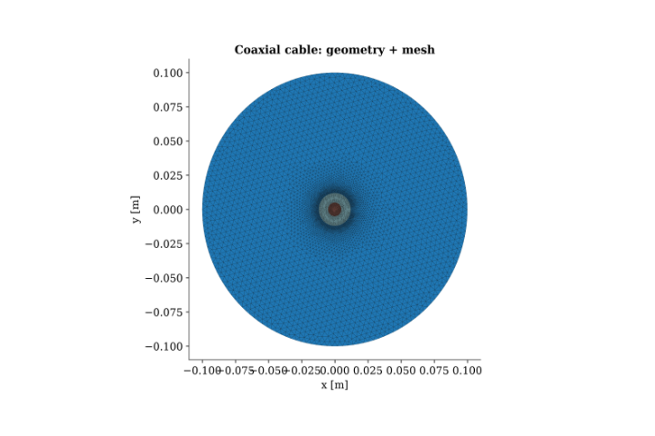
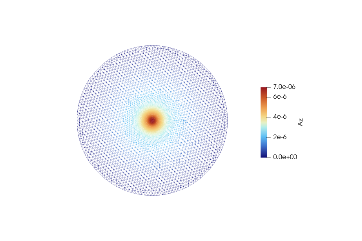
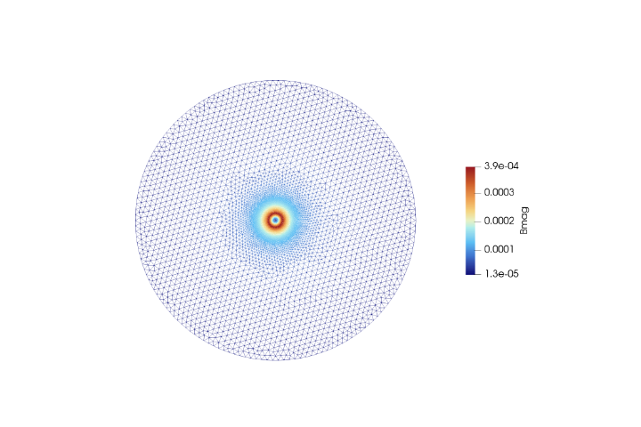
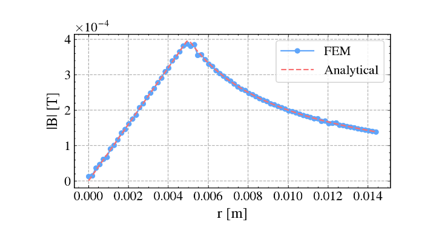
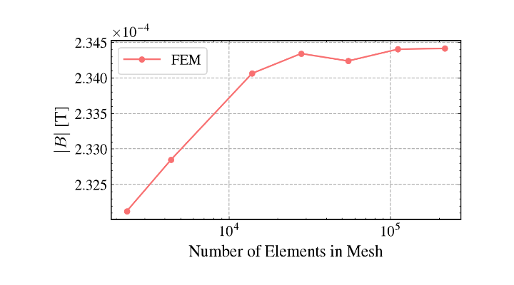

# Validation Case 4: Coaxial Cable

## Objective

This validation case verifies the accuracy of the 2D magnetostatic finite element solver for a coaxial cable geometry by comparing the computed magnetic flux density with the analytical solution obtained from Ampère's Law.

Unlike the previous benchmark involving a single conductor, this case validates the solver's ability to correctly model multiple material regions, current confinement, and the radial variation of the magnetic field inside a coaxial structure.
## Physics Being Validated

This benchmark validates:

- Magnetostatic formulation
- Magnetic vector potential ($A_z$)
- Multiple material region handling
- Current density implementation
- Magnetic flux density computation
- Curl operator
- Radial magnetic field distribution
- Boundary condition implementation
- Agreement with Ampère's Law

## Problem Description

A coaxial cable consists of an inner cylindrical conductor carrying a uniform current surrounded by a dielectric region and an outer return conductor.

For this validation case, the inner conductor carries the applied current while the surrounding regions contain no impressed current density. Due to the cylindrical symmetry of the problem, the magnetic field is purely circumferential and varies only with radial distance from the cable axis.

The problem is solved using a two-dimensional cross-sectional magnetostatic formulation.

## Governing Equation

The magnetostatic equation solved is

$$
\nabla \cdot \left( \nu \nabla A_z \right) = -J_z
$$

where

- $A_z$ is the magnetic vector potential
- $\nu = 1/\mu$
- $J_z$ is the applied current density

The magnetic flux density is obtained from

$$
\mathbf{B}=\nabla \times A_z
$$

## Analytical Solution

Inside the inner conductor,

$$
B(r)=\frac{\mu_0 I r}{2\pi a^2}
$$

where

- $a$ is the radius of the inner conductor.

Outside the inner conductor,

$$
B(r)=\frac{\mu_0 I}{2\pi r}
$$

This analytical solution provides the reference profile for validating the finite element results.

## Geometry

| Parameter | Value |
|-----------|-------|
| Inner conductor radius | 5 mm |
| Dielectric outer radius | 12 mm |
| Air domain radius | 100 mm |
| Geometry | Coaxial cable cross-section |

## Material Properties

| Region | Relative Permeability |
|--------|------------------------|
| Air | 1.0 |
| Inner conductor | 1.0 |
| Dielectric | 1.0 |
| Outer conductor | 1.0 |

## Boundary Conditions

The outer circular boundary satisfies

$$
A_z=0
$$

A uniform current density is applied within the inner conductor while the surrounding regions are modeled as linear magnetic materials.

## Solver Configuration

| Item           | Value                             |
| -------------- | --------------------------------- |
| Solver         | 2D Magnetostatic FEM              |
| Unknown        | Magnetic Vector Potential ($A_z$) |
| Element Type   | Continuous Galerkin               |
| Field Computed | $A_z$, $\mathbf{B}$               |

## Geometry and Mesh

*Figure 1. Geometry and computational mesh.*

The computational model consists of an inner conductor, surrounding dielectric insulation, and an external air region. A locally refined triangular mesh is generated near the conductor interface to accurately capture the steep magnetic field gradients while maintaining computational efficiency throughout the remainder of the domain.

## Magnetic Vector Potential

*Figure 2. Magnetic vector potential ($A_z$).*

The magnetic vector potential reaches its maximum value within the current-carrying conductor and decreases smoothly with radial distance. The continuous distribution across the dielectric and air regions demonstrates correct finite element formulation and continuity of the magnetic potential.

## Magnetic Flux Density

*Figure 3. Magnetic flux density magnitude.*

The magnetic flux density increases approximately linearly within the inner conductor due to the uniformly distributed current and reaches its maximum near the conductor surface. Outside the conductor, the magnetic field decreases approximately according to the inverse radial relationship predicted by Ampère's Law.

## FEM vs Analytical Comparison

*Figure 4. Comparison between FEM and analytical solution.*

The finite element solution closely follows the analytical magnetic field profile throughout the conductor and dielectric regions. The numerical solution accurately reproduces both the linear variation inside the conductor and the inverse radial decay outside the conductor. Slight deviations are observed near the conductor interface where the magnetic field transitions between the two analytical regions.

## Mesh Convergence Study

*Figure 5. Mesh convergence study.*

The mesh convergence study demonstrates that the computed magnetic flux density rapidly approaches a stable value as the number of finite elements increases. The nearly horizontal response for finer meshes indicates that the numerical solution has become mesh independent.
## Validation Results

| Quantity             | Value        |
| -------------------- | ------------ |
| Mean Error           | 1.32 %       |
| RMSE                 | 2.99 × 10⁻⁶  |
| Sample Points        | 62           |
| Analytical Reference | Ampère's Law |

## Interpretation

The finite element solution accurately reproduces the theoretical magnetic field distribution of a coaxial cable. The field exhibits the expected linear increase within the current-carrying conductor followed by an inverse radial decay in the surrounding dielectric region.

Although the maximum pointwise error reaches approximately 22.5%, this occurs only in the vicinity of the conductor interface where the analytical solution changes its functional form and the magnetic field gradient is highest. Away from this transition region, the numerical solution agrees very closely with the analytical solution, resulting in a mean error of only 1.32% and a low RMSE of approximately $3\times10^{-6}$ T.

The mesh convergence study further confirms that the computed solution becomes essentially independent of mesh refinement for sufficiently fine discretizations.

## Validation Statement
The magnetostatic solver successfully reproduces the analytical magnetic field distribution of a coaxial cable. The agreement between the finite element and analytical solutions validates the implementation of the magnetic vector potential formulation, current density source term, multiple material region handling, magnetic flux density reconstruction, and finite element discretization.

## Conclusion
This benchmark demonstrates that the 2D magnetostatic solver accurately models magnetic fields in multi-region conductor configurations. The successful reproduction of the analytical coaxial cable solution provides confidence in the solver's treatment of current-carrying conductors, dielectric interfaces, and radial magnetic field distributions, establishing a strong foundation for subsequent validation of more complex electrical machine geometries such as the BLDC motor.