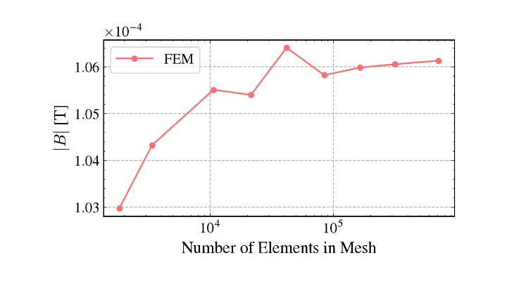

# Validation Case 5: Multi-turn Coil

## Objective

This validation case verifies the accuracy of the 2D magnetostatic finite element solver for distributed current sources by simulating a pair of multi-turn coils carrying equal and opposite currents. The computed magnetic field is compared with the analytical solution obtained through the superposition principle.

This benchmark validates the solver's ability to correctly model multiple current-carrying regions and reproduce the combined magnetic field generated by interacting coils.

## Physics Being Validated

This benchmark validates:

- Magnetostatic formulation
- Magnetic vector potential ($A_z$)
- Distributed current density implementation
- Multiple current source handling
- Superposition principle
- Magnetic flux density computation
- Curl operator
- Boundary condition implementation
- Agreement with analytical superposition

## Problem Description

Two identical circular coils are positioned symmetrically about the origin. The left coil carries a positive current while the right coil carries an equal negative current, producing a dipole-like magnetic field distribution.

Since the geometry is invariant along the axial direction, the problem is solved using a two-dimensional cross-sectional magnetostatic model.

The analytical solution is obtained by superposing the magnetic fields generated by the individual current loops.

## Governing Equation

The magnetostatic equation solved is

$$
\nabla \cdot \left( \nu \nabla A_z \right)=-J_z
$$

where

- $A_z$ is the magnetic vector potential
- $\nu = 1/\mu$
- $J_z$ is the applied current density

The magnetic flux density is computed as

$$
\mathbf{B}=\nabla\times A_z
$$

## Analytical Solution

The analytical magnetic field is obtained by applying the principle of superposition,

$$
\mathbf{B}_{\text{total}}
=
\mathbf{B}_1+\mathbf{B}_2
$$

where

- $\mathbf{B}_1$ is the magnetic field produced by the left coil
- $\mathbf{B}_2$ is the magnetic field produced by the right coil

The analytical line profile along the symmetry axis serves as the reference solution for validation.

## Geometry

| Parameter | Value |
|-----------|-------|
| Number of coils | 2 |
| Coil arrangement | Symmetric |
| Current direction | Equal magnitude, opposite polarity |
| Geometry | Two circular current-carrying coils inside circular air domain |

## Material Properties

| Region | Relative Permeability |
|--------|------------------------|
| Air | 1.0 |
| Coil 1 | 1.0 |
| Coil 2 | 1.0 |

## Boundary Conditions

The outer circular boundary satisfies

$$
A_z=0
$$

Uniform current densities of equal magnitude and opposite direction are applied within the two coil regions.

## Solver Configuration

| Item | Value |
|------|-------|
| Solver | 2D Magnetostatic FEM |
| Unknown | Magnetic Vector Potential ($A_z$) |
| Element Type | Continuous Galerkin |
| Field Computed | $A_z$, $\mathbf{B}$ |

## Geometry and Mesh

*Figure 1. Geometry and computational mesh.*

The computational model consists of two identical circular coils placed symmetrically inside a circular air domain. The triangular mesh is refined around both coils to accurately capture the strong magnetic field gradients while maintaining a coarser discretisation away from the sources.
## Magnetic Vector Potential

*Figure 2. Magnetic vector potential ($A_z$).*

The magnetic vector potential exhibits positive values around one coil and negative values around the other, reflecting the opposite current directions. The antisymmetric potential distribution confirms the correct implementation of multiple current sources and magnetic field superposition.

## Magnetic Flux Density

*Figure 3. Magnetic flux density magnitude.*

The magnetic flux density reaches its highest values near the centers of the two coils and decreases smoothly with increasing distance from the conductors. The symmetric field distribution demonstrates the interaction between the magnetic fields generated by the opposing currents.

## FEM vs Analytical Comparison

*Figure 4. Comparison between FEM and analytical solution.*

The FEM-computed magnetic field closely follows the analytical solution obtained using loop superposition. Both the positive and negative field peaks as well as the central cancellation region are accurately reproduced by the numerical solution, confirming correct implementation of distributed current sources and field superposition.

## Mesh Convergence Study

*Figure 5. Mesh convergence study.*

The mesh convergence study shows that the computed magnetic field rapidly approaches a stable value as the number of mesh elements increases. The solution exhibits only minor changes beyond the finer mesh levels, indicating mesh-independent numerical accuracy.
## Validation Results

| Quantity             | Value                            |
| -------------------- | -------------------------------- |
| Mean Error           | 9.55 %                           |
| RMSE                 | 6.14 × 10⁻⁶                      |
| Sample Points        | 88                               |
| Analytical Reference | Superposition of magnetic fields |

## Interpretation

The finite element solution successfully reproduces the magnetic field generated by two current-carrying coils with opposite current directions. The resulting magnetic field exhibits the expected symmetry, with strong localized magnetic field concentrations around each coil and a region of field cancellation between the two conductors.

The FEM solution closely follows the analytical solution along the symmetry axis, accurately capturing both the positive field peaks near the coil centers and the negative field distribution between the coils. The mesh convergence study further demonstrates that the numerical solution approaches a stable value as the mesh is refined.

Despite localised deviations, the overall agreement remains good, as reflected by the relatively low **mean error of 9.55%** and an **RMSE of 6.14 × 10⁻⁶ T**. These results indicate that the solver accurately captures the global magnetic field behaviour of multiple interacting current sources.

## Validation Statement

The magnetostatic solver successfully reproduces the analytical magnetic field generated by two interacting current-carrying coils. The close agreement between the finite element and analytical solutions validates the implementation of distributed current density sources, magnetic vector potential formulation, magnetic flux density reconstruction, and the superposition of magnetic fields.

## Conclusion

This benchmark extends the validation of the magnetostatic solver beyond single-conductor configurations by demonstrating accurate simulation of multiple interacting current sources. The successful agreement with the analytical superposition solution confirms the solver's capability to model distributed windings and complex current distributions, providing strong confidence in its application to BLDC stator winding simulations and other electromagnetic devices containing multiple energized coils.