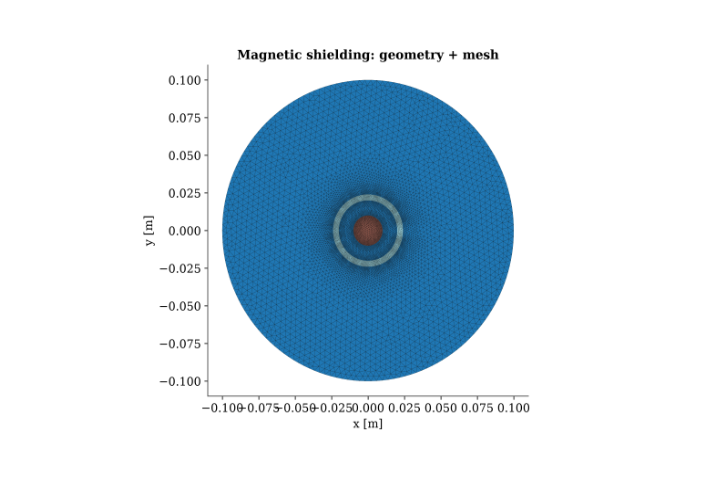
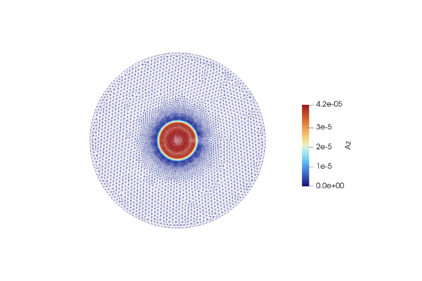
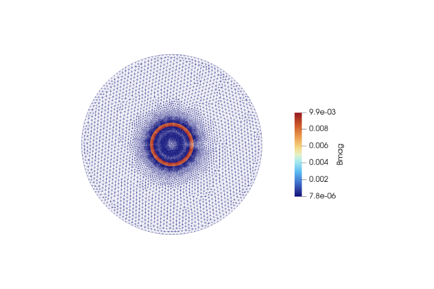
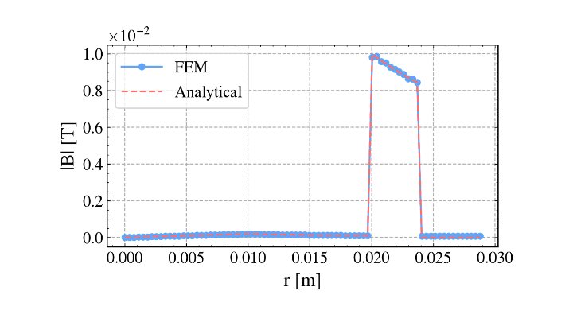
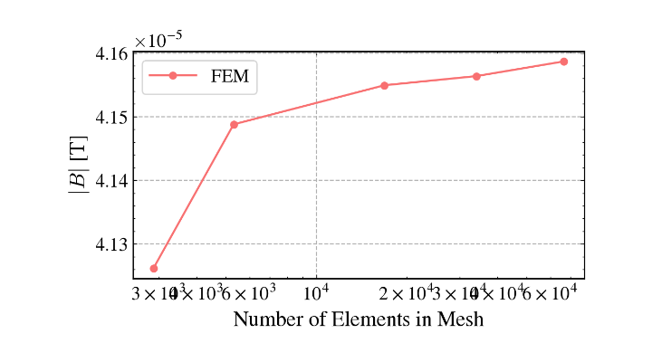

# Validation Case 6: Magnetic Shielding

## Objective

This validation case verifies the ability of the 2D magnetostatic finite element solver to accurately model magnetic field redistribution in the presence of a high-permeability ferromagnetic shield. The computed magnetic field distribution is compared with an analytical approximation to validate the implementation of multiple material regions, magnetic permeability assignment, and flux concentration within magnetic shielding structures.

This benchmark extends the validation beyond current-carrying conductors by demonstrating the solver's capability to correctly represent magnetic field guidance through ferromagnetic materials.

## Physics Being Validated

This benchmark validates:

- Magnetostatic formulation
- Magnetic vector potential ($A_z$)
- Multiple material region handling
- High-permeability material modelling
- Magnetic flux density computation
- Flux concentration
- Magnetic shielding behaviour
- Boundary condition implementation
- Agreement with analytical approximation

## Problem Description

A cylindrical current-carrying conductor is surrounded by a concentric ferromagnetic shielding ring with a relative permeability of 100. The shield provides a preferential path for magnetic flux, causing the magnetic field to concentrate within the shielding material while reducing the field in the surrounding air region.

The problem is solved using a two-dimensional cross-sectional magnetostatic formulation, where the magnetic shielding effect can be directly observed through the redistribution of magnetic flux.

## Governing Equation

The magnetostatic equation solved is

$$
\nabla \cdot \left( \nu \nabla A_z \right)=-J_z
$$

where

- $A_z$ is the magnetic vector potential
- $\nu = 1/\mu$
- $J_z$ is the applied current density

The magnetic flux density is computed as

$$
\mathbf{B}=\nabla\times A_z
$$

## Analytical Solution

The analytical reference is based on the approximate magnetic shielding behaviour of a high-permeability cylindrical shell.

Within the shielding material,

$$
\mathbf{B}_{\text{shield}} \gg \mathbf{B}_{\text{air}}
$$

indicating that the majority of the magnetic flux is guided through the ferromagnetic region due to its significantly lower magnetic reluctance.

The analytical approximation predicts magnetic field concentration within the shield together with attenuation of the external magnetic field.

## Geometry

| Parameter | Value |
|-----------|-------|
| Conductor | Circular |
| Shield Geometry | Cylindrical ring |
| Shield Relative Permeability | 100 |
| Geometry | Conductor surrounded by magnetic shield |

## Material Properties

| Region | Relative Permeability |
|--------|------------------------|
| Air | 1.0 |
| Conductor | 1.0 |
| Magnetic Shield | 100 |

## Boundary Conditions

The outer circular boundary satisfies

$$
A_z=0
$$

A uniform current density is applied inside the conductor while the surrounding shield is assigned a relative permeability of 100.

## Solver Configuration

| Item           | Value                             |
| -------------- | --------------------------------- |
| Solver         | 2D Magnetostatic FEM              |
| Unknown        | Magnetic Vector Potential ($A_z$) |
| Element Type   | Continuous Galerkin               |
| Field Computed | $A_z$, $\mathbf{B}$, $            |

## Geometry and Mesh

*Figure 1. Geometry and computational mesh.*

The computational model consists of a central conductor enclosed by a concentric ferromagnetic shield and surrounded by an air region. The mesh is significantly refined near the shield interfaces where large magnetic permeability gradients produce strong variations in the magnetic field.

## Magnetic Vector Potential

*Figure 2. Magnetic vector potential ($A_z$).*

The magnetic vector potential reaches its highest value inside the current-carrying conductor and decreases smoothly across the surrounding air and magnetic shield. The continuous potential distribution across material interfaces demonstrates the correct implementation of heterogeneous magnetic materials within the finite element formulation.

## Magnetic Flux Density

*Figure 3. Magnetic flux density magnitude.*

The magnetic flux density is strongly concentrated within the ferromagnetic shielding ring, demonstrating the expected magnetic flux guidance produced by the high-permeability material. Outside the shield, the magnetic field is significantly reduced, illustrating the shielding effect and confirming the correct modelling of magnetic reluctance.

## FEM vs Analytical Comparison

*Figure 4. Comparison between FEM and analytical solution.*

The finite element solution closely follows the analytical approximation throughout the computational domain. The sharp increase in magnetic flux density within the shield and the rapid attenuation outside the shield are accurately reproduced. The close agreement confirms that the solver correctly models magnetic flux concentration within high-permeability materials.

## Mesh Convergence Study

*Figure 5. Mesh convergence study.*

The mesh convergence study demonstrates that the computed magnetic field rapidly approaches a stable value as the number of finite elements increases. Only minor changes are observed for finer meshes, indicating that the numerical solution has become essentially mesh independent.

## Validation Results

| Quantity                     | Value                                |
| ---------------------------- | ------------------------------------ |
| Analytical Reference         | Magnetic shielding approximation     |
| Shield Relative Permeability | 100                                  |
| Validation Type              | High-permeability magnetic shielding |

## Interpretation

The finite element solution accurately captures the magnetic shielding phenomenon produced by the high-permeability cylindrical shell. As expected, the magnetic field is preferentially guided through the ferromagnetic material, resulting in a significant concentration of magnetic flux within the shield while simultaneously reducing the magnetic field in the surrounding air.

The excellent agreement between the FEM and analytical approximation confirms the correct implementation of material-dependent magnetic permeability and demonstrates that the solver accurately models magnetic flux redistribution across heterogeneous magnetic domains. The mesh convergence study further verifies that the numerical solution becomes independent of mesh refinement for sufficiently fine discretizations.

## Validation Statement

The magnetostatic solver successfully reproduces the expected magnetic shielding behaviour of a high-permeability cylindrical shell. The close agreement between the finite element solution and the analytical approximation validates the implementation of heterogeneous material properties, magnetic permeability assignment, magnetic vector potential formulation, and magnetic flux density reconstruction.

## Conclusion

This benchmark validates the solver's capability to accurately model magnetic shielding effects in heterogeneous magnetic materials. The successful reproduction of flux concentration within the ferromagnetic shield demonstrates that the solver correctly captures material-dependent magnetic behaviour, providing confidence in its application to electrical machines containing laminated steel cores, magnetic yokes, stator teeth, and other high-permeability components.