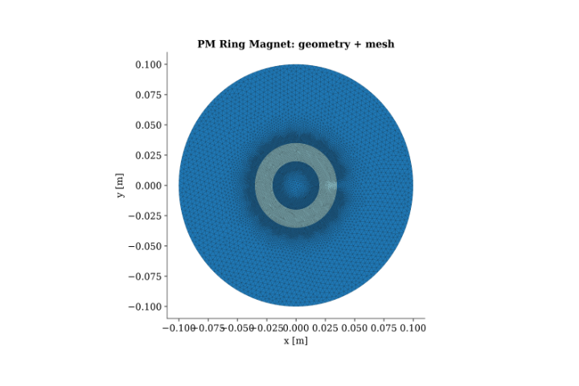
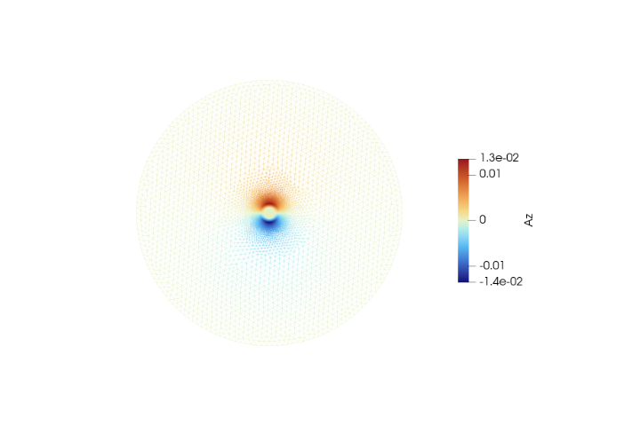
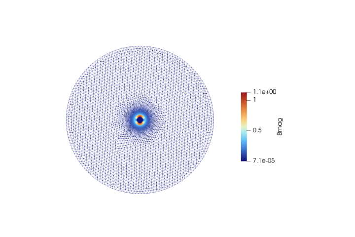
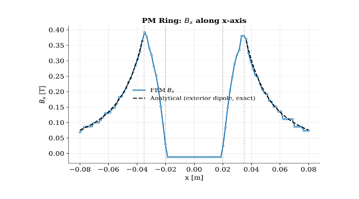
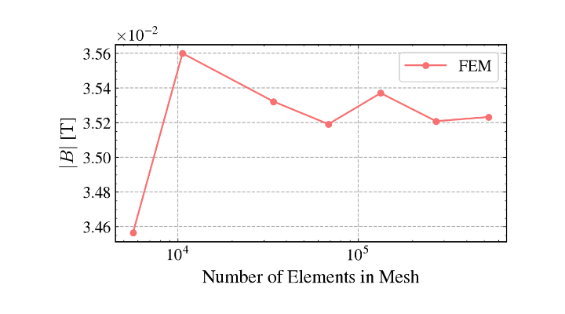

# Validation Case 7: Permanent Magnet Ring

## Objective

This validation case verifies the accuracy of the 2D magnetostatic finite element solver for permanent magnet modelling by comparing the computed magnetic field generated by a uniformly magnetized permanent magnet ring with the corresponding analytical exterior dipole solution.

Unlike the previous validation cases involving impressed current sources, this benchmark validates the implementation of permanent magnet magnetization, equivalent magnetization source terms, and magnetic field computation in magnetized materials.

## Physics Being Validated

This benchmark validates:

- Magnetostatic formulation
- Magnetic vector potential ($A_z$)
- Permanent magnet modelling
- Magnetization source implementation
- Magnetic flux density computation
- Curl operator
- Material permeability assignment
- Exterior dipole magnetic field solution
- Agreement with analytical solution

## Problem Description

A uniformly magnetized permanent magnet ring is placed at the centre of a circular air domain. The magnet is magnetized along the positive x-direction, producing a dipole-like magnetic field surrounding the ring.

The magnetic field is computed using a two-dimensional magnetostatic formulation in which the permanent magnet is represented through an equivalent magnetization vector rather than an impressed current source.

The numerical solution is compared with the exact analytical exterior dipole solution along the x-axis.

## Governing Equation

The magnetostatic equation solved is

$$
\nabla \cdot \left( \nu \nabla A_z \right)
=
-\nabla \times \mathbf{M}
$$

where

- $A_z$ is the magnetic vector potential
- $\nu=1/\mu$
- $\mathbf{M}$ is the permanent magnet magnetization vector

The magnetic flux density is computed as

$$
\mathbf{B}
=
\nabla \times A_z
$$

## Analytical Solution

The analytical reference is the exact exterior dipole solution for a uniformly magnetized permanent magnet ring.

Outside the magnet,

$$
\mathbf{B}_{ext}
=
\mathbf{B}_{dipole}
$$

which represents the magnetic field generated by the equivalent magnetic dipole moment of the ring.

This solution provides the analytical benchmark for validating the exterior magnetic field distribution.

## Geometry

| Parameter | Value |
|-----------|-------|
| Magnet Type | Permanent magnet ring |
| Magnetization | Uniform |
| Magnetization Direction | +x direction |
| Geometry | Ring magnet inside circular air domain |

## Material Properties

| Region | Relative Permeability |
|--------|------------------------|
| Air | 1.0 |
| Permanent Magnet | 1.05 |

## Boundary Conditions

The outer circular boundary satisfies

$$
A_z=0
$$

The permanent magnet is represented using a uniform magnetization vector while the surrounding air region contains no impressed current density.

## Solver Configuration

| Item           | Value                             |
| -------------- | --------------------------------- |
| Solver         | 2D Magnetostatic FEM              |
| Unknown        | Magnetic Vector Potential ($A_z$) |
| Element Type   | Continuous Galerkin               |
| Field Computed | $A_z$, $\mathbf{B}$, $            |

## Geometry and Mesh

*Figure 1. Geometry and computational mesh.*

The computational model consists of a permanent magnet ring embedded within a circular air domain. A locally refined triangular mesh is generated around the magnet interfaces where strong magnetic field gradients occur, while a coarser mesh is used farther from the magnet to reduce computational cost.
## Magnetic Vector Potential

*Figure 2. Magnetic vector potential ($A_z$).*

The magnetic vector potential exhibits the characteristic dipole distribution expected from a uniformly magnetized permanent magnet. Positive and negative potential regions appear on opposite sides of the magnetization direction, demonstrating the correct implementation of equivalent magnetization sources within the finite element formulation.

## Magnetic Flux Density

*Figure 3. Magnetic flux density magnitude.*

The magnetic flux density reaches its maximum near the magnet surface where magnetic flux exits and re-enters the permanent magnet. The resulting field pattern exhibits the expected dipole behaviour, with the magnetic field decaying smoothly into the surrounding air region.
## FEM vs Analytical Comparison

*Figure 4. Comparison between FEM and analytical solution.*

The finite element solution closely follows the analytical exterior dipole solution outside the permanent magnet. The numerical solution accurately reproduces both the peak magnetic flux density near the magnet surface and the decay of the magnetic field with increasing distance from the magnet. Minor deviations occur near the magnet boundaries where the magnetic field transitions between the interior and exterior regions.

## Mesh Convergence Study

*Figure 5. Mesh convergence study.*

The mesh convergence study demonstrates rapid convergence of the computed magnetic field with increasing mesh resolution. Beyond moderate mesh densities, only negligible variations are observed, indicating that the finite element solution has become mesh independent.
## Validation Results

| Quantity                     | Value                          |
| ---------------------------- | ------------------------------ |
| Analytical Reference         | Exact exterior dipole solution |
| Magnet Relative Permeability | 1.05                           |
| Magnetization                | Uniform                        |
| Validation Type              | Permanent magnet benchmark     |

## Interpretation

The finite element solution accurately reproduces the characteristic magnetic field generated by a uniformly magnetized permanent magnet ring. The computed magnetic vector potential and magnetic flux density exhibit the expected dipole symmetry, with magnetic flux emerging from one side of the magnet and returning through the opposite side.

The close agreement between the FEM solution and the analytical exterior dipole solution confirms the correct implementation of permanent magnet modelling through equivalent magnetization source terms. The mesh convergence study further demonstrates that the numerical solution becomes essentially independent of mesh refinement, indicating stable and accurate field computation.

This benchmark validates one of the most important physical components required for permanent magnet electrical machines, namely the accurate representation of magnetization-driven magnetic fields.

## Validation Statement

The magnetostatic solver successfully reproduces the analytical magnetic field generated by a uniformly magnetized permanent magnet ring. The agreement between the finite element and analytical solutions validates the implementation of permanent magnet magnetization, equivalent source formulation, magnetic vector potential computation, magnetic flux density reconstruction, and heterogeneous material modelling.

## Conclusion

This benchmark extends the validation suite from current-driven magnetostatic problems to magnetization-driven electromagnetic phenomena. The successful reproduction of the permanent magnet dipole field demonstrates that the solver accurately models permanent magnets, providing strong confidence in its application to permanent magnet synchronous machines, BLDC motors, and other electromagnetic devices employing rare-earth permanent magnets.